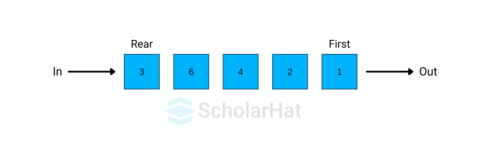

## 스택과 큐

### 스택
- 후입선출 = FILO = LIFO
- pop, push, peek
- 우선탐색(DFS)과 백트랙킹 종류의 코딩 테스트에 효과적이므로 반드시 알아두어야 함.
- 후입선출은 개념 자체가 재귀함수 알고리즘 원리와 일맥상통

### 큐
- 선입선출 = FIFO 
- 삽입삭제가양방향
- rear: 큐에서 가장 끝 부분을 가르키는 영역(데이터가 들어가는 부분)
- front: 큐에서 가장 앞의 데이터를 가르키는 영역(데이터가 나오는 부분)
- add: rear 부분에 새로운 데이터를 '삽입'하는 연산
- poll: front 부분에 있는 데이터를 '삭제'하고 '확인'하는 연산
- peek: 큐의 맨 앞(front)에 있는 데이터를 '확인'하는 연산
- 너비우선탐색에서 자주 사용(BFS)

### 우선순위 큐
- 들어간 순서와 상관 없이 우선순w위가 가장 높은 데이터를 가장 먼저 나오는 자료구조
- 큐의 설정에 따라 front에 항상 우선순위에 따른 최대값 또는 최솟값이 위치한다.
- 힙을 이용해 구현하는데 합은 트리 종류의 하나

