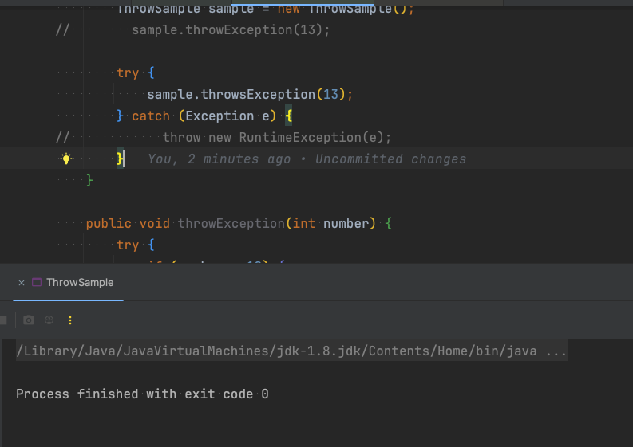
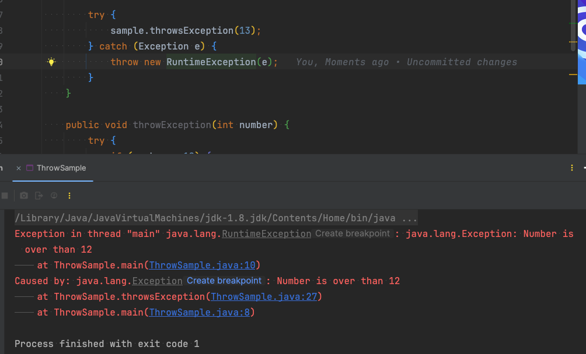

Today I Learned 20240102
---
### 자바의신
- 14장 예외 : 437-440p 정리
  - [exception](https://github.com/melody-story/TIL/tree/main/java/exception.md)
  - [throwable](https://github.com/melody-story/TIL/tree/main/java/throwable.md)
  - [throws](https://github.com/melody-story/TIL/tree/main/java/throws.md)


# Q&A
1. 메소드에 throws 선언하는 것을 지양한다고 한다면, 예외처리 어떤 방법으로 해야하는지?
- 앞단에서 `throw new RuntimeException(e);` catch 블록에 안넣을 경우
- 아무런 로그가 출력되지 않음.

- 앞단에서 `throw new RuntimeException(e);` catch 블록에 넣을 경우
- 중복해서 예외로그가 출력됨.


```java
public class ThrowSample {

    public static void main(String[] args){
        ThrowSample sample = new ThrowSample();
//        sample.throwException(13);

        try {
            sample.throwsException(13);
        } catch (Exception e) {
            throw new RuntimeException(e); // throws선언에서 해당 라인 없을시 무응답, 있을시 exception 중복
        }
    }

    public void throwsException(int number) throws Exception {
        if (number > 12) {
            throw new Exception("Number is over than 12");
        }
        System.out.println("Number is " + number);
    }

    public void throwException(int number) {
        try {
            if (number > 12) {
                throw new Exception("Number is over than 12");
            }
            System.out.println("Number is " + number);
        } catch (Exception e) {
            e.printStackTrace();
        }
    }
}
```