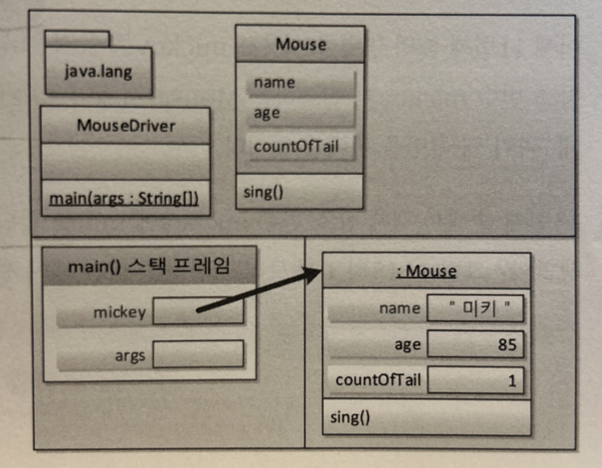

Today I Learned 20240817
---

## 회고하기 WIW

### What-I-did?

- 독서 : 스프링 입문을 위한 자바 객체 지향의 원리와 이해
    - 3장 자바와 객체 재향 77~107p

### What-I-Learn?

**객체지향이란?**

- 객체지향은 현실세계를 반영한다.
- 기존의 구조적프로그래밍언어에서 가장 중요한 것은 함수였다.
- 함수로 인해 프로그램이 조금 더 편해지고나서 더욱 파격적인 제안이 나왔는데, 이것이 객체지향이다.
  우주 만물은 객체들의 합이다. "우리가 주변에서 사물을 인지하는 방식대로 프로그래밍 할 수 있지 않겠는가?"가 객체지향의 출발이다.
- 0과 1로 대변되는 기계에 맞춰 사고하는 방식을 버리고, 현실세계를 인지하는 방식으로 프로그램을 만들자는 것. 그래서 객체지향은 직관적이다.
- 세상에 존재하는 모든것은 사물, 즉 객체이다.
- 각각의 사물은 고유하다.
- 사물은 속성을 갖는다.사물은 행위를 한다.
- 사물을 하나하나 이해하기 보다는 분류(class) 해서 이해하는 것이 인간의 인지방법이다.
    - 직립보행을 하며 말을 하는 존재를 사람이라고 분류한다.
    - 연미복, 짧은 다리, 날지 못하는 새를 펭귄이라고 분류한다.
    - 밤하늘에 반짝이는 사물들을 별이라고 분류한다.

**클래스 vs 객체 = 펭귄 : 뽀로로 = 사람 : 김연아**

- 클래스는 분류에 대한 개념이지 실체가 아니다. 따라서, 사람과 펭귄은 클래스가 된다.
- 객체는 실체다.
- 붕어빵틀과 붕어빵 비유는 잘못된 것이다.

**객체지향의 4대 특성**

- 캡 - 캡슐화 : 정보은닉
- 상 - 상속 : 재사용
- 추 - 추상화 : 모델링
- 다 - 다형성 : 사용 편의

**추상화: 모델링**

- "객체지향의 추상화는 곧 모델링이다."
- ⭐️ 추상화란 구체적인 것을 분해해서 관찰자가 관심있는 특성만을 재조합하는 것.
- 세상에 존재하는 유일무이한 객체를 특성(속성 + 기능)에 따라 분류해보니 객체를 통칭할 수 있는 집합적 개념, 즉 클래스(분류)가 나오게 된다.
    - 객체는 유일무이한 사물이다.
    - 클래스는 같은 특성을 지닌 여러 객체를 총칭하는 집합 개념이다.
- 클래스의 인스턴스 : 클래스를 이용해 object를 만들었다는 겅슬 강조할때 사용.
- 컨텍스트 : 클래스를 설계할때, 사람의 모든 특성을 나열하는 것은 불가능하다. 이떄, 필요한 것이 애플리케이션 경계이다. 이를 컨텍스트(Context)라고 부른다. "내가 만들고자 하는 애플리케이션은 어디에서
  사용될 것인가?"

> - 다시말해 추상화란, 구체적인 것을 분해해서 관심영역에 있는 특성만 가지고 재조합하는 것(=모델링)을 말한다. 
    **추상화는 모델링이다.**

- 모델링(추상화)은 객체지향에서 클래스를 설계할때 필요한 기법이고, 데이터베이스의 테이블을 설계할 때 필요한 기법이다.

> 중요
>- OOP의 추상화는 모델링이다.
>- 클래스 : 객체 = 펭귄 : 뽀로로
>- 클래스 설계에서 추상화가 사용된다.
>- 클래스 설계를 위해서는 애플리케이션 경계부터 정해야한다.
>- 객체 지향에서 추상화의 결과는 클래스다.
>- ⭐️자바에서는 객체지향의 추상화를 class키워드를 통해 지원하고 있다.

**추상화와 T메모리?**

- 객체잠조변수에 의해 참조되지 않는 힙영역의 객체는 GC에 의해 수거된다.

- 클래스를 설계
    - 클래스멤버(static한 것들) = static 멤버 = 정적 멤버
        - 클래스 멤버 속성
            - 정적속성인 경우 T메모리의 스태틱 영역에 클래스가 배치될 때 클래스 내부에 메모리 공간이 확보된다.
                - 승용차 클래스의 바퀴개수
                - 남자 클래스의 주민등록번호 성별코드
        - 클래스 멤버 메서드
    - 객체멤버 = 인스턴스 멤버
        - 객체 멤버 속성
            - 객체 속성은 힙영역에 객체가 생성되면 바로 그때 각 객체안에 멤버 속성을 위한 메모리 공간이 할당된다.
        - 객체 멤버 메서드

- 변수초기화
    - 지역변수 : 별도로 초기화해야한다. 한 지역에서만 사용되고 소면되는 변수이기에 지역에서 초기화. 초기화하지 않으면 쓰레기 값을 갖게 된다.
    - 멤버변수 : 클래스 속성과 객체 속성은 별도의 최고하를 해주지 않아도 정수형은 0, 부동소수점형은 0.0, 논리형은 false, 객체는 null로 초기화된다. 멤버 변수는 공유 변수의 성격을 가지고 있기
      떄문이다. 딱히 누가 초기화해야한다고 규정할 수 없다. 그래서 공유 변수는 별도로 초기화를 해주지 않아도 기본값으로 초기화 되는 것이다.
        - 클래스변수 : 전역 변수로서 프로그램 어디서든 접근 가능한 공유 변수. 클래스 변수의 초기화는 정적 실행영역을 통해 초기화하지만, 딱히 누가 초기화한다고 규정할 수 없다.
        - 객체변수 : 하나의 객체 안에서 다수의 객체 메서드가 공유하는 변수. 객체변수의 초기화는 생성자가 한다.

### What-I-will-do?**

- 독서 : 스프링 입문을 위한 자바 객체 지향의 원리와 이해
    - 3장 자바와 객체 재향 107~144p