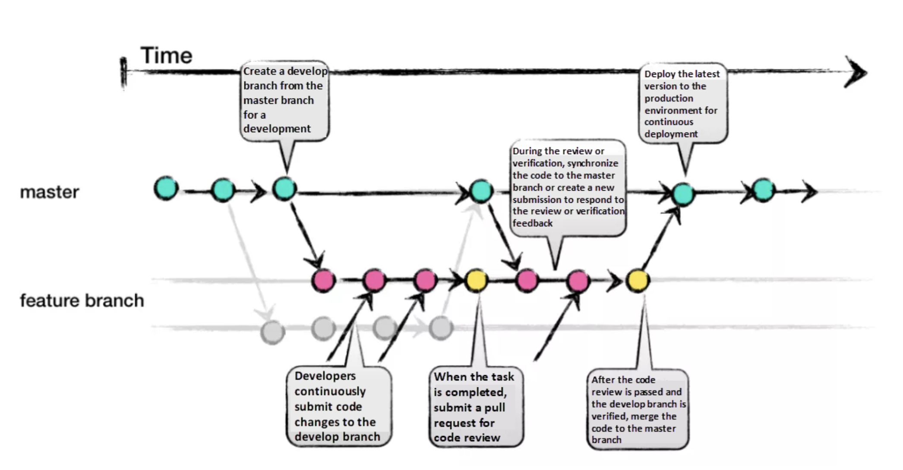

# Git branch 전략이란?

- 여러 개발자가 하나의 저장소에 작업을 할 때, 협업을 좀 더 효과적으로 하기 위함.
- git branch 에 대한 규칙을 정하고 저장소를 잘 활용하기 위한 workflow 를 정의하는 것을 바로 git branch 전략이라고 함.
- 소프트웨어 개발 팀에서는 프로젝트의 특성에 따라 적절한 브랜치 배포 전략을 채택하는 것이 중요함.

### 이점

- 각각의 브랜치가 특정 기능, 이슈에 대응하여 특정 작업을 추적가능
- 필요한 경우 작업 단위의 Rollback 이 가능하여 프로젝트 관리의 유연성을 향상
- 각각의 태그는 Release 를 원하는 버전 단위로 관리할 수 있도록 하여, 배포 안정성을 향상시켜줌.

Git Branch 전략은 여러가지가 있지만, 대표적으로 여러 프로젝트에서 널리 사용되고 있는 두가지 대표 브랜치 전략인 Git Flow 와 GitHub Flow가 있다.

### Git Flow

브랜치 종류는 다음과 같습니다.

1. master: 제품 출시 버전을 관리하는 메인 브랜치

2. develop: 다음 출시 버전을 위해 개발하는 브랜치

3. feature: 새로운 기능을 개발하는 브랜치

4. release: 다음 출시 버전을 준비하는 브랜치

5. hotfix: 출시된 제품의 버그를 고치기 위한 브랜치

이러한 Git Flow 를 사용할 때, 어떻게 개발을 진행하는지 그 흐름에 대해서 살펴보도록 하겠습니다.

1. 신규 기능 개발을 위해 개발자는 develop 브랜치를 기준으로 한 feature 브랜치를 따서 작업을 진행합니다.

2. 작업이 완료된 feature 브랜치는 develop 브랜치로 병합 (Merge) 됩니다. (일반적으로 프로젝트 진행 시에는 Pull Request 를 통해 작업 내용을 Review 받은 후 해당 PR 을
   Merge 하는 방식으로 진행합니다.)

3. 다음 출시 버전을 위해 개발 중인 develop 브랜치에서 release 브랜치를 따서 배포를 위한 준비를 합니다. (이 때 발견되는 버그들은 release 브랜치에서 바로 반영합니다.)

4. 충분한 테스트 후에, 일정한 주기로 (일반적으로는 배포하고자 하는 버전 단위) master 브랜치로 Merge 하여 제품을 출시합니다.

5. 상용 배포 이후, release 브랜치에서 미처 발견되지 못한 새로운 버그들은 hotfix 브랜치에 바로 반영합니다.

### GitHub Flow

GitHub Flow 는 쉽게 요약하자면, 브랜치를 하나의 base 브랜치 (master) + master 에 기능을 추가하기 위한 브랜치 (feature)

두개만으로 운영하여 훨씬 간단하지만 빠르게 수정 배포할 수 있는 전략입니다.

다음 그림은 GitHub Workflow 를 표현한 그림입니다.

Git Flow 와 비교하였을 때 훨씬 간단하죠? Git Flow는 다양한 종류의 브랜치를 사용하는 반면, GitHub Flow는 단일 브랜치 (master) 를 사용합니다.

배포는 Git Flow 와 동일하게 master 브랜치에서 수행되지만, 그 외의 release, hotfix 등의 다른 브랜치들 대신 하나의 feature branch 만이 존재합니다.

GitHub Flow 의 흐름 또한 그림에서 보시는 바와 같이 매우 간단합니다.

1. master 브랜치는 배포를 위한 소스코드를 관리하는 브랜치입니다. 신규 기능 개발이 필요할 때, feature 브랜치를 따서 작업을 진행합니다.

2. 태스크가 완료되면, Pull Request 를 생성하여 Review 를 요청합니다. 이 때의 타겟은 master 브랜치입니다.

3. 리뷰가 완료되고, 피드백이 모두 반영되면 해당 feature 브랜치를 master 브랜치로 Merge 합니다.

Git Flow는 release와 hotfix 브랜치를 통해 명확한 배포 절차를 갖추고 있습니다.

GitHub Flow는 단순하며 지속적인 배포를 강조하며, master 브랜치에서 배포를 수행합니다.

### Git Flow 와 GitHub Flow 중 어떤 전략을 사용해야 할까?

Git Flow 와 GitHub Flow 중 어떤 전략을 사용하는게 좋을까요? 다양한 관점에서 두 전략을 비교해보겠습니다.

1. 브랜치 수: Git Flow는 다양한 종류의 브랜치를 사용하는 반면, GitHub Flow는 단일 브랜치 (master) 를 사용합니다.

2. 배포 방식: Git Flow는 release 와 hotfix 브랜치를 통해 명확한 배포 절차를 갖추고 있습니다.

반면에, GitHub Flow는 단순하며 지속적인 배포를 강조하며, master 브랜치에서 배포를 수행합니다.

3. 복잡성: Git Flow는 복잡한 프로젝트나 대규모 팀에서 사용하기 좋습니다.

그러나 이는 작은 팀이나 개인 프로젝트에 적용하기에는 많은 브랜치와 과정이 불필요하고 부담스러울 수 있습니다.

GitHub Flow 는 단순하며 빠른 개발 및 배포를 위해 사용됩니다.

각각의 전략은 장, 단점이 존재하기에 프로젝트의 규모, 요구 사항 및 팀의 작업 방식에 맞추어 적절하게 채택하는 것이 좋습니다.

Git Flow는 더 많은 제어와 복잡성을 가지고 있어 특정 기능이나 수정을 빠르게 배포해야 할 경우 등에서 유연성이 다소 떨어집니다.

그러나 그만큼 배포 안정성과 버전 관리 및 롤백 등 체계적인 운영이 가능합니다.

GitHub Flow 는 테스트와 검증 절차를 거치지 않고 바로 master 브랜치로 Merge 되므로 위험성을 가지고 있습니다.

하지만 그만큼 단순하고 빠르게 기능을 테스트하고 Agile 하게 배포할 수 있기 때문에, 주로 각 환경의 구분이 명확하지 않고 작은 규모의 프로젝트에 적합한 전략입니다.

[참고](https://devocean.sk.com/blog/techBoardDetail.do?ID=165571&boardType=techBlog)