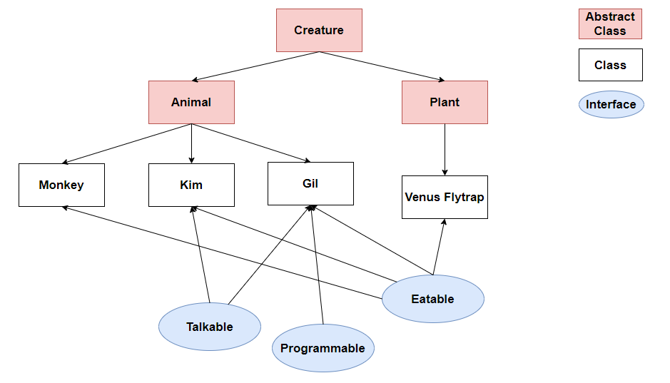
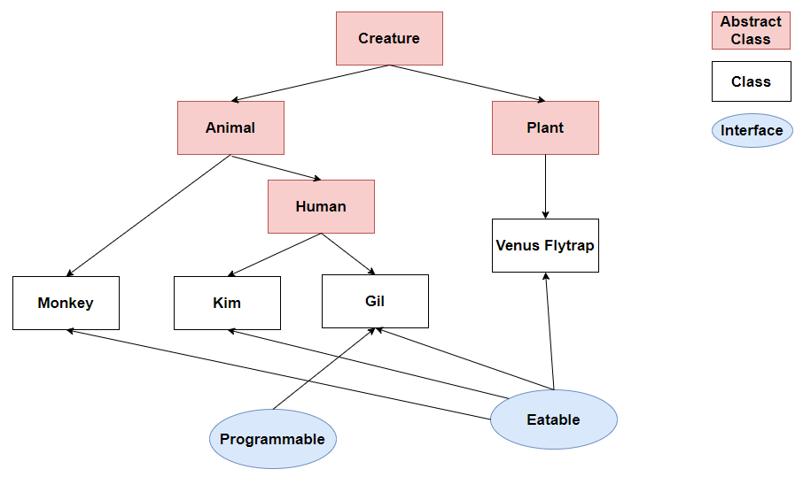

# Interface vs Abstract Class

- 추상클래스는 상속을 위한 클래스. 상속, 확장하여 사용하기 위한 것입니다. new 키워드를 통해 직접 객체를 생성할 수 없다.
- 인터페이스는 해당 인터페이스를 구현한 객체들에 대한 동일한 사용방법과 동작을 보장하기 위해 사용한다.

Interface와 Abstract Class는 상속(extends)받거나, 구현(implements)하는 Class가 Interface나 Abstract Class 안에 있는 Abstract Method를
구현하도록 강제하는 공통점을 가지고 있다.

그렇다면 Interface와 Abstract Class 두 종류가 존재하는건 왜일까?

결론부터 말하자면, Interface와 Abstract Class는 존재 목적이 다르다

## Interface

Interface는 부모, 자식 관계인 상속 관계에 얽메이지 않고, 공통 기능이 필요 할때, Abstract Method를 정의해놓고 구현(implements)하는 Class에서 각 기능들을 Overridng하여
여러가지 형태로 구현할 수 있기에 다형성과 연관되어 있다.

Interface는 해당 Interface를 구현하는 Class들에 대해 동일한 method, 동작을 강제하기 위해 존재한다..


> Java에서 다중 상속이 안되어 발생하는 Abstract Class의 한계도 보완해줄 수 있다.
> Interface의 implements에는 제한이 없어 다중 구현이 가능하다.

하지만 모든 Class가 Interface를 이용한다면, 공통적으로 필요한 기능도 `implements`하는 모든 Class에서 Overrindg해 재정의해야 하는 번거로움이 존재한다.

Interface는 **각각 다른** `Abstract Class`를 상속하는 Class들의 공통 기능을 명시할때 사용하면 편리하다.

## Abstract Class

- Abstract Class는 부모와 자식 즉, 상속 관계에서 Abstract Class를 상속(extends)받으며 같은 부모 Class(여기서는 Abstract Class)를 상속받는 자식 Class들 간에
  공통
  기능을 각각 구현하고, 확장시키며 상속과 관련되어 있다.
- 상속은 SuperClass의 기능을 이용, 확장 하기 위해 사용된다.

- Abstract Class는 IS - A "~이다"이고, Interface는 HAS - A "~을 할 수 있는"이다.

- Abstract Class를 상속하며 Class들간의 구분이 가능해진다.

```java
class Vehicle extends Car, Motorcycle {
    @Override
    public void run() {
        super.drive();
    }
}
```

- Java에서는 다중 상속을 지원하지 않기 때문에 Abstract Class 만으로 구현해야하는 Abstract Method를 강제하는데는 한계가 존재한다.
  만약 Java에서 다중 상속이 가능했다면 Car, Motocycle에 각각 drive method가 정의되어 있을 경우 무엇을 상속받아 Overridng 한건지 모호해진다.
- 이것이 다중 상속의 모호성이고, 이 때문에 Java는 다중 상속을 막아 놓았다.

## Interface vs Abstract Class 예제

만약 아래와 같은 현실세계의 객체들을 Interface, Abstract Class를 이용해 구현한다고 하면 아래와 같다



- 제일 부모 Class인 Creature는 생물에 대한 정의를 내리고 있는 Abstract Class이다.
- 이를 상속 받는 Animal(동물), Plant(식물) Abstact Class는 각각 동물, 식물의 특성을 abstarct method로 정의해놓는다. 동물(움직이기), 식물(광합성하기) 등..
- Animal Class를 상속받는 Monkey, Kim, Gil은 각각 원숭이, 사람, 사람으로 사람은 원숭이와 다르게 따로 말을 할 수 있는 기능(Talkable)이 있고, 이 중 Gil이라는 사람 Class는
Program을 할 수 있다.
- Plant Class를 상속받는 Venus Flytrap은 파리 지옥, 끈끈이 주걱 식물로서, 식물인데도 먹는것이 가능하다.
- 따라서 Eatable Interface를 사용해 Monkey, Kim, Gil, Venus Flaytrap 모두가 implements한다.
- 여기서 Interface의 사용 목적을 알 수 있는데, Eatable Interface를 사용함으로써 Animal, Plant 각각 다른 부모 Class를 상속받고 있는 Monkey, Kim, Gil, Venus Flaytrap에게 공통적인 기능인 먹는 기능을 Interface를 사용함으로써 상속 관계가 다름에도 기능을 구현하도록 강제 할 수 있다.
- Abstract Class의 사용 목적을 살펴보면, 사실 위에 Talkable Interface는 동일한 부모 Class인 Animal을 상속받는 Kim, Gil에서 사용하고 있는 기능이다.

이를 새로운 Abstract Class를 생성해서 아래와 같이,



- `Animal Class`를 상속받는 `Human Class`에 말하는 기능을 `abstract method`로 정의 해놓음으로써, **같은 부모 class를 상속받는 관계에서 공통 기능의 구현을 강제** 할 수 있다.
- 위 그림 예제에서 Eatable Interface와 Human Abstarct Class를 잘 이해한다면, Interface와 Abstract Class의 차이점의 윤곽을 잡을 수 있다.

