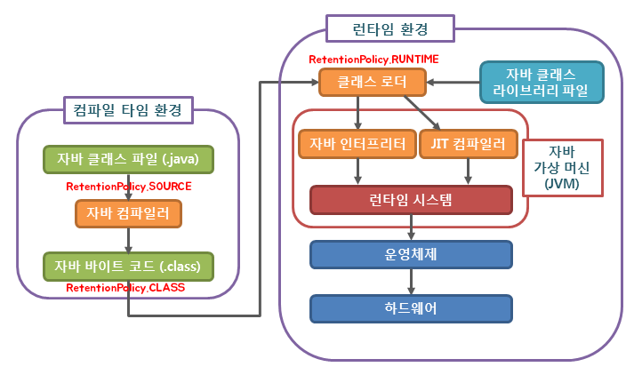

# Annotation란?

- 어노테이션 자체는 주석과도 같다. (실제로 번역기를 돌려도 주석으로 나온다.) 
- 즉, 코드 사이에 주석처럼 쓰이면서 특별한 의미, 기능을 수행하도록 하는 기술로 프로그램에게 추가적인 정보를 제공해주는 메타 데이터이다.

## 사용 목적

- 컴파일러에게 코드 작성 문법 에러를 체크하도록 정보를 제공한다.
- 소프트웨어 개발툴이 빌드나 배치 시 코드를 자동으로 생성할 수 있도록 정보를 제공한다.
- 런타임 시 특정 기능을 실행하도록 정보를 제공한다.
  - **리플렉션(Reflection) API 사용**
    - 리플렉션을 사용하면 클래스와 메서드의 메타정보를 사용해서 애플리케이션을 동적으로 유연하게 만들 수 있다. 
    - 하지만 리플렉션 기술은 `런타임`에 동작하기 때문에, 컴파일 시점에 오류를 잡을 수 없다는 단점이 존재한다.
    - 만일 리플렉션으로 getMethod("메서드명") 를 통해 클래스의 메서드를 가져온다고 가정했을 때 인자로 존재하지도 않는 메서드명을 기재할 경우, 해당 코드를 직접 실행해야 오류가 발생해 미리 대비할수 없게 된다.
    - 가장 좋은 오류는 개발자가 즉시 확인할 수 있는 컴파일 오류이고, 가장 무서운 오류는 사용자가 직접 실행할 때 발생하는 런타임 오류다. 따라서 리플렉션은 초보자가 일반적으로 사용하는데는 유의해야한다.
      

## 특징

- 클래스나 메소드 등의 선언시에 `@`를 사용
- `JDK 5`부터 등장
- 클래스, 메소드, 변수 등 모든 요소에 선언 가능

## 지정된 어노테이션 

- `JDK5 ~ JDK6`
1. `@Override`
- 해당 메소드가 부모 클래스에 있는 메소드를 Override 했다는 것을 명시적으로 선언
- 만약 자식 클래스에 여러 개의 메소드가 있을 때, 어떤 메소드가 Override 되었는지 쉽게 확인
- 제대로 메소드를 Override 했다고 생각했는데, 매개 변수가 하나 빠져있는 등의 실수가 있을 때 컴파일시 오류

2. `@Deprecated`
- 미리 만들어져 있는 클래스나 메소드가 더 이상 사용되지 않는 경우 컴파일시 경고
- Deprecated API를 사용하는 메소드가 있으니 `-Xlint:deprecation` 이라는 옵션을 추가하여 컴파일을 다시 해서 확인해 보라는 메시지

```shell
$ javac c/annotation/AnnotationSample. java
Note: cannotation\AnnotationSample. java uses or overrides a deprecated API.
Note: Recompile with -Xlint:deprecation for details.
```
- `-Xlint:deprecation` 추가하여 컴파일 시 결과

```shell
$ javac -Xlint:deprecation c/annotation/AnnotationSample.java
c\annotation\AnnotationSample.java:6: warning: [deprecation] noMoreUse() in c.anotation.
AnnotationDeprecated has been deprecated
          child.noMoreUse();
               ^
1 warning
```

- 어떤 클래스나 메소드를 불필요하다고 생각해서 지워버린다면, 메소드나 클래스를 참조하는 다른 개발자가 만든 프로그램이 변경된 사항을 모르고 있다면, 컴파일할 때 에러가 발생할 것이다. 
- 그러므로, **하위 호환성**을 위해서 `Deprecated`로 선언하는 것은 꼭 필요하다. 
- 가장 좋은 방법은 계도 기간을 거쳐 알림을 준 후에 지우는 것이 바람직하다.
 
3. `@SupressWarnings`
- 프로그램에는 문제가 없는데 컴파일러에서 경고 warming를 알리는 경우 경고 무시
- 다른 어노테이션과는 다르게 소괄호 속에 문자열을 넘겨 줄수있다.
- 이렇게 어노테이션의 종류에 따라서, 속성값을 지정하는 것도 존재함.
- 너무 남용할 경우 `Deprecated`된 메소드를 사용해도 모르고 넘어갈 수도 있으니 유의
```java
package c.annotation;

public class AnnotationSample {
    @SuppressWarnings ("deprecation")
    public void useDeprecated() {
        AnnotationDeprecated child = new AnnotationDeprecated();
        child.noMoreUse();
    }
}
```


## annotation 선언을 위한 메타 어노테이션
1. `@Target`
- 어노테이션을 어떤 것에 적용할지를 선언
- 선언되지 않은 대상에 사용될 경우 컴파일 에러 발생.

```shell
$ javac c/annotation/UserAnnotationSample.java
c\annotation\UserAnnotationSample. java:4: annotation type not applicable to this kind of declaration
@UserAnnotation (number=0)
^
1 error
```

>`@Target(ElementType.METHOD)`
> @Target({ElementType.METHOD, ElementType.TYPE})

#### 적용 대상 목록

| 요소 타입          | 설명                     |
|----------------|------------------------|
| CONSTRUCTOR    | 생성자 선언시                |
| FIELD          | enum 상수를 포함한 필드 값 선언시  |
| LOCAL_VARIABLE | 지역 변수 선언시              |
| METHOD         | 메소드 선언시                |
| PACKAGE        | 패키지 선언시                |
| PARAMETER      | 매개 변수 선언시              |
| TYPE           | 클래스, 인터페이스, enum 등 선언시 |

2. `@Retention`
- 얼마나 오래 어노테이션 정보가 유지되는지 선언
>@Retention(RetentionPolicy.RUNTIME)

#### 적용 대상 목록

| 대상      | 설명                                                                        |
|---------|---------------------------------------------------------------------------|
| SOURCE  | 어노테이션 정보가 컴파일시 사라짐                                                        |
| CLASS   | 클래스 파일에 있는 어노테이션 정보가 컴파일러에 의해서 참조 가능함. 하지만, 가상 머신(Virtual Machine)에서는 사라짐 |
| RUNTIME | 실행시 어노테이션 정보가 가상 머신에 의해서 참조 가능                                            |

3. `@Documented`
- 해당 "어노테이션에 대한 정보가 Javadocs(API) 문서에 포함된다는 것을 선언

4. `@Inherited`
- 모든 자식 클래스에서 부모 클래스의 어노테이션을 사용 가능하다는 것을 선언

5. `@interface`
- 어노테이션은 어노테언션을 선언할 때 사용


## 어노테이션의 선언

- 어노테이션 관련 클래스들은 java.lang.annotation 패키지에 선언되어있음.
```java
package c.annotation;
import java.lang.annotation.ElementTpe;
import java.lang.annotation.Retention;
import java.lang.annotation.RetentionPolicy;
import java.lang.annotation.Target;

@Target(ElementType.METHOD) //  ---- 1)
@Retention(RetentionPolicy.RUNTIME) //  ---- 2)
public @interface UserAnnotation { //  ---- 3)
    public int number(); //  ---- 4)
    public String text() default "This is first annotation"; //  ---- 5)
}
```

1) `@Target은` 해당 어노테이션 사용 대상을 지정한다. 
   - 여기서는 ElementType.METHOD를 소괄 호 안에 넣어 줌으로써 이 어노테이션은 메소드에 사용할 수 있다고 지정된 것이다.
2) `@Retention은` 어노테이션 유지 정보를 지정하는 데 사용한다. 소괄호 안에 RetentionPolicy. 
   - RUNTIME으로 지정하면 실행시에 이 어노테이션을 참조하게 된다.
3) 어노테이션 이름인 UserAnnotation 앞에는 `@interface가` 선언되어 있다. 
   - 클래스나 인터페이스를 선언할 때처럼 `@interface` 선언하면 `@UserAnnotation` 으로 어노테이션이 사용 가능해진다.
4) 어노테이션 선언 안에는 `number()`라는 메소드와 `text()`라는 메소드가 있다. `number()`의 리턴 타입은 `int`이며, `text()`의 리턴 타입은 `String`이다.
   - 이렇게 메소드처럼 어노테이션 안에 선언해 놓으면, 이 어노테이션을 사용할 때 해당 항목에 대한 타입으로 값을 지정 가능하다.
5) `text()`를 보면 default라는 예약어를 쓴 뒤 문자열이 지정되어 있는 것을 볼 수 있다. `default` 예약어를 사용할 경우에는, `default` 뒤에 있는 값이 이 어노테이션을 사용할 때의 기본값이 된다. 
   - 즉, 값을 지정하지 않아도 default 값으로 지정된다.


### 어노테이션 사용

```java
package c.annotation;
public class UserAnnotationSample {
    @UserAnnotation(number=0)
    public static void main(String args[]) {
        UserAnnotationSample sample = new UserAnnotationSample();
    }
    @UserAnnotation(number=1)
    public void annotationSample1() {
    }
    @UserAnnotation(number = 2, text = "second")
    public void annotationSample2(){
    }
    @UserAnnotation(number=3,text="third")
    public void annotationSample3(){
        
    }
}
```

>- 만일 구현한 어노테이션에 요소가 하나에 불과하고, 해당 요소명이 `value()`인 경우에는 
>- 어노테이션 적용시 요소명을 생략하고, 해당 어노테이션의 인자값 자체에 값을 넣어주기만 해도 된다. 
>
>```java
>@UserAnnotation(0);
>//위와 동일
>@UserAnnotation(value=0);
> ```


## 어노테이션에 선언한 값의 확인

- 자바의 리플렉션(Reflection)이라는 API에서 제공하는 클래스
  - `Class` : 클래스의 정보를 확인
  - `Method` : 메소드의 정보를 확인
    
```java
package c.annotation;
import java.lang. reflect.Method;
public class UserAnnotationCheck {
    
    public static void main(String args[]) {
        UserAnnotationCheck sample = new UserAnnotationCheck();
        sample.checkAnnotations(UserAnnotationSample.class);
    }
    
    public void checkAnnotations(Class useClass) {
        Method[] methods = useClass.getDeclaredMethods();  // ---- 1) 해당 클래스에 선언되어 있는 메소드들의 목록을 배열로 리턴
        for (Method tempMethod: methods) {
            UserAnnotation annotation =
                    tempMethod.getAnnotation(UserAnnotation.class);  // ---- 2) 매개 변수로 넘겨준 어노테이션이 있는지 확인하고, 있을 경우 그 어노테이션의 객체를 리턴
            if(annotation!=null) {
                int number=annotation.number(); // ---- 3) 메소드를 호출하면, 그 값을 리턴
                String text=annotation.text();  // ---- 3) 메소드를 호출하면, 그 값을 리턴
                System.out.println(tempMethod.getName() 
                        ＋"(）： number=" + number + " text=" +  text);
            } else {
                System.out.println(tempMethod.getName()
                    +"() : annotation is null.");
            }
        }
    }
}
```

① `Class` 클래스에 선언되어 있는 `getDeclaredMethods()` 메소드를 호출하면, 해당 클래스에 선언되어 있는 메소드들의 목록을 배열로 리턴한다.
② `Method` 클래스에 선언되어 있는 `getAnnotation()`이라는 메소드를 호출하면, 해당 메소드에 선언되어 있는 매개 변수로 넘겨준 어노테이션이 있는지 확인하고, 있을 경우 그 어노테이션의 객체를 리턴해 준다.
③ 어노테이션에 선언된 메소드를 호출하면, 그 값을 리턴해준다.

- 정상 출력 결과

```shell
main() : number=0 text=This is first annotation
annotationSample1() : number=1 text=This is first annotation 
annotationSample2() : number=2 text=second 
annotationSample3() : number=3 text=third
```

### 어노테이션 상속 불가

- `enum` 클래스가 상속을 지원하지 않듯이, 어노테이션을 선언할 때에도 미리 만들어 놓은 어노테이션을 확장하는 것이 불가능
- 즉, `extends`라는 예약어를 사용할 수가 없다. 
- 지금까지 나온 자바에서는 코드가 반복 되는 문제가 발생한다고 하더라도 어쩔 수 없이 재사용은 불가능하다.


#### 어노테이션의 용도따른 분류
- `제약사항` 등을 선언하기 위해 : `@Deprecated`, `@Overide`, `@NotNull`
- `용도`를 나타내기 위해 : `@Entity`, `@TestCase`, `@WebService`
- `행위`를 나타내기 위해 : `@Statefull`, `@Transaction`
- `처리`를 나타내기 위해 : `@Column`, `@XmlElement`


### 어노테이션은 왜 만드는 것일까?
- 어노테이션이 만들어지기 전까지는 모든 자바 애플리케이션의 설정을 `XML`이나 `properties`라는 파일에 지정해 왔다. 
- 그러면서 설정이 복잡해지고, 어떤 설정이 어디에 쓰이는지 이해하려면 많은 시간이 소요되었다. 
- 그런데, 어노테이션이 만들어지면서, 각 설정이 필요한 위치에 관련 설정이 존재하면서 코드에 대한 가독성이 매우 좋아졌다. 
- 하지만, 아직도 `XML`과 같은 설정파일들은 필요한 부분이 존재하기 때문에 남아 있다.

- `롬복 lombok` :https://projectlombok.org/
  - 개발자가 필요한 작업을 어노테이션 선언만으로도 편하게 처리할 수 있도록 도와준다.
  - 롬복을 사용하려면 관련 라이브러리가 필요한데, 그 사용법은 홈페이지에 있는 설명을 통해서 확인할 수 있다. 다음의 변수가 있다고 할 때, 이 변수에 접근하기 위해서는, 아래와 같이 코딩을 직접해 줘야만 했다.
    >private boolean employed = true;
    ```java
    private boolean employed = true;
    
    public boolean isEmployed(){
        return employed;
    }
    public void setEmployed (final boolean employed) {
        this. employed = employed;
    }
    ``` 
  - 하지만 롬복을 사용하면 다음과 같이 간단한 선언만으로도 getter 메소드와 setter 메소드를 생성해 준다.
    >@Getter Setter private boolean employed = true;

- 이렇게 어노테이션을 사용하면 **개발을 보다 편리하게 할 수 있는 장점**이 존재한다.
- 어노테이션을 지정하면 코드가 내부적으로 어떻게 변환되는지에 대해서 살펴보는 습관을 가지는 것이 좋다.

---

## 어노테이션 커스텀하기

- 커스텀 어노테이션

```java

import java.lang.annotation.*;

@Documented
@Target(ElementType.FIELD)
@Retention(RetentionPolicy.RUNTIME)
public @interface FruitColor {
enum Color{RED, PURPLE, BLUE, BLACK};

    Color value() default Color.PURPLE;
}


@Documented
@Retention(RetentionPolicy.RUNTIME)
@Target(ElementType.FIELD)
public @interface FruitName {
    String value() default "";
}


@Documented
@Target(ElementType.FIELD)
@Retention(RetentionPolicy.RUNTIME)
public @interface FruitProvider {
    int id() default -1;

    String name() default "";

    String address() default "";
}

```

- 커스텀 어노테이션 사용의 예
  - 어노테이션을 만들 때 `@Retention(RetentionPolicy.RUNTIME)` 속성을 줬기 때문에 `리플렉션(Reflection)`을 사용할 수 있다.
  - 만약 `@Retention(RetentionPolicy.CLASS)` 속성을 줬다면, `리플렉션(Reflection)`을 사용할 수 없다.
  

```java
import config.TestConfigure;
import org.junit.Test;

import java.lang.reflect.Field;


public class Annotation extends TestConfigure {

    @Test
    public static void main(String[] args) {
        getFruitInfo(Apple.class);

    }
    static class Apple {
        @FruitName("Apple")
        private String appleName;

        @FruitColor(FruitColor.Color.PURPLE)
        private String appleColor;

        @FruitProvider(id = 1,name = "HomePlus",address="Seoul")
        private String appleProvider;
    }

    public static void getFruitInfo(Class<?> clazz) {

        String strFruitName = " 과일 이름 :";
        String strFruitColor = " 과일 색 :";
        String strFruitProvider = "과일 파는 곳";

        Field[] fields = clazz.getDeclaredFields();

        for (Field field : fields) {
            if (field.isAnnotationPresent(FruitName.class)) {
                FruitName fruitName = field.getAnnotation(FruitName.class);
                strFruitName = strFruitName + fruitName.value();
                System.out.println(strFruitName);
            } else if (field.isAnnotationPresent(FruitColor.class)) {
                FruitColor fruitColor = field.getAnnotation(FruitColor.class);
                strFruitColor = strFruitColor + fruitColor.value().toString();
                System.out.println(strFruitColor);
            } else if (field.isAnnotationPresent(FruitProvider.class)) {
                FruitProvider fruitProvider = field.getAnnotation(FruitProvider.class);
                strFruitProvider = " 과일 파는 곳의 ID: " + fruitProvider.id() + " 지점 이름 : " + fruitProvider.name() + " 지점 주소: " + fruitProvider.address();
                System.out.println(strFruitProvider);
            }
        }
    }


}

```
