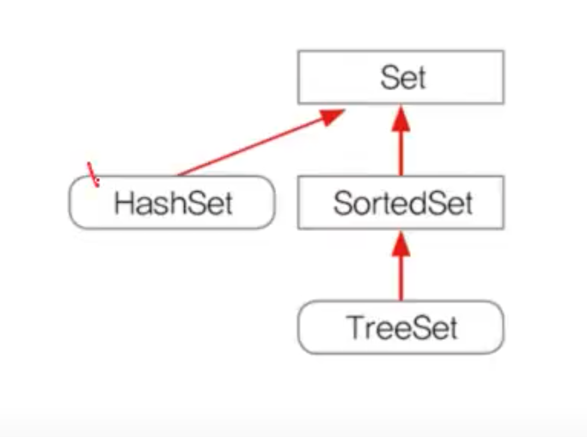
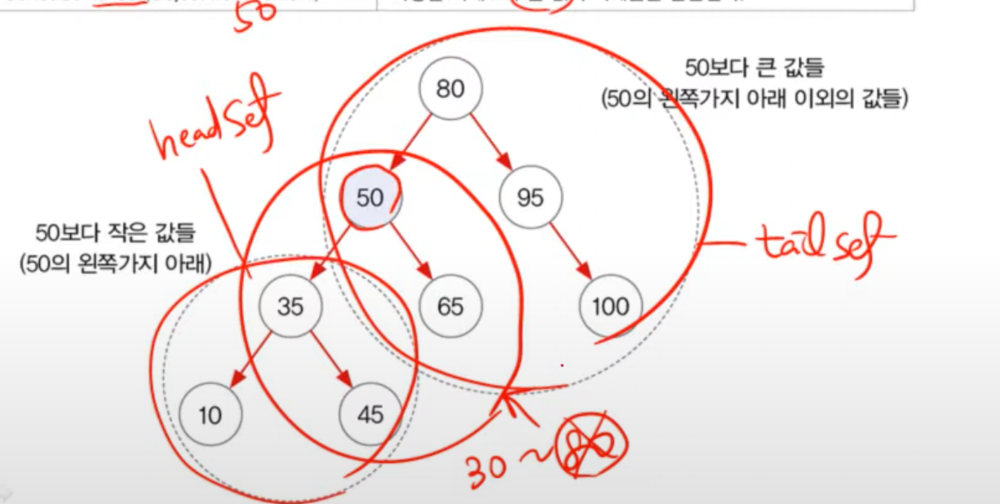

# HashSet & TreeSet

- 순서가 없다.
- 중복된 값이 없다.



## HashSet

- Set인터페이스를 구현한 대표적인 컬렉션 클래스
- 순서를 유지하려면, LinkedHashSet클래스를 사용하면 된다.
- 객체를 저장하기 전에 기존에 같은 객체가 있는지 확인한다.
- 같은 객체가 없으면, 저장하고, 있으면 저장하지 않는다.
- boolean add(Object o)는 저장할 객체의 `equals()`와 `hashCode()` 메소드를 호출한다.따라서 객체의 두 메소드가 오버라이딩 되어있어야 한다.
- jdk 1.8이전에는 String 클래스의 hashCode()메소드르 사용해서 객체의 hashCode() 메소드를 재정의 하였으나,

```java
public int hashCode(){
    return(name+age).hashCode();
}
```

- 1.8 부터는 Object클래스의 hash(인자, 인자2)메소드를 사용할 수 있게 되었다.

```java
public int hashCode(){
    return Object.hash(name,age);
}
```
- Collection은 List를 구현한 자료형만 sort할 수 있다. HashSet을 정렬하고 싶을 때는, LinkedHashSet으로 변경하여 sort하도록 한다.
- iterator를 사용해서 값을 꺼내올때, HashSet은 순서는 없지만, 일정한 순서를 가진상태로 값이 꺼지게 된다. 따라서 랜덤하게 값이 꺼내지도록 하려면 LinkedHashSet을 사용하도록 하자.

### hashCode()오버라이딩 조건

1. 동일 객체에 대해 hashCode()를 여러번 호출해도 같은 값을 반환해야한다.
2. equals()로 비교해서 true를 얻은 두 객체의 hashCode()값을 일치해야한다.

> equals()로 비교한 결과가 false인 경우에도 두객체의 hashCode()가 같을 수 있다. 그러나 성능 향상을 위해 가능하면 서로다른 값을 반환하도록 작성하자.


## TreeSet

- 범위 **검색**과 **정렬**에 유리한 컬렉션 클래스


- 범위 검색과 정렬에 유리한 이진 검색(탐색) 트리(Binary Search Tree)로 구현
링크드 리스트처럼 각 요소(node)가 나무(tree) 형태로 연결된 구조
- 이진 트리 : 모든 노드가 최대 두 개의 하위 노드를 갖음(부모-자식 관계)
- 이진 검색 트리 : 부모보다 작은 값을 왼쪽에, 값을 오른쪽에 저장.
- 부모노드가 자식 노트에 대한 참조 값을 가지고 있음.
- 반복적인 비교 후 저장을 하게되므로, HashSet보다 데이터 추가, 삭제에 시간이 더 걸림

- 데이터 저장과정
  - boolean add(Object o) 호출
  - 중복된데이터가 있는지 확인
  - 루트부터 트리를 따라 내려가며 값을 비교한다.
  - 작으면 왼쪽, 크면 오른쪽에 저장
- 주요 생성자
  - 값을 비교할 때 객체에 `comparable()`을 구현한다.
    - 이 경우, `TreeSet()` 생성자로 바로 객체 생성가능
    - 만약, `comparable()`이 구현되어 있지 않다면, `TreeSet(Comparator comp)`생성자를 사용하여 비교 기준이 되는 `Comparator`을 지정해주어야한다.
  > 적어도 둘중 하나는 꼭 지정해주자.
  - TreeSet(Collection c) 주어진 컬렉션을 저장하는 TreeSet()을 생성
```java
class Student implements Comparable {
  String name;
  int score;

  public int compareTo(Object obj) {
//    return 0; //  compareTo가 0을 반환한다는 것은 해당 객체와 동일한 객체가 존재한다는 뜻. 따라서 객체가 저장되지 않는다.
    return 1; //  1이나 -1로 바꾸면 동일객체가 없다는 것이므로, 값이 저장된다.
  }
}
```

- `Comparator`구현

```java
public class TreeSetEx1{
    public main(){
        TreeSet set = new TreeSet(new NameComep());
    }
  }
class NameComp implements Conparator{
    public int compare(Object o1, Object o2){
        return 1;// 내림차순
    }
}
```

### 메소드(오름차순일 경우)
  - Object first() - 최소값 : 맨왼쪽아래, 첫번째 객체
  - Object last() - 최대값 : 맨오른쪽아래, 마지막 객체
  
### 범위 검색시
  - SortedSet subSet(Object fromElement, Object toElement) : 범위 검색의 결과를 반환한다.(from 이상~ to 미만)
  - SortedSet headSet(Object toElement) :  지정된 객체보다 작은 값의 객체들을 반환
  - SortedSet tailSet(Object fromElement) : 지정된 객체보다 큰 값의 객체들을 반환



### 트리 순회
- 이진 트리의 모든 노드를 한번 씩 읽는 것을 트리 순회라고 함.
  - 전위(부모, 왼쪽, 오른쪽)
  - 중위(왼쪽, 부모, 오른쪽) : 중위순회하면 오름차순으로 정렬된다.
  - 후위(왼쪽, 오른쪽, 부모)