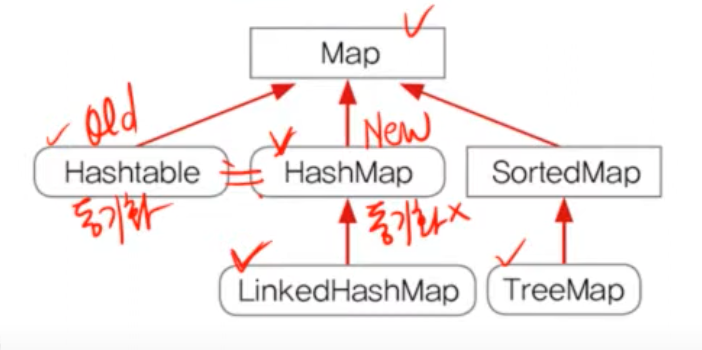

## Map

- 순서가 없다.
- 키는 중복되지 않으나, 값은 중복 가능하다.




# HashMap
- Map인터페이스를 구현한 대표적인 컬렉션 클래스
- HashMap(동기화X)은 HashTable((동기화O))의 신버전
- capacity : 16
- 순서를 유지하려면,LinkedHashMap클래스를 사용하면 된다.

- `hashing`기법으로 데이터를 저장. 데이터가 많아도 검색이 빠르다.
- Map인터페이스를 구현, 데이터를 키와 값의 쌍으로 저장.
- Set은 데이터가 저장된 순서가 유지되나, Map은 유지되지 않는다.
- 데이터를 저장하는 Entry라는 클래스가 있다.(객체 지향적)

```java  
public class HashMap extends AbstractMap  
implements Map, Colneable, Serailizable {  
	transient Entry[] table;  
	...  
	  
	static class Entry implements Map.Entry {  
	final Object key;  
	Object value;  
	...  
	}  
}  
```  
### 주요 메서드

- HashMap() : HashMap 객체를 생성
- HashMap(int initialCapacity) : 지정된 값을 초기용량으로 하는 HashMap 객체를 생성
- HashMap(Map m) : 지정된 Map의 모든 요소를 포함하는 HashMap을 생성(기존 해시맵 복사)

**추가**
- Object put(Object key, Object value) : 지정된 키와 값을 저장
- void putAll(Map m) : Map에 저장된 모든 요소를 HashMap에 저장

**삭제**
- Object remove(Object key) : HashMap에서 지정된 키로 저장된 값(객체를 제거)

**변경**
- Object replace(Object key, Object value) : 지정된 키의 값을 지정된 객체(value)로 대체
- boolean replace(Object key, Object oldVal, Object defaultValue) : 지정된 키와 객체(oldVal)가 모두 일치하는 경우에만 새로운 객체(newVal)로 대체

**검색**
- boolean containsKey(Object key) : HashMap에 지정된 키가 포함되어있는지
- boolean containsValue(Object value) : HashMap에 지정된 값이 포함되어있는지
- Object get(Object key) : 지정된 키(key)의 값(객체)을 반환 못찾으면 null 반환
- Object getOrDefault(Object key, Object defaultValue) : 지정된 키의 값을 반환한다. 키를 못찾으면, 기본값으로 지정된 객체를 반환.

**조회**
- Set entrySet() : HashMap에 저장된 키와 값을 엔트리(키와 값의 결합)의 형태로 Set에 저장해서 반환
- Set keySet() : HashMap에 저장된 모든 키가 저장된 Set을 반환
- Collection values() : HashMap에 저장된 모든 값을 Collection의 형태로 반환, 값은 중복이 있기 때문에 Set이 아님.

## hashing 해싱


- 해시함수로 해시 테이블(데이터를 저장하는 공간)에 데이터를 검색, 저장
- 해시함수가 데이터를 어디에 저장할지, 어디에 저장되어있는지를 알려주니, 성능에 좋다.
- 데이터가 많을 수록, 찾기가 힘듦
- 이진검색->빠르나, 정렬하는데에, 시간이 오래걸린다.
- 해싱에서는 데이터를 저장하거나, 검색할 떄, 해시함수를 호출해야하므로, 데이터를 적을때는 오히려 해싱의. 성능이나, 배열이나, 이진트리보다 적을 수있음.

```java
public class Collection {  

public static void main(String[] args) {  
	HashMap hashMap = new HashMap();  
	hashMap.put("myId", "1234");  
	hashMap.put("yourId", "456");  
	// hashMap.put("yourId", "1234");  
	  
	Set set = hashMap.keySet();  
	System.out.println(set);  
	System.out.println(hashMap.values());  
	System.out.println(hashMap.get("yourId"));  
	  
	// hashMap.remove("yourId");  
	System.out.println(hashMap.get("yourId"));  
	System.out.println(hashMap.getOrDefault("yourId", "N/A"));  
	Set set1 = hashMap.entrySet();  
	Iterator iterator = set1.iterator();  
	System.out.println("===========");  
	while (iterator.hasNext()) {  
		Map.Entry e = (Map.Entry) iterator.next();  
		System.out.println(e.getKey());  
		System.out.println(e.getValue());  
	}      	
}
```

# HashTable

- 배열과 링크드 리스트가 조합된 형태
- capacity : 11
- 해시테이블에 저장된 데이터를 가져오는과정
1. 키로 해시함수를 호출해서 해시코드를 얻는다.
2. 해시코드(해시함수의 반환값)에 대응하는 링크드리스트를 배열에서 찾는다.
3. 링크드리스트에서 키와 일치하는 데이터를 찾는다.
> 해시함수는 같은 키에 대해. 항상 같은 해시코드를 반환해야한다.
> 서로 다른 키일지라도 같은 값의 해시코드를 반환할 수도 있으나, 가능하면 같은 코드를 반환하지 않게 하는것이 중요하다.
> 연결리스트가 길어져 성능이 저하될 수 있기 떄문
>


# TreeMap(TreeSet을 이용해 구현)
- **정렬**과 **범위 검색**에 유리한 컬렉션 클래스
- 이진 검색 트리의 구조로 키와 값의 쌍으로 이루어진 데이터를 저장
- TreeSet처럼 데이터를 정렬해서 저장하기 때문에 저장하는데 소요되는 시간이 길다.
  (TreeSet은 TreeMap을 이용해서 구현되어 있다.)
- **다수의 데이터**에서 **개별적인 검색**은 TreeMap보다 HashMap이 빠르다.
- HashMap보다 **데이터 추가, 삭제**에 시간이 더 걸림
- Map이 필요할 주로 HashMap을 사용하고, 정렬이나 범위검색이 필요한 경우에 TreeMap을 사용
- 값을 통한 정렬시에는 생성자에 comparator 적용
```java

Iterator it = map.entrySet().interator();
// 순회
while (it.hasNext()) {  
Map.Entry e = (Map.Entry) it.next();  
System.out.println(e.getKey());  
int value = ((Integer) e.getValue()).intValue();
}

// map을 ArrayList로 변환한다음에 Collections.sort로 정렬
Set set = map.entrySet();
List list = new Arraylist(set);

Collections.sort(list,new ValueComparator());

it = list.iterator();


// 내림차순 정렬시 
static class ValueComparator implements Comparator{
	 public int compare(Object o1, Object o2) {
		 if(o1 instanceof Map.Entry && o2 instanceof Map.Entry){
			 Map.Entry e1 = (Map.Entry) o1;
			 Map.Entry e2 = (Map.Entry) o2;
			 
			int v1 = ((Integer) e1.getValue()).intValue();
			int v2 = ((Integer) e2.getValue()).intValue();
			
			return v2 - v1;
		 }
		 return -1;
	 }
}
```
