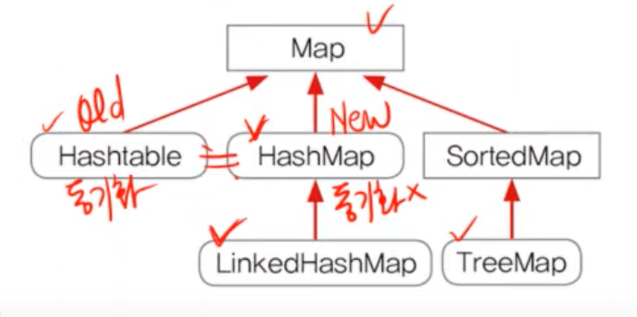

## Map

- 순서가 없다.
- 키는 중복되지 않으나, 값은 중복 가능하다.



# HashTable

# HashMap
- Map인터페이스를 구현한 대표적인 컬렉션 클래스
- HashMap(동기화X)은 HashTable((동기화O))의 신버전
- 순서를 유지하려면,LinkedHashMap클래스를 사용하면 된다.

- hashing기법으로 데이터를 저장. 데이터가 많아도 검색이 빠르다.
- Map인터페이스를 구현, 데이터를 키와 값의 쌍으로 저장.
- Set은 데이터가 저장된 순서가 유지되나, Map은 유지되지 않는다.
- 데이터를 저장하는 Entry라는 클래스가 있다.(객체 지향적)

```java
public class HashMap extends AbstractMap 
        implements Map, Colneable, Serailizable {
    transient Entry[] table;
    ...

    static class Entry implements Map.Entry {
        final Object key;
        Object value;
        ...
    }
}
```
### 주요 메서드

- HashMap() : HashMap 객체를 생성
- HashMap(int initialCapacity) : 지정된 값을 초기용량으로 하는 HashMap 객체를 생성
- HashMap(Map m) : 지정된 Map의 모든 요소를 포함하는 HashMap을 생성(기존 해시맵 복사)
**추가**
- Object put(Object key, Object value) : 지정된 키와 값을 저장
- void putAll(Map m) : Map에 저장된 모든 요소를 HashMap에 저장
**삭제**
- Object remove(Object key) : HashMap에서 지정된 키로 저장된 값(객체를 제거)
**변경**
- Object replace(Object key, Object value) : 지정된 키의 값을 지정된 객체(value)로 대체
- boolean replace(Object key, Object oldVal, Object defaultValue) : 지정된 키와 객체(oldVal)가 모두 일치하는 경우에만 새로운 객체(newVal)로 대체
**검색**
- boolean containsKey(Object key) : HashMap에 지정된 키가 포함되어있는지
- boolean containsValue(Object value) : HashMap에 지정된 값이 포함되어있는지
- Object get(Object key) : 지정된 키(key)의 값(객체)을 반환 못찾으면 null 반환
- Object getOrDefault(Object key, Object defaultValue) : 지정된 키의 값을 반환한다. 키를 못찾으면, 기본값으로 지정된 객체를 반환.
**조회**
- Set entrySet() : HashMap에 저장된 키와 값을 엔트리(키와 값의 결합)의 형태로 Set에 저장해서 반환
- Set keySet() : HashMap에 저장된 모든 키가 저장된 Set을 반환
- Collection values() : HashMap에 저장된 모든 값을 Collection의 형태로 반환, 값은 중복이 있기 때문에 Set이 아님.


# TreeMap(TreeSet을 이용해 구현)
- 정렬과 범위 검색에 유리한 컬렉션 클래스
- HashMap보다 데이터 추가, 삭제에 시간이 더 걸림