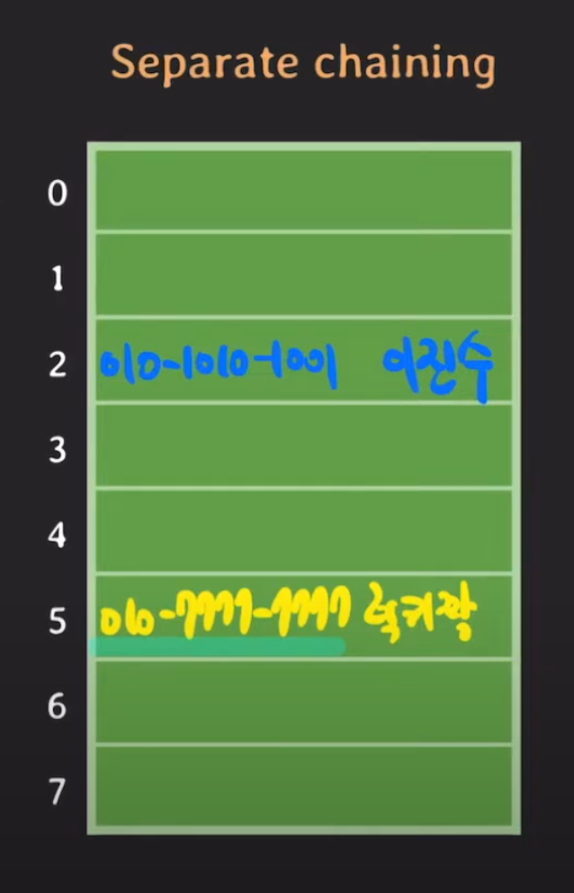
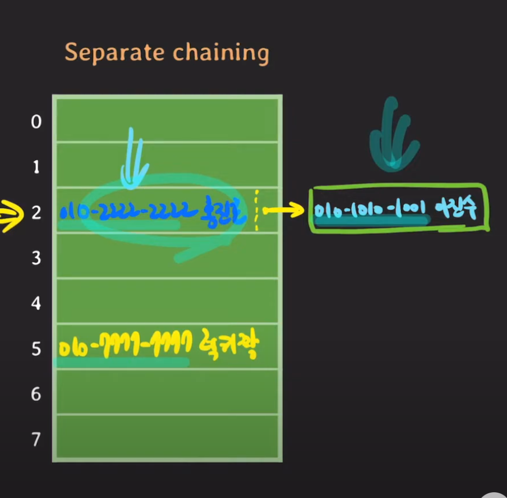
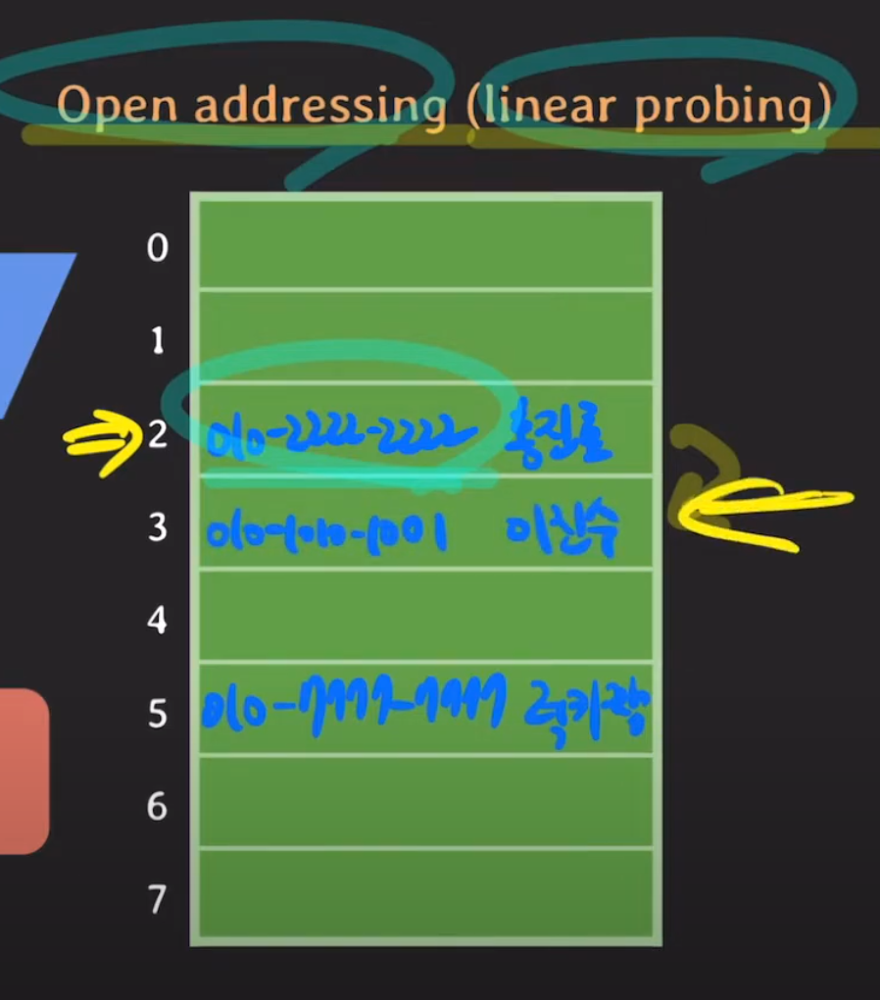

## 해시충돌이란?
1. key는 다른데, hash가 같을때
2. key도 hash도 다른데, `hash % map_capa` 결과가 같을때

## 해시 충돌 알고리즘
### 1. Separate chaining 체이닝
- 해시 충돌이 발생하면, 해당 해시코드의 저장 장소와 추가 노드를 연결하여, 연결 리스트를 만든다.
- Java에서 기본적으로 제공하는 해시 맵 구현체들인 `HashMap`, `HashSet`, `ConcurrentHashMap`은 체이닝 방식을 사용하여 해시 충돌을 해결합니다.
-  즉, 해시 충돌이 발생한 경우 해당 버킷에 연결 리스트를 사용하여 충돌된 요소들을 저장합니다





## 2. Open addressing 개방주소법
- 충돌이 발생하면 다른 빈 버킷을 찾아 요소를 저장하는 방법입니다.
- 선형 탐사(Linear Probing), 이차 탐사(Quadratic Probing), 이중 해싱(Double Hashing) 등의 방법이 사용될 수 있습니다.
- 이 방법은 `IdentityHashMap` 등 일부 자바 컬렉션에서 사용됩니다.
  
### Linear probing
- 해시코드가 같고, 키를 비교해서 키가 다르다고 하면, 바로 그 다음 공간을 찾아서 비어있으면, 저장을 한다.
- 삭제 시에는 더미데이터를 넣어주어야 해시충돌나서 다음 버킷에 저장하였던 값을 조회할 때, 잘 가져올 수 있다.

## 3. 최적화된 hash 함수의 개선
- 효과적인 해시 함수를 사용하여 충돌 가능성을 최소화할 수 있습니다.
- Java 8 이후의 버전에서는 `HashMap` 및 `HashSet`과 같은 해시 기반 컬렉션에 대한 기본 해시 함수가 개선되어 충돌을 줄이는 노력이 이루어졌습니다.
- `HashMap` 클래스에서 사용되는 해시 함수 코드
  ```java
  static final int hash(Object key) { 
      int h; 
      return (key == null) ? 0 : (h = key.hashCode()) ^ (h >>> 16); 
  }
  ```
1. 키가 null인지 확인하고 null인 경우 해시 코드를 0으로 설정합니다.
2. 키의 `hashCode()` 메서드를 호출하여 초기 해시 코드를 얻습니다.
3. XOR 비트 연산자(^)를 사용하여 초기 해시 코드의 상위 16비트와 하위 16비트를 혼합합니다.

## 4. 재해시
- 해시 테이블의 크기를 동적으로 조절하여 충돌을 최소화할 수 있습니다.
- 일반적으로 해시 테이블이 일정 수준 이상으로 채워지면 크기를 확장하고 모든 요소를 새로운 해시 테이블에 다시 배치합니다.
- 자바의 HashMap(16) 및 HashSet(16)는 내부적으로 기본적으로 75%만큼 차게되면 재해시를 수행하여 해시 충돌을 최소화합니다.


## String 생성시, 충돌을 날수밖에 없는 구조인데 어떻게 해결했을까?

JVM의 문자열 상수풀(String Pool)은 일반적으로 해시 테이블(Hash Table)을 사용하여 구현됩니다.
이 해시 테이블은 `문자열`을 `키(key)`로 사용하고, 각 문자열에 해당하는 `값(value)`으로는 해당 `문자열의 인스턴스가 저장된 메모리 주소`가 저장됩니다.

**객체의 동일성을 기반으로 키를 관리**하는  identityHashCode() 를 사용하여, 해시충돌을 해결해였다.


```java
public class StringPoolExample {
    public static void main(String[] args) {
        // 문자열 상수풀에 문자열을 추가합니다. 
        String str1 = "Hello";
        String str2 = "Hello";
        String str3 = new String("Hello"); // 새로운 인스턴스를 생성합니다. 

        // 동일한 문자열 리터럴을 사용한 경우, 같은 인스턴스를 참조합니다. 
        System.out.println("str1 == str2: " + (str1 == str2)); // true 
        // 새로운 문자열 인스턴스를 생성했으므로, 다른 인스턴스를 참조합니다. 
        System.out.println("str1 == str3: " + (str1 == str3)); // false 

        // 문자열 상수풀에 문자열을 추가합니다. 
        String str4 = "World";
        String str5 = "World";

        // 다른 문자열 리터럴을 사용한 경우에도, 같은 인스턴스를 참조합니다. 
        System.out.println("str4 == str5: " + (str4 == str5)); // true 

        // 문자열 인스턴스가 저장된 메모리 주소 출력 
        System.out.println("str1의 메모리 주소: " + System.identityHashCode(str1));
        System.out.println("str2의 메모리 주소: " + System.identityHashCode(str2));
        System.out.println("str3의 메모리 주소: " + System.identityHashCode(str3));
        System.out.println("str4의 메모리 주소: " + System.identityHashCode(str4));
        System.out.println("str5의 메모리 주소: " + System.identityHashCode(str5));
    }
}
```

해시 테이블은 문자열의 해시 코드를 기반으로 특정 슬롯에 문자열을 저장하고 검색하는 데 사용됩니다. 해시 함수를 통해 문자열의 해시 코드를 생성하고, 이 코드를 기반으로 테이블 내에서 해당 문자열을 빠르게 검색할 수 있습니다.

Java의 문자열 상수풀은 문자열의 중복을 허용하지 않으며, 동일한 내용의 문자열 리터럴은 동일한 인스턴스를 참조하도록 보장됩니다.

>**이를 가능하게 하는 것이 바로 해시 테이블을 이용한 문자열 상수풀의 구현입니다.**

즉, 문자열이 이미 상수풀에 존재하는지를 검사하여 이미 존재하는 경우에는 해당 인스턴스를 반환하고, 존재하지 않는 경우에는 새로운 문자열 인스턴스를 생성하여 상수풀에 추가합니다.

이러한 구현은 문자열의 고유성을 보장하면서도 메모리를 효율적으로 관리할 수 있도록 도와줍니다. 해시 테이블은 문자열 상수풀에 대한 `빠른 검색` 및 `삽입`을 지원하므로, 자바 프로그램이 빠른 속도로 문자열을 상수풀에 저장하고 검색할 수 있습니다.