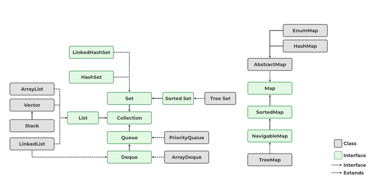

# Collection

- `목록성` 데이터를 처리하는 `자료구조`를 통칭
- `자료 구조`(Data Structure)
    - 어떤 정보를 담는 것을 의미
        - 하나의 데이터가 아닌 여러 데이터를 담을 때 사용
    - 분류
        - 순서가 있는 목록 List 형 - Collection 인터페이스를 구현
        - 순서가 중요하지 않은 셋 Set 형 - Collection 인터페이스를 구현
        - 먼저 들어온 것이 먼저 나가는 큐 Queue 형 - Collection 인터페이스를 구현
        - 키-값으로 저장되는 맵 Map 형


- 배열은 그 크기가 정해져 있을 때 유용하지만, 담으려는 데이터의 크기가 얼마나 되는지 모르는 경우에는 사용에 어려움이 있다.

## java.util.Collection



- 여러 개의 객체를 하나의 객체 에 담아 처리할 때 공통적으로 사용되는 여러 메소드들을 선언해 놓았다.
- 이 목록에서 유일하게 맵만이 `Collection`과 관련 없는 별도의 인터페이스로 선언되어 있다.

> **Collection 인터페이스의 선언**
>
>- `public interface Collection<E> extends Iterable<E>`
>

- Collection 인터페이스 선언문에서 특이한 것은 Iterable<E>이라는 인터페이스를 확장(extends) 했다는 점이다.

> - Iterable 인터페이스에 선언되어 있는 메소드는 단지 하나, `Iterators<T> iterator()`
>- `Iterator`라는 인터페이스에는 추가 데이터가 있는지 확인하는 `hasNext()` 메소드, 현재 위치를 다음 요소로 넘기고 그 값을 리턴해주는 `next()`라는 메소드, 데이터를
   삭제하는 `remove()` 메소드가 있다.

> 결론적으로, `Collection` 인터페이스가 `Iterable` 인터페이스를 확장했다는 의미는,
> - `Iterator` 인터페이스를 사용하여 `데이터를 순차적으로 `가져올 수(get)` 있다`는 의미이다.

### Collection 인터페이스에 선언된 주요 메소드들

| 리턴타입     | 메소드 이름 및 매개변수           | 설명                                                                                   |
|----------|-------------------------|--------------------------------------------------------------------------------------|
| boolean  | add(E e)                | 요소를 추가한다.                                                                            |
| boolean  | addAll(Collection)      | 매개 변수로 넘어온 컬렉션의 모든 요소를 추가한다.                                                         |
| void     | clear()                 | 컬렉션에 있는 모든 요소 데이터를 지운다.                                                              |
| boolean  | contains(Object)        | 매개 변수로 넘어온 객체가 해당 컬렉션에 있는지 확인한다. 동일한 값이 있으면 true를 리턴한다.                              |
| boolean  | containsAll(Collection) | 매개 변수로 넘어온 객체들이 해당 컬렉션에 있는지 확인한다. 매개 변수로 넘어온 컬렉션에 있는 요소들과 동일한 값들이 모두 있으면 true를 리턴한다. |
| boolean  | equals(Object)          | 매개 변수로 넘어온 객체와 같은 객체인지 확인한다.                                                         |
| int      | hashCode()              | 해시 코드값을 리턴한다.                                                                        |
| boolean  | isEmpty()               | 컬렉션이 비어있는지 확인한다. 비어있으면 true를 리턴한다.                                                   |
| Iterator | iterator()              | 데이터를 한 건씩 처리하기 위한 Iterator 객체를 리턴한다.                                                 |
| boolean  | remove(Object)          | 매개 변수와 동일한 객체를 삭제한다.                                                                 |
| boolean  | removeAll(Collection)   | 매개 변수로 넘어온 객체들을 해당 컬렉션에서 삭제한다.                                                       |
| boolean  | retainAll(Collection)   | 매개 변수로 넘어온 객체들만을 컬렉션에 남겨둔다.                                                          |
| int      | size()                  | 요소의 개수를 리턴한다.                                                                        |
| Object[] | toArray()               | 컬렉션에 있는 데이터들을 배열로 복사한다.                                                              |
| <T> T[]  | toArray(T[])            | 컬렉션에 있는 데이터들을 지정한 타입의 배열로 복사한다.                                                      |

---

## List 인터페이스와 구현 클래스들

- List 인터페이스는 `Collection` 인터페이스를 확장함.
- 몇몇 추가된 메소드를 제외하고는 Collection에 선언된 메소드와 큰 차이는 없다.
- Collection을 확장한 다른 인터페이스와 List 인터페이스의 가장 큰 차이점은 배열처럼 `순서`가 있다는 것이다.
- List 인터페이스를 구현한 클래스들
    - 다수가 있으나, java.util 패키지에서는 `ArrayList`, `Vector`, `Stack`, `LinkedList`를 많이 사용
- `ArrayList`와 `Vector` 클래스의 사용법은 거의 동일하고 기능도 거의 비슷, 확장 가능한 배열
    - `Vector` : JDK 1.0 ~, `Tread Safe`
    - `ArrayList` : JDK 1.2 ~

- `Stack`
    - `Vector` 클래스를 `확장`하여 만듦
    - `LIFO`(Last In First Out)을 지원

- `LinkedList`
- `목록`에도 속하지만, `큐`에도 속한다.

---

## `ArrayList`에 대해 알아보자

- ArrayList 클래스의 `상속관계`

 ```java
java.lang.Object
    L java.util.AbstractCollection<E>
        L java.util.AbstractList<E>
            L java.util.Arraylist<E>
 ```

1. 가장 상위 부모는 Object 클래스
2. 그 다음에는 Abstract Collection
3. AbstractList의 순으로 확장

### ArrayList가 구현한 모든 인터페이스

- Serializable, Cloneable, Iterable‹E>, Collection‹E›, List<E>, RandomAccess

| 인터페이스         | 용도                                                               |
|---------------|------------------------------------------------------------------|
| Serializable  | 원격으로 객체를 전송하거나, 파일에 저장할 수 있음을 지정                                 |   
| Cloneable     | Object 클래스의 clone() 메소드가 제대로 수행될 수 있음을 지정. 즉, 복제가 가능한 객체임을 의미한다. |
| Iterable<E>   | 객체가 `foreach` 문장을 사용할 수 있음을 지정                                   |
| Collection<E> | 여러 개의 객체를 하나의 객체에 담아 처리할 때의 메소드 지정                               |
| List<E>       | 목록형 데이터를 처리하는 것과 관련된 메소드 지정                                      |
| RandomAccess  | 목록형 데이터에 보다 빠르게 접근할 수 있도록 임의로 (random하게) 접근하는 알고리즘이 적용된다는 것을 지정  |

### ArrayList의 생성자는 3개

- 배열처럼 사용하지만 대괄호는 사용하지 않고, 메소드를 통해서 객체를 넣고, 빼고, 조회한다.

| 생성자                                  | 설명                                                           |
|--------------------------------------|--------------------------------------------------------------|
| ArrayList ()                         | 객체를 저장할 공간이 `10개`인 ArrayList를 만든다.                           | 
| ArrayList(Collection‹? extends E> c) | `매개 변수로 넘어온 컬렉션 객체`가 `저장`되어 있는 ArrayList를 만든다.               | 
| ArrayList (int initialCapacity)      | `매개 변수로 넘어온 initialCapaity 개수만큼`의 `저장공간`을 갖는 ArrayList를 만든다. |

- 여러 종류를 하나의 객체를 담는 경우
    - 되도록 DTO라는 객체를 하나 만들어서 담는 것이 좋다.

```java
package d.collection;

import java.util.ArrayList;

public class ListSample {
    public static void main(String[] args) {
        ListSample sample = new ListSample();
        sample.checkArrayList1();
    }

    public void checkArraylist1() {
        ArrayList list1 = new ArrayList(); // 대부분 서로 다른 종류의 객체를 넣는 경우
        list1.add(new Object());
        list1.add("ArrayListSample");
        list1.add(new Double(1));
    }
}
```

- 보통은 한 가지 종류의 객체만 저장
    - String만 담는 ArrayList를 생성할 때에는 다음과 같이 사용.

> ArrayList<String> list1 = new ArrayList<String>();

- `JDK 7`부터는 생성자를 호출하는 부분(`new` 뒤에 있는 부분)에 따로 타입을 적지 않고 `<>로만 사용`해도 된다.

> ArrayList<String> list1 = new ArrayList<>();

- 제네렉을 사용하면, String 타입 이외의 타입을 가진 객체들을 저장시키려고 할때 컴파일시 에러가 발생한다.
- 제네릭을 사용하지 않으면, 실행시 오류가 나게된다.

```java
package d.collection;

import java.util.ArrayList;

public class ListSample {
    public static void main(String[] args) {
        ListSample sample = new ListSample();
        sample.checkArrayList1();
    }

    public void checkArraylist1() {
        ArrayList<String> list1 = new ArrayList<>();
        list1.add(new Object());
        list1.add("ArrayListSample");
        list1.add(new Double(1));
    }
}
```

### ArrayList 객체 선언시 성능상의 문제

- ArrayList 객체를 선언할 때 매개 변수를 넣지 않으면, 초기 크기는 10이다.
- 하지만, 10개 이상의 데이터가 들어가면 크기를 늘이는 작업이 ArrayList 내부에서 자동으로 수행되는데, 이는 곧 애플리케이션의 성능에 까지 영향을 주게 된다.
- 따라서, 만약 저장되는 데이터의 크기가 어느 정도 예측 가능하다면 `예측한 초기 크기를 지정`할 것을 권장한다.

> ArrayList<String> list2 = new ArrayList<String>(100);

### ArrayList에 데이터 담기

| 리턴 타입   | 메소드 이름 및 매개 변수                               | 설명                                      |
|---------|----------------------------------------------|-----------------------------------------|
| boolean | add(E e)                                     | 매개변수로 넘어온 데이터를 가장 끝에 담는다.               |
| void    | add(int index, E e)                          | 매개변수로 넘어온 데이터를 지정된 index 위치에 담는다.       |
| boolean | addAll(Collection<? extends E> c)            | 매개변수로 넘어온 컬렉션 데이터를 가장 끝에 담는다.           |
| boolean | addAll(int index, Collection<? extends E> c) | 매개변수로 넘어온 컬렉션 데이터를 index에 지정된 위치부터 담는다. |

> ### Shallow copy와 Deep copy
> `Shallow copy`
> - list2 = 11st와 같이 다른 객체에 원본 `객체의 주소 값만을 할당`하는 것
>
> `Deep copy`
> - 객체의 `모든 값을 복사`하여 `복제된 객체에 있는 값을 변경해도` `원본에 영향이 없도록` 할 때 수행
> - 예를 들어 배열을 복사할 때 System 클래스에 있는 arraycopy()와 같은 메소드를 이용하면 Deep copy를 쉽게 처리할 수 있다.
>
> **따라서, 하나의 `Collection` 관련 객체를 복사할 일이 있을 때에는 이와 같이 생성자를 사용하거나, `addAll()` 메소드를 사용할 것을 권장한다.**

### ArrayList에 데이터 꺼내기

| 리턴 타입    | 메소드 이름 및 매개 변수  | 설명                                                                      |   
|----------|-----------------------|-------------------------------------------------------------------------|
| int      | size()                | ArrayList 객체에 들어가 있는 데이터의 개수를 리턴한다.                                     |
| E        | get(int index)        | 매개변수에 지정한 위치에 있는 데이터를 리턴한다.                                             |
| int      | indexOf(Object o)     | 매개변수로 넘어온 객체와 동일한 데이터의 위치를 리턴한다.                                        |
| int      | lastIndexOf(Object o) | 매개변수로 넘어온 객체와 동일한 마지막 데이터의 위치를 리턴한다.                                    |
| Object[] | toArray()             | `비추천`, ArrayList 객체에 있는 값들을 Object[] 타입의 배열로 만든다. |
| <T> T[]  | toArray (T[] a)       | ⭐️`추천`, ArrayList 객체에 있는 값들을 `매개변수로 넘어온 T 타입의 배열`로 만든다.                 |


```java
public void checkArrayList6() {
    ArrayList<String> list = new ArrayList<String>();
    list.add("A");
    String[] strlist=list.toArray(new String[0]);
    System.out.println(strList[0]);
}
```
- `new String[0]` 매개변수 객체 배열의 크기를 `0`으로 정한 이유
  - 매개 변수로 넘기는 배열은 그냥 타입만을 지정하기 위해서 사용할 수 있다. 
  - 그러나 실제로는 매개 변수로 넘긴 객체에 값들을 담아주게 된다.
  - 하지만, `매개 변수로 배열 객체의 크기`가 `ArrayList 객체의 데이터크기` 보다 작을 경우
    - 매개 변수로 배열의 모든 값이 `null`로 채워진다.
    - 큰경우는 빈공간만큼 `null`로 채워진다.


### ArrayList에 있는 데이터 삭제
| 리턴 타입 | 메소드 이름 및 매개 변수             | 설명                                            |
|---------|----------------------------|-----------------------------------------------|
| void    | clear()                    | 모든 데이터를 삭제한다.                                 |
| E       | remove(int index)          | 매개 변수에서 지정한 위치에 있는 데이터를 삭제 하고, 삭제한 데이터를 리턴한다. |
| boolean | remove(Object o)           | 매개 변수에 넘어온 객체와 동일한 첫번째 데이터를 삭제한다.            |
| boolean | removeAll(Collection<?> c) | 매개 변수로 넘어온 컬렉션 객체에 있는 데이터와 동일한 `모든` 데이터를 삭제한다.  |

- `숫자`가 들어있는 `ArrayList`인 경우 `new Integer(1)`와 같은 방법으로 `Object`를 생성하여 매개변수로 넘겨준다. 


- `removeAll`의 예
```java
public void checkArraylist8() {
    ArrayList<String> list = new Arraylist<String>();
    list.add("A");
    list.add("B");
    list.add("C");
    list.add("A");
    
    // System.out.println("Removed " + list.remove(0));
    // System.out.println(list.remove("A"));
        
    ArrayList<String> temp = new ArrayList<String>();
    temp.add("A");
    list.removeAll(temp);
    for(int loop=0; loop<list.size; loop++){
        System.out.println("list.get(" + loop + ")=" + list.get(loop));
    }
}
```

- 출력 결과
```shell
list.get(0)=B 
l1st.get(1)=C
```
 

### ArrayList 객체에 있는 값 변경
| 리턴 타입 | 메소드 이름 및 매개 변수              | 설명                                                                  |
|-------|-----------------------------|---------------------------------------------------------------------|
| E     | set (int index, E element)  | 지정한 위치에 있는 데이터를 두 번째 매개 변수로 넘긴 값으로 변경한다. 그리고, 해당 위치에 있던 데이터를 리턴한다.  |

- `remove()` + `add()` 두단계를 한번에 끝낼 수 있음.

### `trimTosize()`

- ArrayList 객체 공간의 크기를 데이터의 개수만큼으로 변경
- 즉, String 클래스의 trim() 메소드가 앞 뒤의 공백을 없애는 것처럼, 이 메소드를 사용하면, 저장할 수 있는 공간은 만들어 두었지만, 데이터가 저장되어 있지 않을 때 해당 공간을 없애버린다.
- 사용 예 : AarrayList의 객체를 원격으로 전송하거나, 파일로 저장하는 일이 있을 때 이 메소드를 한 번 호출함으로써, 데이터의 크기를 줄일 수 있다는 장점이 있다.

>###  ArrayList를 여러 쓰레드에서 사용해도 안전(Tread Safe)하게 만들기
> ```java
> List list = Collections.synchronizedList(new ArrayList<>()); 
> ```

---

## `Vector`
- Tread safe 한 잠점이 있다.
- ArrayList와 메소드가 약간 상이하다.

--

## Stack

- `Tread safe` 한 잠점이 있다.
- 속도가 `ArrayDeque` 보다 느리나, `ArrayDeque`는 `Not Tread Safe`  
- `LIFO` 기능을 구현하려고 할 때 필요한 클래스

- `Stack` 클래스의 `상속관계`

```shell
java.lang.Object
  Ljava.util.AbstractCollection<E>
    Ljava.util.AbstractList<E>
      Ljava.util.Vector<E>
        Ljava.util.Stack<E>
```

1. 가장 상위 부모는 Object 클래스
2. 그 다음에는 Abstract Collection
3. AbstractList의 순으로 확장
4. ArrayList와 다르게 Stack 클래스의 `부모 클래스`는 `Vector`

>`Stack` 클래스는 자바에서 상속을 잘못 받은 클래스다. 
>이 클래스가 `JDK 1.0`부터 존재했기 때문에 원래의 취지인 `LIFO`를 생각한다면 `Vector`에 속해서는 안 된다.
>하지만, 자바의 하위 호환성을 위해서 이 상속관계를 계속 유지하고 있다고 생각하면 된다.

### `Stack` 생성자

| 생성자     | 설명                         |
|---------|----------------------------|
| Stack() | 아무 데이터도 없는 Stack 객체를 만든다.  |


### `Stack`의 메소드
| 리턴 타입 | 메소드 이름 및 매개 변수   | 설명                           |
|---------|------------------|------------------------------|
| boolean | empty()          | 객체가 비어있는지를 확인한다.             |
| E       | peek()           | 객체의 가장 위에 있는 데이터를 리턴한다.      |
| E       | pop()            | 객체의 가장 위에 있는 데이터를 지우고, 리턴한다. |
| E       | push(E item)     | 매개 변수로 넘어온 데이터를 가장 위에 저장한다.  |
| int     | search(Object o) | 매개 변수로 넘어온 데이터의 위치를 리턴한다.    |

```java
public void checkPop() {
    Stack<Integer> intStack = new Stack<Integer>();
    for (int loop=0; loop<5; loop++){
        intStack.push(loop);
        System.out.println(intStack.pop());
    }
    System.out.println("size= " +intStack size());
}
```


 
