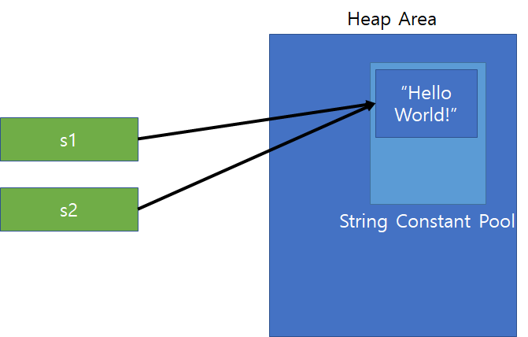

# Constant pool

## `String hello = new String(”hello”)와 String hello = "hello"` 의 차이

```java
public class StringTest {

    public static void main(String[] args) {
        String s1 = "Hello World!";
        String s2 = new String("Hello World!");

        System.out.println(s1);
        System.out.println(s2);
    }

}
```

- 결과

```shell
Hello World!
Hello World!
```

위 코드에서 s1과 s2를 다른 방식으로 초기화 시켰다. 초기화 방법을 다르게 한다고 해서 결과값이 다르지는 않다는 것을 알 수 있다. 그렇다면 저 코드는 완벽히 동일하다고 할 수 있을까?

먼저 이 두 코드의 차이점을 이해하기 위해서는 Heap Area와 그 안에 존재하는 String Constant Pool에 대해 알고 넘어갈 필요가 있다. 아래 그림을 통해 알아보도록 하자.

- 먼저 `Heap Area`에는 문자열 객체 뿐만아니라 `모든 객체들이 생성`되는 메모리 공간이다. 
- 그리고 그 메모리 공간의 `일부`는 `String Constant Pool`이라고 불리는 `문자열 상수`가 저장되는 메모리 공간이 존재한다.

- 문자열을 읽는 전용으로 사용한다면, String Constant Pool에 선언하는 것이 더 유용
- 같은 문자열이라도 각각을 따로 다룰 필요가 있다면 그 문자열은 Heap Area에 선언하는 것이 바람직


<br>


### `String s1 = "Hello World!";`
```java
public class StringTest {

	public static void main(String[] args) {
		String s1 = "Hello World!";
		String s2 = "Hello World!";
		
		if(s1 == s2)
			System.out.println("참조하는 값이 같습니다.");
		else
			System.out.println("참조하는 값이 다릅니다.");
	}

}
```
- 결과

```shell
참조하는 값이 같습니다.
```

- 두 참조변수가 같은 객체를 바라보고 있다.
- 결국 `String s1 = "Hello World"라`는 코드를 실행하게 되면 `String Constant Pool`에 `문자열 상수가 생성`되고, 
- 다음에 s2가 `s1와 같은 문자열 상수로 초기화` 되면 객체를 생성하지 않고 ` String Constant Pool에 이미 존재하는 객체를 참조`하는 형식으로 동작한다.



<br>

### `String s1 = new String("Hello World!");`


```java
public class StringTest {

	public static void main(String[] args) {
		String s1 = new String("Hello World!");
		String s2 = new String("Hello World!");
		
		if(s1 == s2)
			System.out.println("참조하는 값이 같습니다.");
		else
			System.out.println("참조하는 값이 다릅니다.");
	}

}
```

- 결과

```shell
참조하는 값이 다릅니다.
```
- new 연산자로 객체를 생성하여 문자열을 초기화한다면, 초기화할때 Heap Area에 별도의 객체를 생성하여 그 객체를 참조하도록 동작


- 필요한 문자열을 생성해 놓고 읽는 경우에만 사용할경우에는 `String Constant Pool`에 생성하고 사용하는 것이 좋다. 
- 왜냐하면 같은 문자열을 `new` 예약어로 객체를 반복적으로 생성한다면 이것은 메모리의 낭비로 이어질 수 있다.
- 따라서 상황별로 알맞게 객체를 생성해 주는 것이 바람직 하다.

- 동적으로 생성되는 문자열의 경우에는 `String constant pool`에 저장되는 대상이 아니다.
- 즉, ORM, MyBatis등 DB에서 조회해 오는 String, File에서 읽어 들이는 String 등은 string constant pool에 저장되는 대상이 아닙니다. 그러므로 이런 동적인 문자열은 동일한 문자열이어도 동일연산(==)의 결과는 false이므로 문자열 비교는 `동등연산(equals)`을 통해 진행해야 한다.


<br>

### String constant pool은 GC의 대상이 될까? 

#### String constant pool 위치 변경
Java6까지 string constant pool의 위치는 Perm 영역이었다. Perm 영역에 위치하였던 게 Java7에서 Heap 영역으로 변경되었다. 그 이유는 OOM 문제 때문이다.

Perm 영역은 고정된 사이즈고 Runtime에 사이즈가 확장되지 않는다. Perm 영역의 사이즈를 늘릴 수는 있지만 어쨌거나 Runtime에 사이즈가 변경되는 것은 아니다. 

그래서 Java6까지는 String의 intern() 메서드를 호출하는 것은 OutOfMemoryException을 발생시킬 수 있고 그 부분을 컨트롤할 수 없었기 때문에 거의 사용하지 않는 것이 맞다.

그래서 Oracle의 엔지니어들이 Java7에서 Perm 영역이 아닌 Heap 영역으로 string constant pool의 위치를 변경하였다. Heap 영역으로 변경함으로써 얻는 이점이 무엇일까?

바로 string constant pool의 모든 문자열도 GC의 대상이 될 수 있다는 점이다.

string constant pool의 사이즈를 지정할 수 있는데 -xx:StringTableSize 옵션으로 설정할 수 있다. 여기에는 1,000,000와 같은 숫자가 아닌 1,000,003과 같은 소수를 사용해야 한다. 

intern() 메서드를 적극적으로 사용한다면 -xx:StringTableSize의 기본값 (1009) 보다 높게 설정해야 한다. 

그렇지 않으면 Linked List 수준의 성능으로 떨어진다고 한다.