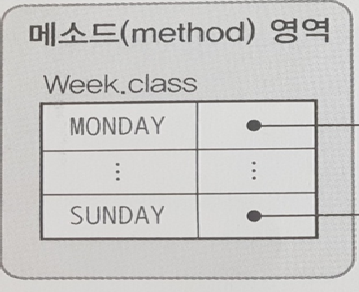
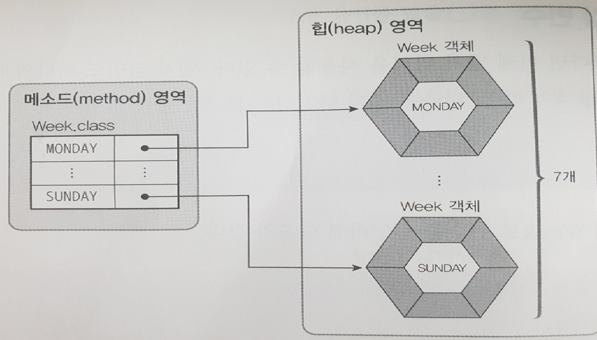
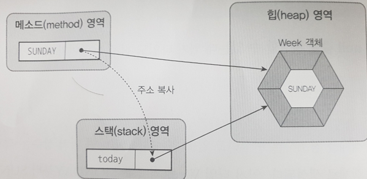

# enum 클래스

- JDK 1.5에서 처음 소개됨.
- `enum`
    - enumeration, 셈, 계산, 열거, 목록, 일람표
- 어떤 클래스가 절대 변하지 않는 값인 상수만을 가지고 있을때, `class`가 아닌 `enum`으로 선언할 수있다.
- enum이라고 선언하면 `상수의 집합`임을 명시적으로 나타낼 수 있다.
- 타입이지만 클래스의 일종, 열거형 클래스라고 불러도 무방

<br>

- 초과근무시 수당에 대한 상수들의 집합.
- 상수들만 있다면 마지막 세미콜론(;)도 필요 없다.

```java
public enum OverTimeValues {
    THREE_HOUR,
    FIVE_HOUR,
    WEEKEND_FOUR_HOUR,
    WEEKEND_EIGHT_HOUR;
}
```

- 값을 전달하는 법

```java
public class OverTimeManager {
    public static void

    public static void main(String[] args) {
        String value = OverTimeValues.THREE_HOUR;
        OverTimeManager overTimeManager = new OverTimeManager();
        overTimeManager.getOverTimeAmount(value);
    }

    public int getOverTimeAmount(OverTimeValues value) {
        int amount = 0;
        System.out.println(value);
        switch (value) {
            case THREE_HOUR:
                amount = 40000;
                break;
            case FIVE_HOUR:
                amount = 30000;
                break;
            case WEEKEND_FOUR_HOUR:
                amount = 40000;
                break;
            case WEEKEND_EIGHT_HOUR:
                amount = 60000;
                break;
        }
    }
}
```

- value라는 변수는 OverTimeValues라는 enum클래스의 객체라고 생각하면 된다.
- 하지만, enum클래스는 생성자를 만들 수 있지만, **생성자를 통하여 객체를 생성할 수는 없다.**

---

## Enum을 보다 제대로 사용하기

```java
public enum OverTimeValues2 {
    THREE_HOUR(18000),
    FIVE_HOUR(30000),
    WEEKEND_FOUR_HOUR(40000),
    WEEKEND_EIGHT_HOUR(60000);

    private final int amount;

    OverTimeValues2(int amount) {
        this.amount = amount;
    }

    public int getAmount() {
        return amount;
    }
}
```

- 상수 아래에 amount라는 변수가 final로 선언되어있다.
- public이나 protected를 생성자에 사용해서는 안된다.
- enum클래스의 생성자 : 아무것도 명시하지 않은 `package-private`, `private`만 접근 제어자로 사용할 수 있다.
- 즉, enum클래스내에서 선언할때만 생성자를 사용가능
- enum클래스는 일반 클래스와 마찬가지로 컴파일할 때 생성자를 자동으로 만든다.

```java
public class OverTimeManager2 {
    public static void

    public static void main(String[] args) {
        OverTimeValues2 values2 = OverTimeValues2.FIVE_HOUR;
        System.out.println(values2);
        System.out.println(values2.getAmount());
    }
}
```

<br>

### Enum클래스를 사용하면 생기는 단점

- 수당이 오르거나 낮아질 경우 자바 프로그램을 수정한 후 다시 컴파일하고 서버를 중지했다가 다시 실행해야한다는 단점이 존재한다.

## enum클래스의 부모는 무조건 java.lang.Enum

- 자바에서 다중 상속은 허용되지 않으나, 여러 단계의 상속을 거쳐 여러 부모 클래스를 가질 수 있다.
- 하지만, enum클래스는 무조건 `java.lang.Enum`이라는 클래스의 상속을 받는다.
- 컴파일러가 알아서 `extends java.lang.Enum`이라는 문장을 추가해서 컴파일한다.
- 따라서 누가 만들어놓은 enum을 `extends`를 이용하여 선언할 수는 없다.

### Enum클래스의 생성자

- 접근제어자 : protected
- 메소드 : Enum(String name, int ordinal)
    - name : 상수
    - ordinal : enum의 순서, 상수가 선언된 순서대로 0부터 증가한다.
- 설명 : 컴파일러에서 자동으로 호출되도록 해놓은 생성자다. 하지만, 개발자가 이 생성자를 호출할 수는 없다.

<br>

### Enum 클래스의 사용가능 메소드

- Enum 클래스의 부모클래스는 Object클래스이기 때문에, Object 클래스의 메소드들은 모두 사용할 수 있으나,
- 4개의 메소드는 `Overriding`하지 못하도록 막아 놓았다.
- clone()과 finalize() 메소드는 사용해서는 안된다.

### Object클래스의 메소드

| 메소드        | 내용                                                                                            |
|------------|-----------------------------------------------------------------------------------------------|
| clone()    | 객체를 복제. enum클래스에서 호출될 경우 CloneNotSupportedException 예외 발생                                     |
| finalize() | GC가 발생할 때 처리하기위한 메소드                                                                          |
| hashCode() | int타입의 해시코드 값을 리턴                                                                             |
| equals()   | 두개의 객체가 동일한지 확인                                                                               |
| toString() | enum변수에 메소드를 호출하면 상수이름이 출력된다. object 클래스 메소드중 유일하게 final로 선언되어 있지 않다. 따라서 Overriding 해도 상관없다. |

### Enum클래스의 메소드

| 메소드                                     | 내용                                                                                                                            |
|-----------------------------------------|-------------------------------------------------------------------------------------------------------------------------------|
| compareTo(E e)                          | 가장 많이 사용하는 메서드. 매개변수로 enum타입과의 순서(ordinal)차이를 리턴. enum이 선언된 순서대로 각 상수들의 순서가 정해짐. 같은 상수라면 0을리턴, 다르다면 순서의 차이를 리턴(앞이면 음수, 뒤면 양수) |
| getDeclaringClass()                     | 클래스 타입의 enum을 리턴                                                                                                              |
| name()                                  | 상수의 이름을 리턴                                                                                                                    |
| ordinal()                               | 상수의 순서를 리턴                                                                                                                    |
| valueOf(Class<T> enumType, String name) | static 메소드. 첫번째 개변수로 클래스 타입의 enum을, 두번째 매개변수로는 상수의 이름을 넘겨주면 된다.                                                               |
| values()                                | 클래스에 선언되어있는 모든 상수를 배열로 리턴                                                                                                     |


## Enum과 메모리 구조
JAVA에서 열거 상수는 상수 각각을 내부적으로 public static final 필드이면서 객체로 제공되도록 합니다. static이 붙어있기 때문에 각각의 상수는 클래스변수로 클래스로더가 로드 시점에 JVM Method영역에 해당 클래스 변수들을 항상 상주시켜 프로그램이 종료되기 전에는 언제든지 가져다 쓸 수 있는 주소공간을 확보합니다.


## Enum과 메모리 초기화
```java
Week today = Week.MONDAY;
```
이제는 사용 부를 살펴보겠습니다. 사용 부에서는 클래스의 인스턴스를 생성하는 것과 비슷하지만, new가 없는 형태입니다.
어떤 클래스에서든 해당 로직을 만나면 Heap영역에 Week 객체는 MONDAY부터 SUNDAY까지 각각 java.lang.Enum클래스를 상속받는 고유의 객체가 만들어지고 Method 영역의 열거상수들은 해당 Heap영역에 생성된 객체를 바라봅니다. 즉 로직을 만나는 순간 이전에 Method에 할당되었던 메모리에 Heap영역에 생긴 객체들이 할당됩니다.



today변수는 JVM Stack영역에서 사용하므로 stack영역의 today는 Method 영역에 있는 MONDAY의 객체의 주소 값을 복사하므로 today와 Week.MONDAY는 Heap에 생성된 같은 객체를 바라봅니다.

이러한 이유로 today == Week.SUNDAY 로직이 같은 객체를 반환하므로 true가 성립됩니다. 같은 이유로 아래 코드가 true가 나와도 이해가 됩니다.

```java
Week thisWeek = Week.SUNDAY;
Week nextWeek = Week.SUNDAY;
thisWeek == nextWeek // true
```
#### **참고**
- https://honbabzone.com/java/java-enum/