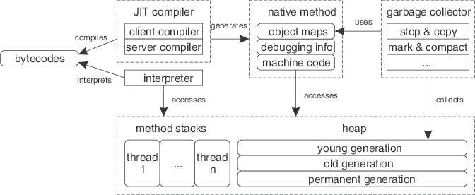
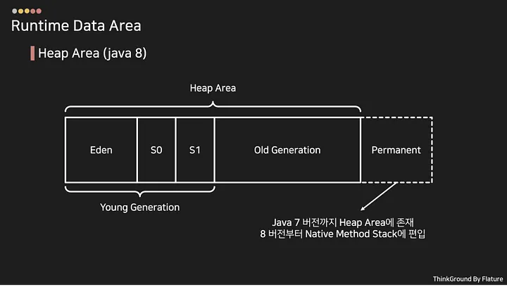
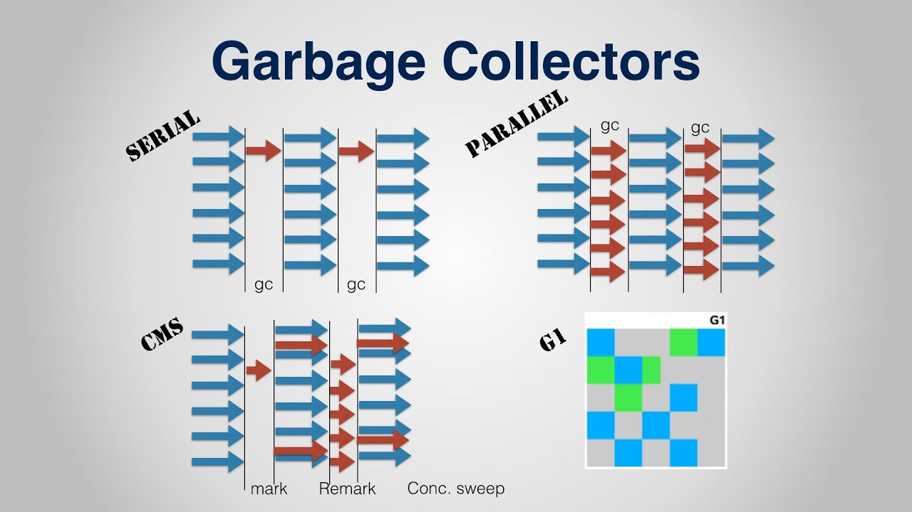
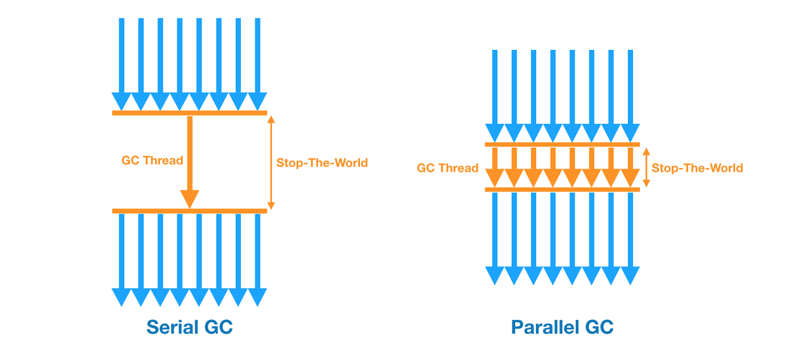
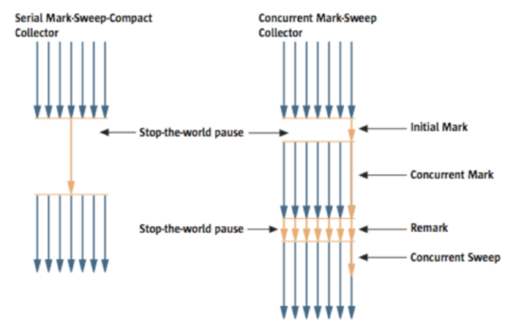
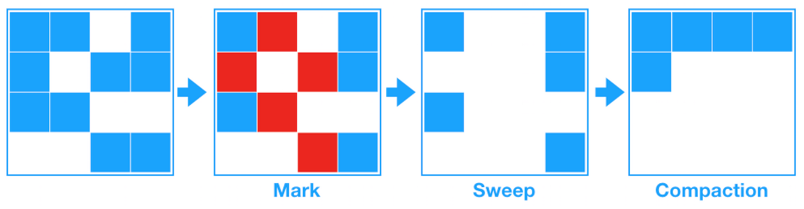
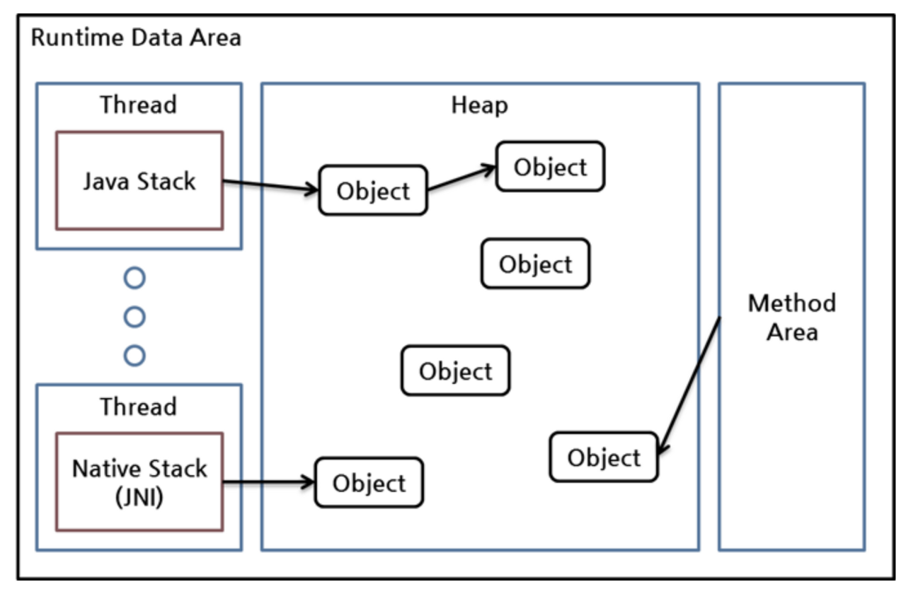
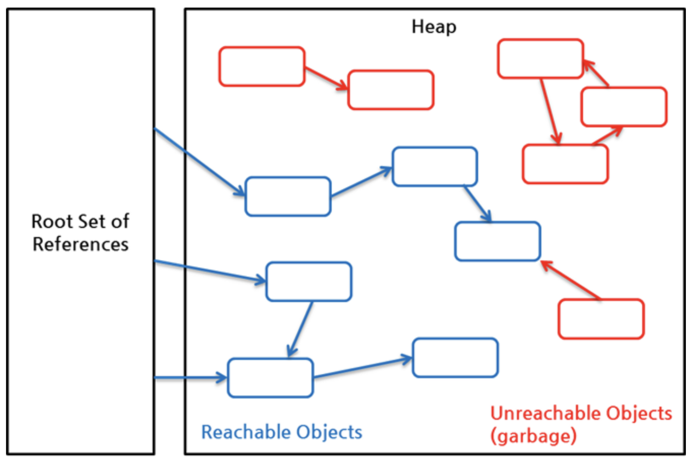

# GC(Garbage Collection)

---

## Garbage Collector

- 가비지 컬렉터란 가비지 컬렉션을 실행하는 프로그램
- JVM은 메모리를 부여받고 프로그램을 실행하다가 메모리가 부족해지는 순간이 오면 추가적으로 메모리를 더 요청
- 요청하는 바로 이때 가비지 컬렉터가 실행

## GC란?(Garbage Collection)

- `Java Application`에서 사용하지 않는 메모리를 자동으로 수거하는 기능
- C언어의 경우 malloc, free등을 이용해서 메모리를 할당하고, 일일이 그 메모리를 수거해줘야했다. 그러나 Java 언어에서는 GC가 알아서 해준다.

### STW(Stop-the-world)

- GC를 실행하기 위해 JVM이 어플리케이션의 실행을 멈춘다.
- GC를 실행하는 쓰레드를 제외한 나머지 쓰레드는 모두 작업을 멈추는 현상
- 이를 Stop-the-world라고 한다.
- `GC 튜닝`이란, 이` Stop-the-world의 시간을 줄이는 것`이다.

### Generational GCs

- Weak Generation Hypothesis
    - 개발자들이 GC 를 만들 때, 다음의 두 가지 가설을 가지고 만들었다고 한다.
        - 1. 대부분의 객체는 오랜시간동안 살아있지 않는다.
        - 2. 오래된 객체에서 젊은 객체로의 참조는 아주 적게 존재한다.

- 이러한 두 가지에 조건하에 가비지 컬렉터를 효율적으로 동작시키기 위해 `HotSpot VM`에서는 메모리를 크게 2개의 물리적 공간으로 나누었다.
- 그 영역이 Young / Old이다. 이러한 방식의 운영을 Generational GC라고 한다.

### Hotspot Heap Structure

- Young :  젊은 객체들이 존재
    - Eden : 객체를 생성하자마자 저장되는 장소
    - Survivor : 한번의 Minor GC를 경험한 객체들이 저장되는 곳(두개의 공간이 존재)
        - Survivor1
        - Survivor2
- Old : 늙은 객체들이 존재
- Perm : 클래스나 메소드에 대한 정보가 쌓임. Code가 모두 로딩되고 나면 거의 일정한 수치를 유지.

>generational gc의 핵심은 대부분의 객체는 생명이 짧다에 근거합니다.
>실제로 우리가 만드는 웹페이지를 보면 dbms에서 데이터를 가져다가 vo로 만들어 display 하고 vo의 역할이 끝납니다. 
>즉 많은 수의 객체가 request 시마다 생성되고 소비되고 바로 생명이 끝납니다.
>그 반면에 servlet 같이 프로세스 내내 살아있는 객체도 있습니다.
>- generational gc 는 객체가 생성되면 eden 영역에 적재가 됩니다. 
>- eden 영역이 일정수준 공간이 차면 살아있는 것만 survivor1 로 옮깁니다.
>- 다시 eden 영역이 일정수준 차면 eden 영역의 살아있는 것과 survivor1 의 살아있는 것을 survivor2 로 옮깁니다.(이 상태에서 survivor1 은 덮어써도 되는 상태. 즉 빈상태입니다.)
>- 다시 eden 영역이 차면 이번엔 eden + survivor2 살아있는 것들을 survivor1 로 옮깁니다. 
>- 이런식으로 여러번 반복하면(이것을 세대라고 합니다.) 즉 몇세대 반복하면 항상 살아있는 객체가 나옵니다.
>- 이것들은 servlet 같이 오래 사용되는 것들이라고 판단할 수 있고 
>- old 영역으로 이동시킬 수 있는 후보가 되고 더 반복되면 old 영역으로 이동하게 됩니다.

### metaspace / permanent generation /

- permanent generation은 `jdk8`버전부터 삭제되고 metaspace영역으로 대체되었다.
- permanent는 `heap영역`에 속해 `jvm`에 의해 관리되는 영역이었다.
- metaspace는 `native memory`영역으로 `os`에 의해 관리되는 영역이다.
- 기존의 permanent영역은 `jvm에 의해 크기가 강제`되었기 때문에 `out of memory`의 이슈가 존재했다.
- metaspace는 `os에서 사용가능한 메모리 영역을 사용`할 수 있다.
- 기존에 permanent영역에서 저장되던 클래스, 메서드의 메타정보, static 변수 등은 metaspace에 저장된다.

#### Minor GC or Young GC(Garbage Collection)

1. `Eden`영역에서 객체가 생성
2. `Eden`영역이 꽉차면, 살아있는 객체만 `Survivor`영역으로 복사되고, 다시 `Eden`영역을 채우게 된다.
3. `Survivor`영역이 꽉차게 되면 다른 `Survivor`영역으로 객체가 복사된다. 이때, `Eden` 영역에 있는 객체들 중 살아있는 객체들도 다른 `Survivor`영역으로 한다.
   즉, `Survivor`영역중 둘중하나는 반드시 비어있어야한다.

4. Minor GC가 발생하면 Eden과 Survivor1에 살아있는 객체를 Survivor2로 복사한다.
5. 그리고 Survivor1과 Eden을 Clear한다.
6. 결과적으로 한번의 Minor GC에서 살아남은 객체만 Survivor2영역에 남는다.
7. 그리고 다음번 Minor GC가 발생하면 같은 방식으로 Eden과 Survivor2영역에서 살아있는 객체를 Survivor1로 복사하고 클리어한다.
8. 결과적으로 Survivor1에만 살아있는 객체가 남게된다.
9. 이렇게 반복적으로 Survivor1, Survivor2를 왔다갔다하다가, Survivor 영역에서 오래 살아남은 객체는 Old영역으로 옮겨진다.

#### Major GC or Full GC

4. 오래 살아있는 객체들은 Old영역으로 이동
5. 지속적으로 이동하다가 Old영역이 꽉 차면, GC가 발생

- Young GC가 Full GC 보다 빠르다. 일반적으로 더 작은 공간이 할당되고, 객체들을 처리하는 방식도 다르기 때문.
- 전체 힙 영역을 영 영역으로 만든다면 장애로 이어질 확률이 매우 높아진다.

Full GC는 속도가 매우 느리고, Full GC가 발생하는 순간, 자바 어플리케이션이 멈춘다. (Stop-the-world). 따라서 Full GC는 성능과 안정성에 아주 큰 영향을 미친다.

## GC 동작방식 설명

1. 맨 처음 객체가 생성이 되면 Eden 영역에 생성된다.
2. Minor GC가 발생하면, 미사용 객체가 제거된다. 또한, 아직 사용되는 것으로 판단되는 객체를 Survivor 1 또는 Survivor 2 영역으로 이동시킨다. 만약, 객체의 크기가 Survivor 영역의 크기보다 크다면 Survivor 영역을 거치지 않고 바로 Old Generation으로 이동시킨다.
3. Survivor 1과 Survivor 2 영역은 둘 중 한 곳에만 객체가 존재하며 다른 한 곳은 비어져 있어야 한다. 객체가 존재하는 Survivor 영역을 From 이라고 부르자. From 영역이 가득 차면 다른 Survivor 영역으로 객체를 보내게 되고, 기존의 Survivor 영역을 비우게 된다. 이 때 From 영역에서 객체를 받는 Survivor 영역을 To 영역이라고 부른다.
4. 위의 1 ~ 3 과정을 반복하면서 Survivor 영역에서 계속 살아남는 객체들에 대해 일정한 score가 누적된다. 해당 score가 기준치 이상을 넘은 객체들에 대하여 Old Generation으로 이동시킨다.
5. Old Generation 영역에서 살아남았던 객체들이 일정 수준으로 쌓이게 되면, 미사용된다고 식별된 객체를 제거하는 Full GC가 발생한다. 이 때 STW(Stop-The-World) 가 발생하게 된다.

## GC 종류와 동작 방식

- 오라클 JDK에서 제공하는 GC의 방식은 4가지가 있다.
- Java 7 부터 추가된 G1(Garbage First)를 포함하여 총 5가지의 가비지 컬렉터가 존재한다.

- Serial GC
- Parallel Young Generation Collector
- Parallel Old Generation Collector
- Concurrent Mark & Sweep Collector (줄여서 CMS)
- Shenandoah GC
- ZGC

- 이 중에서 WAS로 사용하는 JVM에서 사용하면 안 되는 것은 `Serial GC`다.
- 이 GC 방식은 `-client` 옵션을 지정했을 때 사용된다.
- 즉, 클라이언트용 장비에 최적화된 GC이기 때문에 만약 WAS에서 이 방식을 사용하면 GC 속도가 매우 느려 웹 애플리케이션이 엄청 느려 진다.
- 그 외에 다른 GC 방식들은 서로 장단점이 존재하기 때문에 어떤 GC 방식이 가장 적합 하다고 이야기하기는 매우 어렵다.

#### 1. Serial GC (-XX:+UseSerialGC)

- Young 영역과 Old 영역이 직렬로 처리 되며 단일 쓰레드를 사용한다.
- `mark-sweep-compact` 알고리즘을 사용한다

> Mark-Sweep-Compaction 방식이란?
>
>- 사용되지 않는 객체를 식별하는 작업(Mark)
>- 사용되지 않는 객체를 제거하는 작업(Sweep)
>- 파편화된 메모리 영역을 앞에서부터 채워나가는 작업(Compaction)

#### 2. Parallel GC (-XX:+UseParallelGC)

- `Young` 영역의 GC를 `멀티 스레드 방식`을 사용하기 때문에, Serial GC에 비해 상대적으로 Stop The World 가 짧다
- Parallel GC는 Serial GC와 기본적인 알고리즘은 같다.
- Serial GC는 GC를 처리하는 스레드가 하나인 것에 비해, Parallel GC는 `GC를 처리하는 쓰레드가 여러 개`이다. 그렇기 때문에 Serial GC보다 빠르게 객체를 처리할 수 있다.
- `Parallel GC는 메모리가 충분하고 코어의 개수가 많을 때 유리`하다.
- `JAVA8`에는 `기본설정된 GC`로 사용 되었다.

#### 3. Parallel Old GC(-XX:+UseParallelOldGC)

- Parallel GC는 Young 영역에 대해서만 멀티 스레드 방식을 사용했다면, Parallel Old GC는 `Old 영역까지 멀티스레드 방식`을 사용
- 이 방식은 `Mark-Summary-Compaction` 단계를 거친다.
- Summary 단계는 앞서 GC를 수행한 영역에 대해서 `별도로 살아 있는 객체를 식별`한다는 점에서 `Mark-Sweep-Compaction` 알고리즘의 Sweep 단계와 다르며, 약간 더 복잡한 단계를
  거친다.
- mark-sweep-compact방식은 단일 스레드가 old영역을 검사하는 방식이라면 mark-summary-compact방식은 여러 스레드를 사용해서 old영역을 탐색한다.
    1. mark단계 : old영역을 region별로 나누고 region별로 살아있는 객체를 식별한다.
    2. summary단계 : region별 통계정보로 살아있는 객체의 밀도가 높은 부분이 어디까지 인지 dense prefix를 정한다. 오랜 기간 참조된 객체는 앞으로 사용할 확률이 높다는 가정하에 dense
       prefix를 기준으로 compact영역을 줄인다.
    3. compact단계 : compact영역을 destination과 source로 나누며 살아있는 객체는 destination으로 이동시키고 참조되지 않는 객체는 제거한다.

#### CMS GC (-XX:+UseConcMarkSweepGC)

- `stop-the-world`로 Java Application이 멈추는 현상을 줄이고자 만든 GC
- Reacable 한 객체를 한번에 찾지 않고 나눠서 찾는 방식을 사용 (4 STEP으로 나눠짐)
- 가비지 컬렉션 작업을 `애플리케이션 스레드와 동시 수행`한다.
- `stop-the-world 시간이 짧다`
- 다른 GC 방식보다 `메모리와 CPU를 더 많이 사용`한다.
- `Compaction 단계가 기본적으로 제공되지 않는다`.
- 조각난 메모리가 많아 Compaction 작업을 실행하면 다른 GC 방식의 stop-the-world 시간보다 stop-the-world 시간이 더 길기 때문에 Compaction 작업이 얼마나 자주, 오랫동안
  수행되는지 확인해야 한다.

1. Initial Mark : GC Root가 참조하는 객체만 마킹 (stop-the-world 발생)
2. Concurrent Mark : 참조하는 객체를 따라가며, 지속적으로 마킹. (stop-the-world 없이 이루어짐)
3. Remark : concurrent mark 과정에서 변경된 사항이 없는지 다시 한번 마킹하며 확정하는 과정. (stop-the-world 발생)
4. Concurrent Sweep : 접근할 수 없는 객체를 제거하는 과정 (stop-the-world 없이 이루어짐)

=> stop-the-world가 최대한 덜 발생하도록 하여, Java Application이 멈추는 현상을 줄임

#### G1 GC

- 현재 GC 중 `stop-the-world의 시간이 제일 짧음`
- Heap을 Region이라는 일정한 부분으로 나눠서 메모리를 관리한다.
- 전체 Heap에 대해서 탐색하지 않고 부분적으로 `Region` 단위로 탐색하여, 각각의 Region에만 GC가 발생한다.
- `Young` 영역과 `Old` 영역이 `물리적으로 나뉘어 있지 않고`, `각 구역의 크기는 모두 동일`하다.
- `G1 GC`는 `바둑판 모양의 레이아웃`으로 `Heap 영역 전체를 N개로 쪼개어 각각의 영역에서 GC를 진행`한다.
- `JAVA 9` 부터는 `디폴트`로 설정되어 있다.(`Java 7` 부터 `사용은 가능`)
- `Heap 메모리가 많이 필요한 경우` G1 를 사용하는 것이 `유리`하다.

### 가비지 컬렉터가 실행하는 시점

- 관리하고 있는 힙에서 사용되는 메모리가 허용된 임계값을 초과하는 경우
- 프로그래머가 직접 GC를 실행하는 경우(JAVA에서는 System.gc()라는 메소드가 있지만 가급적 안 쓰는 것이 좋다.)

## GC 의 Garbage 판단 : Reachability

- GC 가 해당 객체가 가비지인지 아닌지 판별하는 방법으로 `Reachability` 라는 개념을 사용한다.
- `reachable` : 객체에 유효한 참조가 있음.
- `unreachable` : 객체에 유효한 참조가 없음. **가비지 컬렉션의 대상.**
- `root set` : 객체에서 한 객체는 다른 여러 객체를 참조(의존) 하고, 그 객체들은 또 다른 객체를 참조하는 참조 사슬구조를 이루는데, 이런 사슬구조에서 유효한 참조 여부를 결정하기 위해서는 유효한
  최초의 참조가 있어야 한다. 이를 `root set` 이라 한다.
- `GC Root`가 될 수 있는 대상
    - JVM 메모리의 `Stack 영역`에 존재하는 `참조 변수`
    - Method Area의 `static 데이터`
    - `JNI`에 의해 생성된 객체들
      - `JNI` : 자바코드가 네이티브 응용 프로그램(하드웨어와 운영 체제 플랫폼에 종속된 프로그램들) 그리고 C, C++ 그리고 어셈블리 같은 다른 언어들로 작성된 라이브러리들을 호출하거나 반대로 호출되는 것을 가능하게 하는 프로그래밍 프레임워크

### Runtime Area 의 구조

Heap 영역의 객체에 대한 참조는 다음 4가지가 있다.

- 1. 힙 내 다른 객체에 의한 참조 (사슬)
- 2. Java 스택 영역, 즉 메서드 실행 시의 지역변수와 파라미터에 의한 참조
- 3. JNI 에 의해 생성된 객체에 대한 참조
- 4. 메서드 영역의 정적변수에 의한 참조

- 이들 중 처음의 다른 객체에 의한 참조를 뺀 3가지가 Root Set 으로, Reachable, UnReachable 을 판가름하는 기준이다.

- 위의 그림처럼 `빨간색`들은 `객체들끼리의 참조`는 있지만, 나머지 3가지의 참조는 없다.
- 오른쪽 아래처럼 reachable 객체를 참조하더라도, `root set` 이 유효하지 않으므로 Unreachable 이다.
- 이런 빨간색 객체들이 `Unreachable` 객체이며, `GC의 대상`이 된다.

## GC 관련 파라미터

1. Heap 사이즈 조절
    - Xms : 최소 힙 사이즈 / Xmx : 최대 힙 사이즈
    - Xms, Xmx 를 같게두면 일정한 크기의 힙 사이즈를 유지한다. 일반적으로 server application인 경우에는 ms와 mx 사이즈를 같게 하는것이 Memory의 growing과
      shrinking에 의한 불필요한 로드를 막을 수 있어서 권장할만하다.
    - ms와 mx사이즈를 다르게 하는 경우는 Application의 시간대별 memory 사용량이 급격하게 변화가 있는 Application에 효과적이다
2. Perm 사이즈 조절
    - 자바 어플리케이션 클래스가 로딩되는 영역
    - 어플리케이션 시작 시 `Out Of Memory` 에러가 발생할 경우 Perm사이즈를 의심하자.
    - PermSize는 `-XX:MaxPermSize=128m` 식으로 지정할 수 있다.
3. `Young` / `Old` 영역 크기 비율 조정
4. `Survivor` 영역 조정
5. `-server` / `-client` 옵션
   `-server` : 서버용 어플리케이션에 적합한 JVM옵션. 부팅 시간보다는 `요청에대한 응답시간`을 줄이는 것이 중요하다. 메모리 역시, 서버의 경우 New 객체들이 많이 발생한다. 왜냐하면 세션이 끊기면
   특정
   사용자에 대한 객체는 사라지기 때문이다. 그래서 상대적으로 `Old영역이 작고` `New영역이 크다`.
   `-client` : 클라이언트용 어플리케이션에 적합한 JVM옵션. `부팅시간이 빨라야 한다`. 그리고 하나의 클라이언트에서는 객체가 상대적으로 오랫동안 살아있는다. 따라서 `Old영역이 상대적으로 크다`.
6. GC 알고리즘 선택

 

#### 참고

- https://alkhwa-113.tistory.com/entry/Java-Garbage-Collection
- https://memostack.tistory.com/229
- https://incheol-jung.gitbook.io/docs/q-and-a/java/garbage-collecter
- https://jgrammer.tistory.com/entry/JAVA-GC%EC%9D%98-%EB%8F%99%EC%9E%91-%EC%9B%90%EB%A6%AC-Serial-GC-Parallel-GC-Parallel-Old-GC