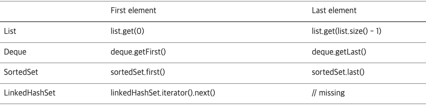
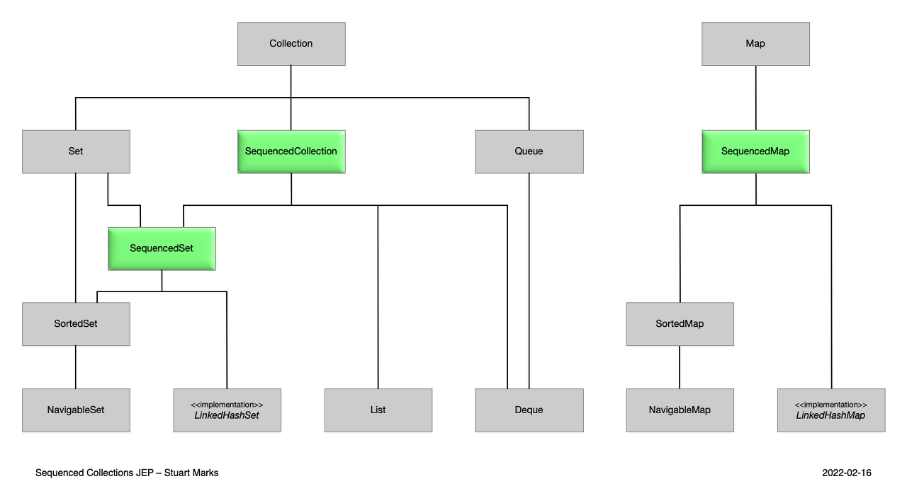

## JDK 21

1. 가상 스레드: 
- Java 21의 가장 중요한 발전 중 하나는 가상 스레드의 공식적 추가입니다. 이러한 스레드는 기존 플랫폼 스레드에 비해 가볍고 기존 Java 코드를 수정할 필요 없이 생성할 수 있습니다. 대신
   가상 스레드를 사용하도록 애플리케이션 프레임워크에 지시하기만 하면 됩니다. 이 기능은 처리량이 많은 동시 애플리케이션을 더 쉽게 작성, 유지 및 관찰할 수 있도록 하여 동시 애플리케이션의 확장성과 성능을 향상시키는 데 목적이
   있습니다.
- 가상 쓰레드는 처리량이 많은 동시성 애플리케이션을 개발하고 모니터링하고 유지 및 관리하는데 드는 비용을 획기적으로 줄여줄 경량 쓰레드이다. 자바 진영(스프링 MVC)에서는 멀티쓰레드 모델을 기본적인 동시성 처리
  방법으로 사용해왔고, 이로 인해 I/O 요청이 들어오면 쓰레드가 블로킹되면서 자원이 낭비되곤 했다. 코틀린과 같은 언어에서 코루틴을 이용해 이를 해결할 수도 있지만, 이를 위해 특정 키워드(async-await
  또는 suspend 등과 같은)를 통해 논블로킹 구간을 지정해주어야 한다.
- 하지만 자바는 이를 JVM 레벨에서 처리하도록 하였고, 따라서 개발자는 키워드를 명시해주지 않아도 JVM이 알아서 논블로킹 처리를 해주기 때문에 많은 이점을 가질 수 있다.


2. 레코드 패턴

- 레코드 패턴은 데이터 전달자 역할만 하는 클래스 개발 프로세스를 쉽게 만드는 것입니다.
- Java 16에 도입된 레코드는 Java 21에서 향상되었습니다.
- 이러한 향상된 기능을 통해 레코드에 메서드를 추가할 수 있으므로 보다 다양한 응용 프로그램에 유용하고 다용도로 사용할 수 있습니다.
- 자바 16에서는 instance of 연산자에 타입 패턴을 적용하여 레코드의 값을 손쉽게 처리할 수 있도록 도와줍니다.
- 자바 21에서는 레코드 패턴이 적용되어 `레코드의 구성요소도 패턴변수로 할당가능`하다.
- 따라서 obj가 Point의 인스턴스인지 여부를 테스트할 뿐만 아니라 개발자를 대신해 **접근자 메소드를 호출**하여 **직접 변수들에 접근**할 수 있게 된다.
- 타입 패턴 덕분에 instance of 하위 블록에서는 직접적으로 타입 캐스팅할 필요가 없어졌다.
- 이렇듯 새롭게 도입된 레코드 패턴(Record Pattern)은 **레코드 객체를 분해**해주는 기능이라고 볼 수 있다.
- 중첩된 레코드 또한 사용가능하다.
- 제네릭도 가능

```java
record Point(int x, int y) {};

// Prior to Java 21
static void printSum(Object obj){
	if(obj instanceof Point p){
	    int x=p.x();
	    int y=p.y();
	    System.out.println(x+y);
	}
}

// As of Java 21
static void printSum(Object obj){
	if(obj instanceof Point(int x,int y)){
	    System.out.println(x+y);
	}
}

// As of Java 21
static void printColorOfUpperLeftPoint(Rectangle r){
	if(r instanceof Rectangle(ColoredPoint(Point p,Color c),
	    ColoredPoint lr)){
	    System.out.println(c);
	}
}
```

3.`SequncedCollection`  인터페이스 추가 :

- 기존의 자바 컬렉션 프레임워크는 정해진 순서의 원소에 접근하는 것이 어려웠다. 예를 들어 List와 Deque는 모두 처음과 마지막 원소에 접근할 수 있지만, 이들의 공통 상위 인터페이스는 Collection라서
  접근 방법이 다르다. SortedSet과 LinkedHashSet 역시 비슷한데, 이로 인해 다음과 같이 일관되지 못한 방법으로 원소에 접근하게 되는 것이다.
  
- Java 21부터는 정해진 순서의 원소를 조회할 수 있는 컬렉션을 표현하는 새로운 인터페이스를 도입한다. 이를 통해 `정해진 순서의 원소`(첫 원소와 마지막 원소 등)에 접근하고, 이를 `역순으로 처리`하기
  위한 `일관된 API를 제공`한다.

```java
interface SequencedCollection<E> extends Collection<E> {
	// new method
	SequencedCollection<E> reversed();

	// methods promoted from Deque
	void addFirst(E);
	void addLast(E);

	E getFirst();
	E getLast();
	E removeFirst();
	E removeLast();
}
```



4. switch의 패턴매칭

- Instanceof 사용
    - 기존의 스위치 문은 특정 타입 여부를 검사하는 것이 상당히 제한적이였기 때문에, 특정 타입인지 검사하려면 instance of에 if-else 문법을 사용해야 했다.
    - 하지만 자바 21부터는 이러한 부분을 개선하였고, 다음과 같은 간결한 방식으로 패턴 매칭을 처리할 수 있게 되었다.
  ```java
  // Prior to Java 21
  if (obj instanceof Integer i) {
      System.out.println("Integer");
  } else if (obj instanceof String s) {
      System.out.println("String");
  } else if (obj instanceof Pair) {
      System.out.println("Pair");
  } else {
      System.out.println("other");
  }
     
  // As of Java 21   
  switch (obj) {
     case null -> System.out.println("null");
     case Integer i -> System.out.println("Integer");
     case String s -> System.out.println("String");
     case Pair(String s, Integer i) ->
       System.out.printf("Pair(String:%s, Integer:%d)\n", s, i)
     default -> System.out.println("other");
  }
  ```
    - null 검사
        - 기존에는 스위치 문의 파라미터가 null이라면 NPE(NullPointerException)을 던지기 때문에, null에 대한 검사가 스위치 문 외부에서 수행되어야 했다.
        - 하지만 자바21부터는 이러한 부분을 개선하였고, null에 해당하는 케이스를 스위치 내부에서 검사할 수 있게 되었다.
      ```java
      // As of Java 21
      static void testFooBarNew(String s) {
         switch (s) {
             case null         -> System.out.println("Oops");
             case "Foo", "Bar" -> System.out.println("Great");
             default           -> System.out.println("Ok");
         }
      }
      ```
- case 세분화
    - case 문은 여러 값에 대한 검사를 필요로 하기 때문에 세분화될 수 있다. 자바 21 이전에는 이러한 부분을 코드로 작성하면 상당히 복잡한 구조로 만들 수 밖에 없었다.
    - 자바 21부터는 이러한 부분 역시 개선이 되었고, 다음과 같이 세분화할 수 있게 되었다. 이를 통해 보다 읽기 좋은 스위치 문 작성이 가능해진 것이다.
    - 같은 타입이면, 조건 붙은 case가 앞에 위치해야함.
  ```java
  // As of Java 21
  static void testStringNew(String response) {
    switch (response) {
        case null -> { }
        case String s
        when s.equalsIgnoreCase("YES") -> {
            System.out.println("You got it");
        }
        case String s
        when s.equalsIgnoreCase("NO") -> {
            System.out.println("Shame");
        }
        case String s -> {
            System.out.println("Sorry?");
        }
    }
  }
  ```
- enum 개선
    - 기존에는 스위치 문에서 enum을 사용하는 것이 상당히 제한적이였다.
    - 앞서 살펴본 새로운 문법인 case 세분화를 도입하여도, 코드는 불필요하게 장황해졌고, 복잡성이 완전히 해결되지 않았다.
- 그래서 이러한 부분을 완전히 해결하고자 다음과 같은 문법으로 코드를 작성할 수 있도록 개선되었다. 이를 통해 더욱 가독성있는 enum 관련 스위치 문을 작성할 수 있을 것이다.
  ```java
  // As of Java 21
  static void exhaustiveSwitchWithBetterEnumSupport(CardClassification c) {
    switch (c) {
        case Suit.CLUBS -> {
            System.out.println("It's clubs");
        }
        case Suit.DIAMONDS -> {
            System.out.println("It's diamonds");
        }
        case Suit.HEARTS -> {
            System.out.println("It's hearts");
        }
        case Suit.SPADES -> {
            System.out.println("It's spades");
        }
        case Tarot t -> {
            System.out.println("It's a tarot");
        }
    }
  }
  ```
  

### 정리
> record 패턴을 switch에서 사용가능해서 용도가 있을 것이다.
> switch null case : null비교를 위한 if가 없어 좋다.
> switch에 타입 패턴 매칭이 들어가서 좋다.
> when이 들어가서 좋다. 복잡한 if-else블록을 switch로 대체할수있다.

- 참고
    - https://openjdk.org/projects/jdk/21/
    - https://mangkyu.tistory.com/308
    - https://developers.redhat.com/articles/2023/09/21/whats-new-developers-jdk-21#virtual_threads
    - https://techblog.woowahan.com/15398/
    - https://www.youtube.com/watch?v=8rVhPMEr2zQ
    - [switch expression](https://velog.io/@nunddu/Java-Switch-Expression-in-Java-14)
