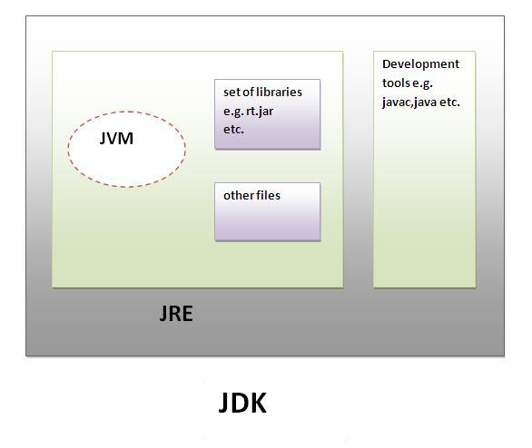

## JRE 개념
1. JRE(Java Runtime Enviroment) : 컴파일된 자바 프로그램을 실행시킬 수 있는 자바 환경
2. JRE는 JVM이 자바 프로그램을 동작시킬 때 필요한 `라이브러리 파일`들과 `기타 파일`들을 가지고 있다.
3. JRE는 JVM의 실행환경을 구현했다고 할 수 있다.
4. 자바 프로그램을 실행시키기 위해선 `JRE를 반드시 설치해야한다.`
5. 하지만 `자바 프로그래밍 도구`는 포함되어있지 않기 때문에 자바 프로그래밍을 하기 위해선 JDK가 필요하다.

## JDK 개념
1. JDK(Java Development kit) : 자바 프로그래밍시 필요한 컴파일러 등 포함
2. JDK는 개발을 위해 필요한 도구(javac, java 등)들을 포함한다.
3. JDK를 설치하면 JRE도 같이 설치가 된다.
4. 즉 JDK = JRE + @ 라고 생각하면 된다.

## 정리
1. JDK = JRE + @ 이며
2. JRE는 읽기 전용, JDK는 읽기와 쓰기 전용이라 생각할 수 있다.
