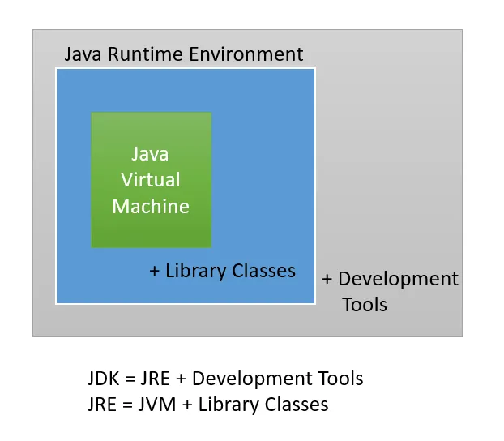
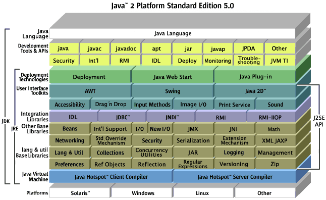
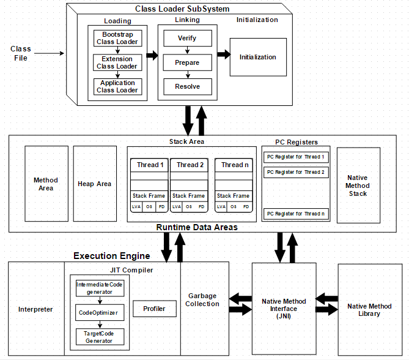
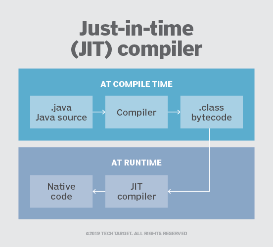

# JVM(java Virtual Machine, 자바 가상머신)

- 자바 프로그램이 수행되는 프로세스를 의미
- java라는 명령어를 통해 애플리케이션이 수행되면, JVM 위에서 애플리케이션이 동작한다.
- JVM에서 개발자가 작성한 프로그램을 찾고 실행하는 일련의 작업이 진행된다.

## JDK 플랫폼에 따른 차이



- 자바는 Oracle에서만 만드는 것이 아니다.
- 우리나라에서 많이 사용하는 서버에는 IBM, HP, Solaris 서버가 있다.
- IBM, HP 는 별도의 운영체제를 가지고 있으며, 그 OS에 최적화되더있는 JDK를 개발하여 사용하고 있다.
    - 각 Java 버전에서 제공되어야하는 표준문서가 만들어지면, 그 기준에 해당하는 각 벤더에 맡는 JDK가 별도로 만들어진다.
    - 어떤 OS에서 개발하든지 JDK버전만 맞으면 적용할 OS에서 컴파일만 하면 애플리케이션 실행에 문제가 없다.
    - Oracle JDK로 개발하고, HP의 JDK에서 컴파일하더라도 전혀 문제가 발생하지 않는다.
    - OpenJDK : 소스에 라이선스 문제가 되는 부분을 제거한 완전 오픈소스 버전의 JDK를 의미

## 자바 아키텍처


위 그림을 보면 JDK에서 JRE 부분이 나누어져 있는 것을 확인할 수 있다.
JRE는 Java Runtime Environment를 의미하며 말 그대로 실행만을 위한 환경이다. 이 JRE만 설치하면 자바를 컴파일하는 등의 각종 프로그램은 제외된 상태로 설치가 된다.

JRE에 포함되어 있는 블록들은 자바에서 제공하는 라이브러리들이다.

## Java의 5가지 특징

1. Simple, object-oriented and familliar
2. Robust and Secure
3. Architecture-neutral and Portable
4. High Performance
5. Interpreted, Threaded, Dynamic

### Architecture-neutral and Portable

- 자바는 아키텍처에 중립적인 바이트 코드(.class)를 생성한다.
- 따라서 자바의 버전만 동일하다면, 동일한 프로그램은 어떤 플랫폼에서도 실행할 수 있다. JVM이 이 역할을 해준다.

### High Performance

- 자바는 실행 환경에서 최대한의 성능을 낼 수 있도록 되어있다.
- `자동화된 GC`도 낮은 우선 순위의 스레드로 동작하기 때문에 높은 성능을 낼 수 있다.
- 또한 빠른 성능을 위해서 `네이티브한 언어`로 작성한 부분을 자바에서 사용할 수 있도록 되어있다.

### Interpreted, Threaded, Dynamic

- 자바는 `인터프리터 언어`이고 `스레드`를 제공하고, `동적`이라는 의미이다.
- 자바 인터프리터는 자바 바이트 코드를 `어떤 장비에서도 수행`할 수 있도록 도와준다.
- 자바는 `멀티 스레드` 환경을 제공하기 때문에 동시에 여러 작업을 수행할 수 있다.
- 자바는 `실행시에 동적으로 필요한 프로그램들을 링크`시킨다.

## JIT 컴파일러



- JIT는 Just-In-Time의 약자로 '동적 변환(Dynamic Translation)'을 의미
- JIT를 만든 이유 : 프로그램 실행을 보다 빠르게 하기 위함
- 명칭은 JIT 컴파일러이지만 실행시에 적용됨.
- JIT는 한 줄씩 읽고 실행하는 `인터프리트 방식`과 컴파일하여 실행 파일을 생성하고 그것을 실행하는 `정적 컴파일 방식`을 혼합한 방식
- 변환 작업은 `인터프리터`에 의해서 지속적으로 수행되지만 필요한 코드의 정보는 `메모리`에 올려두었다가(캐시에 담아두었다가) `재사용`한다.
- JVM이 설치되어 있는 어떤 컴퓨터에서든 실행할 수 있게 만든 바이트 코드 .class 파일을 한줄 한줄 읽어서 컴퓨터가 이해할 수 있는 형태(기계어)로 변환하는 작업을 수행
- 장점
    - 반복적을 수행되는 코드는 매우 빠른 성능을 보인다.
- 단점
- 처음 시작할 때에는 변환 단계를 거쳐야 하므로 성능이 느리다. -> CPU의 성능이 많이 좋아졌고, jDK의 성능 개선도 많이 이루어져 단점도 많이 개선됨
  

## HotSpot

- `JDK 1.3`부터 `HotSpot JVM`이 제공된다.
- 자바에는 `HotSpot Client Compiler`, `HotSpot Server Compiler` 두가지 컴파일러가 있다.

- `HotSpot Client Compiler`
    - 요즘은 대부분의 PC에 여러개의 코어가 있지만, 예전엔 대부분의 PC가 단일 코어였다.
    - `CPU 코어`가 하나뿐인 사용자들을 위해 만들어진 컴파일러이다.
    - 이 컴파일러는 `애플리케이션 시작 시간을 빠르게` 하고, `적은 메모리를 점유`하도록 한다.
- `HotSpot Server Compiler`
    - `코어가 많은 장비`에서 애플리케이션을 돌리기 위해 만들어진 컴파일러이다.
    - 이 컴파일러는 `애플리케이션의 수행 속도`에 초점이 맞추어져 있다.

### 핫스팟 서버 컴파일러, 핫스팟 클라이언트 컴파일러는 선택 기준

- 기본적으로는 자바가 시작할 때 알아서 클라이언트 장비인지 서버 장비인지 확인한다. 기준은 다음과 같다.

2개 이상의 물리적 프로세서
2GB 이상의 물리적 메모리
이 두 조건을 만족하면 Oracle에서 만든 JVM은 서버 컴파일러를 선택한다. 만약 명시적으로 어떤 종류의 JVM인지를 지정해주고 싶다면 'java' 명령어로 .class 파일을 실행할 때 '-server', '
-client' 등의 옵션을 주면 된다.

```shell
$ java -server Calculator

$ java -server -Xms512m Calculator
```

- `-Xms` 옵션은 JVM의 시작 메모리 크기를 지정해주는 옵션이다. `-Xms512m`는 512MB의 메모리 크기로 시작하라는 의미이다.
- `OS에 따라서` 서버 컴파일러를 쓸지, 클라이언트 컴파일러를 쓸지가 `결정`되기도 하는데, 윈도우는 기본적으로 지정해주지 않는다면 클라이언트 컴파일러가 사용된다.


