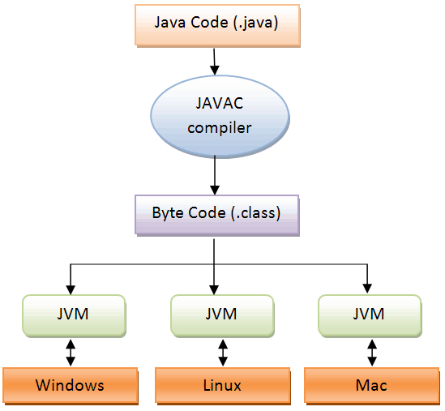
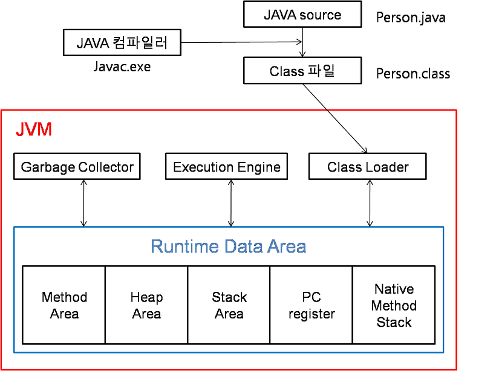
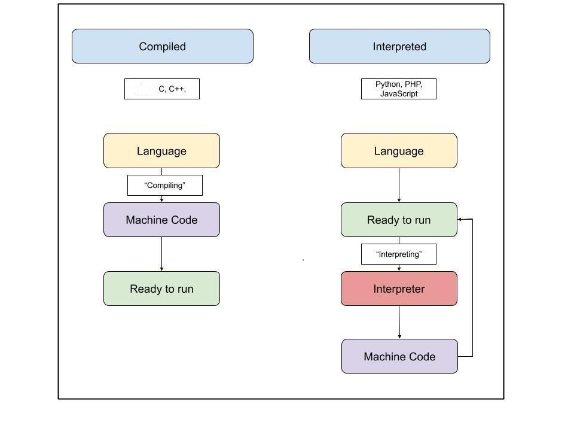
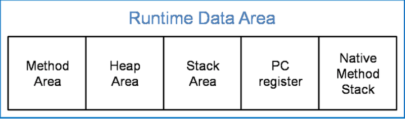
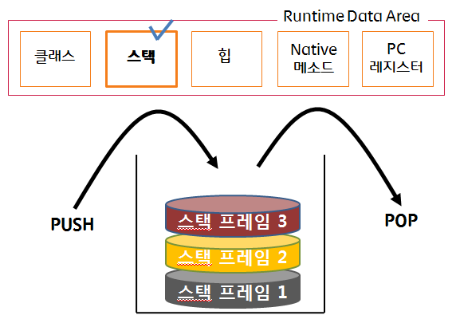

# JVM 메모리 구조

## JVM이란?

- `Java Virtual Machine`의 약자로, 자바 가상 머신이라 부름
- 역할
    - `자바와 운영체제 사이에서 중개자 역할` 수행
    - 자바가 `운영체제에 구애 받지 않고` 프로그램을 실행할 수 있도록 도와줌
    - `가비지 컬렉터(GC)`를 사용한 `메모리 관리`도 자동으로 수행
    - 다른 하드웨어와 다르게 레지스터 기반이 아닌 `스택 기반`으로 동작

### 자바 프로그램 실행단계

1. 자바 컴파일러에 의해 자바 소스 파일은 바이트 코드로 변환
2. 바이트 코드를 JVM에서 읽어 들임
3. 어떤 운영체제든간에 프로그램을 실행할 수 있도록 만듦

- 자바 소스 파일은 리눅스에서 만들었고 윈도우에서 이 파일을 실행하고 싶다면, 윈도우용 JVM을 설치만 하면 된다. 
  => **즉, JVM은 운영체제에 종속적이다.**

 

## JVM 메모리 구조

> JVM의 구조는 크게 4가지로 나뉜다.
> 1. Garbage Collector
> 2. Execution Engine
> 3. Class Loader
> 4. Runtime Data Area

### (1) Class Loader

- 자바 클래스들은 시작 시 한번에 로드되지 않고, 애플리케이션에서 필요할 때 로드된다.
- 클래스 로더는 `JRE`의 일부로써 **런타임**에 클래스를 동적으로 `JVM`에 로드 하는 역할을 수행하는 모듈이다.
- 자바의 클래스들은 자바 프로세스가 새로 초기화되면 클래스로더가 차례차례 로딩되며 작동한다.

[1] 부트스트랩 클래스로더(Bootstrap classloader)
- JVM 시작 시 가장 최초로 실행되는 클래스로더
- 자바 클래스를 로드하는 것이 아닌, 자바 클래스를 로드할 수 있는 `자바 자체의 클래스로더`와 `최소한의 자바 클래스`(java.lang.Object, Class, Classloader)만을 로드
- JAVA8 기준으로 `${JAVA_HOME}/jre/lib`에 위치한 `자바 런타임 코어 클래스`를 로드
- 부모 클래스로더를 갖지 않기 때문에 원시 클래스로더(Primordial classloader)라고도 불린다.
- 특히 `${JAVA_HOME}/jre/lib/rt.jar` 파일에는 `java.lang`, `java.util` 등의 필수 패키지들이 들어 있는 것을 확인할 수 있다.

[2] 확장 클래스로더(Extension classloader)
- 부트스트랩 클래스로더를 부모로 갖는 클래스로더
- 확장 자바 클래스들을 로드
- `java.ext.dirs` 환경 변수에 설정된 디렉토리의 클래스 파일을 로드
- 이 값이 설정되어 있지 않은 경우 `${JAVA_HOME}/jre/lib/ext`에 있는 클래스 파일을 로드

[3] 애플리케이션 클래스로더(Application classloader)
- 자바 프로그램 실행 시 지정한 `Classpath에 있는 클래스 파일` 혹은 `Jar`에 속한 클래스들을 로드한다

### (2) Execution Engine

- 클래스 로더를 통해 JVM 내의 `Runtime Data Area`에 배치된 `바이트 코드`들을 명렁어 단위로 읽어서 실행
- 최초 JVM이 나왔을 당시에는 `인터프리터 방식`이었기 때문에 `속도가 느리다`는 단점이 있었지만 `JIT 컴파일러` 방식을 통해 이 점을 보완함.
- `JIT 컴파일러`는 바이트 코드를 `어셈블러 같은 네이티브 코드로 바꿈`으로써 실행이 빠르지만 역시 `변환하는데 비용이 발생`하였음.
- 이 같은 이유로 JVM은 모든 코드를 `JIT(Just In Time) 컴파일러` 방식으로 실행하지 않고, `인터프리터` 방식을 사용하다가 일정한 기준이 넘어가면 JIT 컴파일러 방식으로 실행함.

1. Interpreter 방식
- 자바 바이트 코드를 한 줄씩 번역하고 실행하는 방식입니다.
2. 정적(Static) 컴파일 방식
- 실행하기 전에 컴퓨터가 이해할 수 있는 언어인 Native Code로 변환하는 방식입니다.
3. JIT(Just In Time) 방식
- Interpreter 방식의 단점을 보완하기 위해 도입된 컴파일러입니다. 이미 한번 읽어서 Native Code(바이너리코드)로 변환한 소스코드는 캐싱을 통해 저장해두기 때문에 다시 번역하지 않기 때문에 실행 속도를 높일 수 있습니다.

 

>### JIT 컴파일러
>- 실행 시점에서는 인터프리터와 같이 기계어 코드를 생성하면서 해당 코드가 컴파일 대상이 되면 컴파일하고 그 코드를 캐싱한다. 
>- JIT 컴파일은 코드가 실행되는 과정에 실시간으로 일어나며(그래서 Just-In-Time이다), 전체 코드의 필요한 부분만 변환한다. 
>- 기계어로 변환된 코드는 캐시에 저장되기 때문에 재사용 시 컴파일을 다시 할 필요가 없다.

> #### **참고**  
> - 컴파일러와 인터프리터 모두 high-level language를 machine language로 번역한다.
> - 인터프리터방식 : 한줄씩 기계언어로 변환, 그때그때 번역이 일어나므로 속도가 느림, 반드시 인터프리터가 있어야함.
> - 컴파일러방식 : 한꺼번에 기계언어로 변환하여 메모리상에 적재한다. 번역과정 복잡, 시간 소요, 하지만 한번 번역해놓으면 다시 번역할 필요 없음. 기계어에 종속적이므로, 실행기계가 달라지면 새로이 컴파일해야함.
> - Ex) 파이썬은 인터프리트 언어이고 C, C++는 컴파일 언어이다. 자바는 컴파일러와 인터프리터 모두 사용한다.

### (3) Garbage Collector(GC)

- `힙 메모리 영역`에 생성된 객체들 중에서 참조되지 않은 객체들을 탐색 후 제거하는 역할
- GC가 역할을 하는 시간은 언제인지 정확히 알 수 없음

### (4) Runtime Data Area

- JVM의 메모리 영역으로 자바 애플리케이션을 실행할 때 사용되는 데이터들을 적재하는 영역
- 이 영역은 크게 6가지로 나눌 수 있음.
    - Method Area
    - Heap Area
    - Stack Area
    - PC Register
    - Native
    - Method Stack

#### [1] Method area

- 모든 쓰레드가 공유하는 메모리 영역입니다. 
- 클래스, 인터페이스, 메소드, 필드, 클래스 변수(static 멤버), Enum(public static final 필드)  등의 `바이트 코드`를 보관합니다.

#### [2] Heap area

- 모든 쓰레드가 공유하며, `new 키워드로 생성된 객체와 배열`이 생성되는 영역입니다. 
- 모든 인스턴스 변수(non-static 멤버)가 저장되는 영역
- `메소드 영역에 로드된 클래스만 생성이 가능`
- Garbage Collector가 참조되지 않는 메모리를 확인하고 제거하는 영역입니다.

#### [3] Stack area

- `메서드 호출 시마다`각각의 `스택 프레임`(그 메서드만을 위한 공간)이 생성합니다. 
- 그리고 메서드 안에서 사용되는 값들을 저장
- 호출된 메서드의 `매개변수`, `지역변수`, `리턴 값` 및 `연산 시 일어나는 값`들을 임시로 저장
- 메서드 수행이 끝나면 프레임별로 삭제
  

#### [4] PC Register
- 쓰레드가 시작될 때 생성되며, 쓰레드 생성시마다 하나씩 공간이 생성됨. 
- 쓰레드가 `어떤 부분`을 `무슨 명령`으로 실행해야할 지에 대한 기록을 하는 부분
- 현재 수행중인 `JVM 명령의 주소`를 갖음.

#### [5] Native method stack

- 자바 외 언어로 작성된 네이티브 코드를 위한 메모리 영역입니다.

#### **참고**
- https://jooona.tistory.com/158
- https://steady-coding.tistory.com/305
- https://leeyh0216.github.io/posts/java_class_loader/