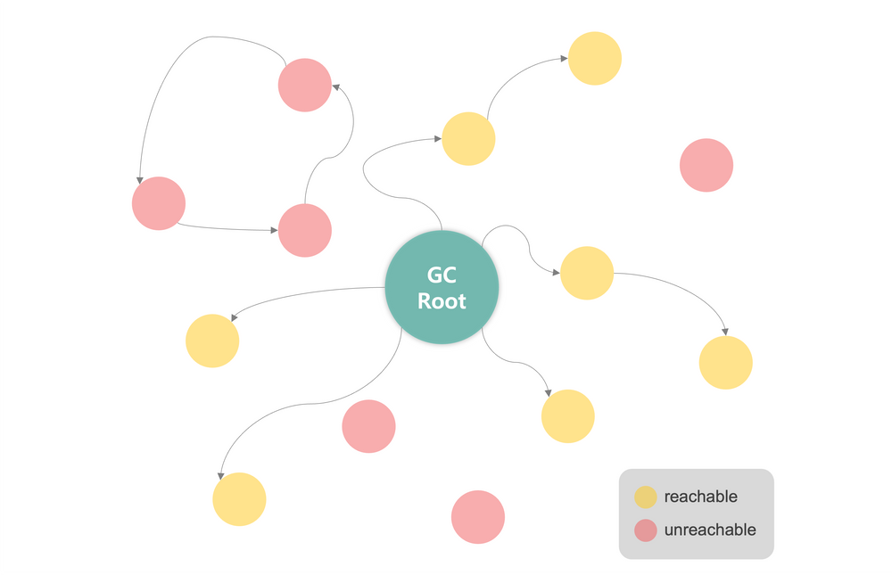
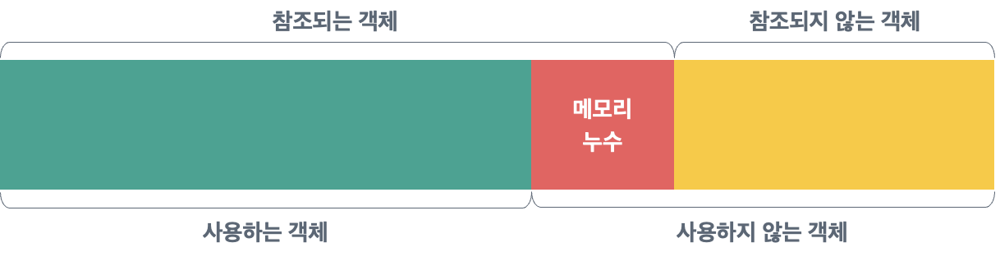

# 메모리 누수(Memory Leak)

메모리 누수란?
- 메모리 누수(Memory Leak)란 더 이상 사용하지 않는 객체들이 힙(Heap) 영역에 남아 있어 불필요하게 메모리를 차지하고 있는 상황을 의미
- 사용하지 않는 객체들이 계속 메모리에 남아 있으면 성능저하를 야기하고, 종국에는 Out of Memory Error를 발생시킬 수 있으므로 주의가 필요하다.
- Java의 경우 JVM의 가비지 컬렉터(Garbage Collector)가 메모리 영역을 관리 해주기때문에, 개발자가 일일이 메모리를 할당하고 해제하는 작업을 하지 않아도 된다.
- 가비지 컬렉터는 주기적으로 힙 메모리에서 사용하지 않는 객체들을 찾아 메모리를 해제한다.

## 가비지 컬렉터 "더이상 사용하지 않는 객체"라고 판단하는 기준

- JVM의 메모리 구조 중 힙 영역이 가비지 컬렉션(Garbage Collec tion, GC)의 대상이 되는 영역이다.

1. 메서드 영역(Method Area): 클래스, 필드, 메서드, 생성자 등의 정보가 저장되는 영역
2. 힙 영역(Heap Area): 객체와 배열 등 런타임에 생성된 인스턴스들이 저장되는 영역
3. 스택 영역(Stack Area): 스레드가 메서드를 호출할 때마다 스택 프레임이 생성되고 제거되는 영역

- `힙 영역에 있는 객체` 중 `스택 영역`과 `메서드 영역`에 의해 참조되는 객체는 `가비지 컬렉션의 기준`이 되는 객체라 하여 `GC Root`라 하는데, 
- 현재 실행 중인 `스레드에서 참조하고 있는 객체`, `정적 변수`가 참조하는객체 등이 이에 해당된다.
- 아래 그림과 같이 `GC Root`에 의해 참조되는 객체는 `reachable` 객체, 참조되지 않는 객체는 `unreachable` 객체라 하는데, 가비지 컬렉터는 `unreachable` 객체를 더 이상 사용하지 않는 객체라 판단하고 삭제한다.




따라서 `사용하지 않는 객체`인데도 `GC Root`가 참조하고 있다면 `가비지 컬렉터는 이 객체를 사용 중인 상태로 판단하고 메모리에 유지`하는데, 이것이 바로 `메모리 누수의 발생 원인`이 된다.



>메모리 누수로 인해 불필요한 객체들이 메모리에 계속 쌓이다보면, 가비지 컬렉터가 검사해야 할 범위가 넓어지기 때문에 GC 시간도 함께 늘어나게 된다.
>
>GC는 애플리케이션 실행이 일시 중단되는 Stop-the-world 상태를 야기하기 때문에, 메모리 누수로 인해 GC 시간이 늘어나지 않도록 주의해야 한다.

## 메모리 누수가 의심되는 경우라면?

애플리케이션을 가동한 시간이 길어질수록 프로그램 성능이 저하되는 상황이라면 메모리 누수를 의심해볼 수 있습니다. 이 경우 메모리 사용 실태를 먼저 파악하고, 문제의 발생 지점을 찾아야 할 것입니다. 이를 위해서
Visual VM, Eclipse Memory Analyze 등의 도구를 활용할 수 있습니다. Visual VM을 예로 들어 살펴보면, 아래와 같이 CPU, 힙 메모리, 클래스, 스레드 등의 사용 현 황을
모니터링할 수 있습니다. 메모리 사용량이 지속적으로 증가하는 경향을 발견하면 메모리 누수를 의심해볼 수 있습니다.

메모리 누수를 발견했다면 다음으로는 문제 지점을 찾아야 하는데 힙 덤프(Heap Dump) 분석 방법을 사용할 수 있습니다. 힙 덤 프는 Java 프로세스의 메모리 스냅샷으로, 객체와 참조 관계에 대한 상세 정보를
포함합니다. 힙 덤프는 jmap 명령어 또는 VisualVM과 같은 프로파일링 도구로 생성할 수 있습니다. 힙 덤프를 살펴봤을 때 비정상적으로 점유율이 높은 객체가 있다면, 이 객체 에 중점을 두고 메모리 누수
발생지점을 찾는 것이 효율적입니다.

## 메모리 누수의 종류와 예방 방법

- 메모리 누수를 발생시키는 몇 가지 대표적인 사례들을 염두해두고 개발한 다면, 메모리 누수의 발생 가능성을 낮출 수 있을 것이다.

1. 해제되지 않은 리소스로 인한 누수

- 리소스를 사용한 뒤 닫아주지 않으면 이는 메모리 누수의 원인이 될 수 있다.
- 예컨대 Filelnputstream 를 사용하고 제대로 닫아주지 않으면, 열린 파일 핸들이 반환되지 않아 운영체제의 파일 핸들 제한에 도달할 수 있습니다. 
- 따라서 InputStream, Outputstream과 같은 입출력 관련 리소스나, ResultSet, Statement, Connection 과 같은 SOL 관련 리소스는 사용하고 나서 close() 메서드를 호출하여 정상적으로 해제해주어야 합니다. 
- 이 때 Java 7부터 도입된 `try-with-resources` 구문을 사용하면, 개발자가 close() 메서드를 호출하지 않아도 리소스들이 해제되므로 편리하게 메모리 누수를 방지할 수 있습니다. 
- try-with-resources 구분은 java.lang.Autocloseable 인터페이스를 구현한 리소스에 대해 아래와 같이 사용할 수 있습니다.

```java
try(FilenputStream fis=new FilenputStream("input.txt");
	FileOutputStream fos=new FileOutputStream("output.txt")){
	// 리소스 사용
	}catch(IOException e){
	// 예외 처리
	}
```

2. static 변수에 의한 누수

- static 변수는 `클래스가 로드될 때 생성`되어 `JVM이 종료될 때까지 메서드 영역에 남아있기 때문에`, `static 변수가 참조하는 객체`는 가비지 컬렉션에 의해 회수되지 않습니다. 
- 만약 static 변수가 `사이즈가 큰 객체를 참조한다면` 해당 객체는 `메모리에서 해제되지 않아 메모리 누수를 발생시킬 가능성`이 있습니다. 
- 따라서 꼭 필요한 경우에만 static 변수를 사용하고, static 변수를 더 이상 사용하지 않는 경우에는 변수에 `null`을 할당해 참조를 제거함으로써 메모리 누수를 방지할 수 있습니다.

3. 내부 클래스로 인한 누수

- Java 내부 클래스는 크게 비정적(non-static) 클래스와 정적(static)클래스로 나뉜다.
- 이 중 비정적 내부 클래스는 외부클래 스 참조로 인해 메모리 누수의 원인이 될 수 있으므로 주의해야한다.
- 비정적 내부 클래스를 생성하려면 아래와 같이 외부 클래스를 객체화한 다음, 그 외부 클래스를 통해 생성할 수 있습니다.
- 이처럼 비정적 내부 클래스는 항상 외부 클래스에 대한 참조를 가지기 때문에, 가비지 컬렉터가 외부 클래스를 제거하지 못하게 하여 메모리 누수의 원인이 될 수 있다.

```java
public class OuterClass {
	// non-static nested class
	private class InnerClass {
		//
	}

	public static void main(String[] args) {
		OuterClass outerClass = new OuterClass();
		InnerClass innerClass = outerClass.new InnerClass();
	}
}
```

- 반면 정적 내부 클래스의 경우 아래와 같이 외부 클래스에 대한 참조 없이 생성할 수 있으므로, 내부 클래스가 필요한 경우 정적 클래스를 사용하는 것이 메모리 누수 방지에 도움이 된다.

```java
public class OuterClass {
	// static nested class
	private static class InnerClass {
		//
	}

	public static void main(String[] args) {
		OuterClass.InnerClass innerClass = new OuterClass.InnerClass();
	}
}
```

4. 강한 참조로 인한 누수
   
자바에서 일반적인 참조 방식은 객체를 직접 참조하는 "강한 참조(Strong reference)" 방식인데, 강한 참조로 인한 메모리 누수 가 우려되는 경우 javalangref 의 Reference 클래스를
사용할 수 있다. 
Reference 클래스에 의해서만 참조되는 객체는 GC Root의 참조 사슬에 포함되어 있더라도 가비지로 취급되어 메모리로부터 회수되기 때문입니다.

Reference 클래스에는 대표적으로 SoftReference 와 WeakReference 가 있는데, SotReference 객체는 메모리 공간이 부족할 때 회수되고, WeakReference 객체는 GC가
발생할 때마다 회수된다는 차이가 있습니다. 아래의 예를 살펴보면 약한 참조가 메모리 누수 방지에 어떻게 도움이 될 수 있는지 이해할 수 있습니다. 화면에 사이즈가 큰 이미지가 있을 때 서버 부하와 파일 로딩
시간을 줄이기 위해 이미지 파일을 캐싱해두고 사용할 수 있습니다. 그런데 이미지가 더 이상 필요가 없을 때에도 캐싱되어 메모리에 남 아있다면, 사이즈가 큰 파일이기 때문에 메모리 공간을 부족하게 만들 수
있습니다. 따라서 적절한 시점에 메모리로부터 회수되는 것이 필요한데, 이러한 경우 WeakReference 를 사용한 WeakHashMap 이 유용할 수 있습니다. 일반 HashMap 과 다르게 WeakHas
hMap 은 Key 값 객체가 GC의 대상이 되면, 해당 Key에 맵핑된 Value도 GC 대상이 되어 메모리로부터 제거되기 때문입니다. 아 래와 같이 이미지를 더 이상 사용하지 않아 imageName 이
GC의 대상이 되면, 해당 imageName 에 맵핑된 bytell 도 GC가 발생 때 메모리로부터 회수됩니다.

```java
WeakHashMap<ImageName, byte[]> map = new WeakHashMape<>();
byte[] biglmage = loadBiglmage();
ImageName imageName = new ImageName("big image");
map.put(imageName, bigimage);
assertTrue(map.containsKey(imageName));

imageName=null; // Key 값이 GC의 대상
        
// GC 발생 후
assertFalse(map.containsKey(imageName));
```