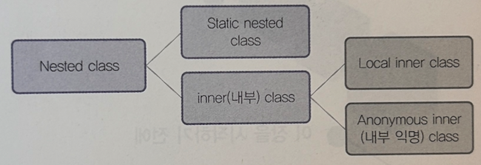

# nested class

- 자바에서는 클래스 안에 클래스가 들어갈 수 있다. 이러한 클래스를 `Nested 클래스`라고 부른다.
- 존재의 가장 큰 이유 : 코드를 간단하게 표현하기 위함
  - 1. 한 곳에서만 사용되는 클래스를 논리적으로 묶어서 처리할 필요가 있을 때
  - 2. 캡슐화가 필요할 때(예를 들어 A라는 클래스에 `private` 변수가 있다. 이 변수에 접근하고 싶은 B라는 클래스를 선언하고, B 클래스를 외부에 노출시키고 싶지 않을 경우가 여기에 속한다). 즉, 내부 구현을 감추고 싶을 때를 말한다.
  - 3. 소스의 가독성과 유지보수성을 높이고 싶을 때
- `Static nested 클래스`와 `내부(inner) 클래스`로 구분
- 내부 클래스는 다시 두 가지로 나뉘는데 이름이 있는 내부 클래스는 `로컬(혹은 지역) 내부 클래스`라고 하고, 이름이 없는 클래스를 `익명 내부 클래스`"라고 부른다. 
- 일반적으로는 간단하게 줄여서 각각 `내부 클래스`와 `익명 클래스`로 부른다.




### `PublicClass.java`파일
```java
package c.inner;

public class PublicClass {
}

class JustNotPublicClass {
}
```


## `Static nested` 클래스의 특징
- Static nested 클래스는 감싸고있는 외부 클래스의 변수에 접근하는 것이 불가능
- 

```java
package c.inner;

public class OuterOfStatic {
    static class StaticNested {
        private int value = 0;

        public int getValue() {
            return value;
        }
        public void setValue(int value) {
            this.value = value;
        }
    }
}
```
- 내부에 있는 `Nested 클래스`는 별도로 컴파일할 필요가 없다. 왜냐하면 여기서 `OuterOfStatic`이라는 감싸고 있는 클래스를 컴파일하면 자동으로 컴파일되기 때문
- 컴파일하면 다음과 같이 두개의 클래스가 만들어진다.

```shell
OuterOfStatic.class
OuterOfStatic$StaticNested.class
```

### 객체 생성 방법

```java
OuterOfStatic.StaticNested staticNested = new OuterfStatic.StaticNested();
```
- static nested 클래스를 만드는 이유 : 일반적으로 클래스를 묶기 위함.

- University 클래스의 예

```java
public class University {
    static class Student {
        
    }
}
```

- School 클래스의 예

```java
public class School {
    static class Student {
        
    }
}
```

- School.Student 클래스는 School 클래스에 만들었기 때문에 University 클래스에서는 사용할 수가 없다.

 
## 내부클래스(local 내부 클래스와 익명 클래스)

```java
package c.inner;

public class OuterOfInner {
    class Inner {
        private int value = 0;
        public int getValue() {
            return value;
        }
        public void setValue(int value){
            this.value = value;
        }
    }
}
```

### 객체 생성 방법

```java
OuterOfInner outer=new OuterOfInner();
OuterOfInner.Inner inner=outer.new Inner();
```

### 내부 클래스를 만드는 이유
  - 하나의 클ㄹ래스에서 공통적인 작업은 수행하는 클래스가 필요한데, 그 클래스가 다른 클래스에서는 전혀 필요가 없을 때, 내부 클래스를 만들어 사용함.
  - ex) GUI관련 프로그램(Swing, Applet, swt, gwt 등)을 개발할 떄 가장 많이 사용. Listner 처리할떄.

### 내부 클래스를 만드는 것보다도 더 간단한 방법 : 익명 클래스

- `MagicButton`

```java
package c.inner;

public class MagicButton {
    
  private EventListener listener;
  
  public MagicButton() {}
  
  public void setListener (EventListener listener) {
    this.listener=listener;
  }
  
  public void onClickProcess() {
    if(listener!=null) {
      listener.onClick();
    }
  }
}
```

- `EventListener`

```java
package c.inner;

public interface EventListener{
    public void onClick();
}
```

- `AnonymousSample`와 내부클래스  `MagicButtonListner`

```java
package c.inner;

public class AnonymousSample {
    public static void main(string args[]) {
        AnonymousSample sample = new AnonymousSample();
        sample.setButtonListener();
    }
    
    // 1. 내부클래스 생성자 사용
    public void setButtonListener() {
        MagicButton button = new MagicButton();
        MagicButtonListener listener = new MagicButtonListener(); 
        button.setListener(listener);
        button.onClickProcess();
    }
    
    // 2. 익명 클래스 사용 - 주의!! 기존에 있던 인터페이스의 메소드를 재정의함.
    public void setButtonListenerAnonymous() { 
        MagicButton button = new MagicButton();
        button.setListener(new EventListener() {
            public void onClick() {
                System.out.println("Magic Button Clicked !!!");
            }
        }); // 소괄호 닫는것 유의
        button.onClickProcess();
    }

    class MagicButtonListener implements EventListener {
        public void onClick() {
            System.out.println("Magic Button Clicked !!!");
        }
    }
}
```

## 익명 클래스
- 클래스 이름도 없고, 객체 이름도 없기 때문에 다른 클래스나 메소드에서는 참조할 수가 없다. 
- 만약 객체를 해당 클래스 내에서 재사용하려면, 다음과 같이 객체를 생성한후 사용하면 된다.

- 컴파일 결과 : `자바파일명${익명객체정의된순번}.class` 규칙순으로 클래스 파일이 생기게 된다

```shell
AnonymousSample$1.class
AnonymousSample$2.class 
```

```java
public void setButtonListenerAnonymousObject() {
    MagicButton button = new MagicButton();
    
    EventListener listener=new EventListener() { // 익명클래스를 변수에 담아 객체 생성
        public void onClick() {
        System.out.println("Magic Button Clicked !!!");
      }
    };
    button.setListener(listener); 
    button.onClickProcess();
}
```

###  익명 클래스를 만들었을때의 장점
- 클래스 정의 없이 **메소드 내에서 바로 클래스를 생성**해 인스턴스화 할 수 있다.
- 클래스의 선언과 객체의 생성을 동시에 하기 때문에 단 한 번만 사용될 수 있고, 익명으로 정의된 클래스는 `일회용`으로써 사용되고 버려진다. 
- 만일 어느 메소드에서 `부모 클래스의 자원을 상속`받아 재정의하여 사용할 자식 클래스가 한번만 사용되고 버려질 자료형이면, 굳이 상단에 클래스를 정의하기보다는, 지역 변수처럼 익명 클래스로 정의하고 스택이 끝나면 삭제되도록 하는 것이 유지보수면에서나 프로그램 메모리면에서나 이점을 얻을 수 있다.
- ***즉, 익명 클래스는 부모 클래스의 자원을 일회성으로 재정의하여 사용하기 위한 용도 인 것이다.***

##  Nested 클래스의 특징
- 감싸고 있는 클래스의 변수 중 참조 가능한 변수

```java
package c. inner;

public class NestedValueReference {
    public int publicInt=0;
    protected int protectedInt=1;
    int justInt=2;
    private int privateInt=3;
    static int staticInt=4;

    static class StaticNested { // Static Nested 클래스에서는 감싸고 있는 클래스의 static 변수만 참조 가능
        public void setvalue() {
            staticInt=14;
        }
    }
    
    class Inner { // 감싸고 있는 클래스의 어떤 변수라도 참조 가능
        public void setvalue() {
            publicInt=20;
            protectedInt=21;
            justInt=22;
            privateInt=23; 
            staticInt=24;
        }
    }
    
    public void setValue() {
        EventListener listener = new EventListener() { //  감싸고 있는 클래스의 어떤 변수라도 참조 가능
                                    public void onClick() {
                                        publicInt = 30;
                                        protectedInt = 31;
                                        justInt = 32;
                                        privateInt = 33;
                                        staticInt = 34;
                                    }
                                 };
    }
}
```


- 역참조 가능
  - `private`라고 할지라도 모두 접근할 수 있다.

```java
package c.inner;

public class ReferenceAtNested {
    static class StaticNested {
        private int staticNestedInt = 99;
    }
    
    class Inner {
        private int innerValue = 100;
    }
      
    public void setValue(int value) {
        Staticested nested=new StaticNested();
        nested.staticNestedInt=value;
        Inner inner=new Inner();
        inner.innerValue=value;
    }
}
```