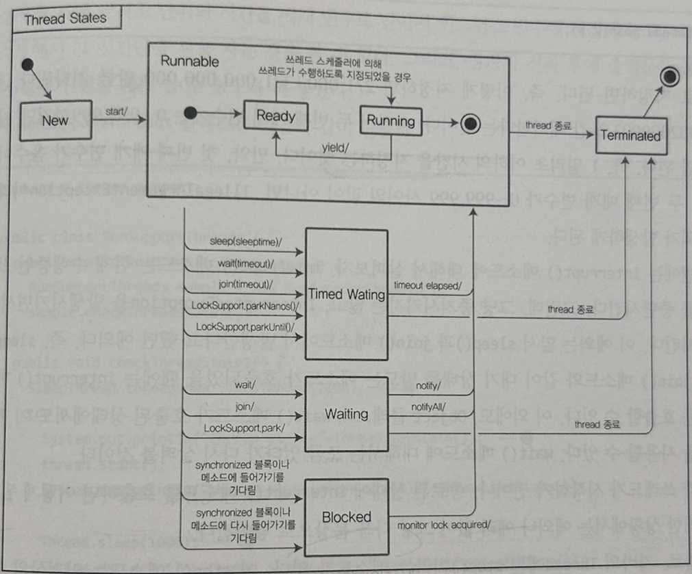

# 쓰레드 (Thread)

1. java 라는 명령어를 실행해서 클래스실행
2. jvm이 시작되면서 자바 프로세스가 시작
3. main() 메소드가 시작되면서 하나의 쓰레드가 시작

- 많은 쓰레드가 필요하면, main() 메소드에서 여러 쓰레드를 생성해주면 된다.
- 하나의 프로세스 내에 여러 쓰레드가 수행된다.
- 기본적으로 jvm을 관리하기 위한 여러 쓰레드가 존재한다.
- 자바의 객체를 청소하는 GC 관련 쓰레드도 이에 속한다.

- 쓰레드 사용예
    - 자바를 사용하여 웹을 제공할때
    - Tomcat과 같은 WAS를 사용한다. 이 WAS도 main()메소드에서 생성한 쓰레드들이 수행되는 것이다.

## 쓰레드를 만든 이유?

- 프로세스 하나가 시작하면 많은 자원들이 필요하다.
- 만약 하나의 작업을 동시에 수행하려 할때 여러개의 프로세스를 띄우려면 각각의 프로세스가 메모리 공간을 차지하게 된다.
- JVM은 기본적으로 아무런 옵션 없이 실행하면 32MB~64MB 의 물리 메모리를 점유한다.(이 공간은 OS마다 다르다.)
- 쓰레드 1개 추가시 1MB이내의 메로리를 점유한다.
- 때문에 쓰레드를 경량 프로세스라고 한다.
- 대부분의 작업은 단일 쓰레드로 실행하는 것보다 다중 쓰레드로 실행하는 것이 더 빠른 시간에 결과를 제공해준다.
- 따라서 보다 빠른 처리를 할 필요가 있을 때, 쓰레드를 사용하면 빠르게 처리할 수 있다.

## 쓰레드 생성방법

1. Runnable 인터페이스를 구현
2. Thread 클래스를 확장
    - Thread 클래스는 `Runnable 인터페이스를 구현`한 클래스로 `매우 많은` `생성자`와 `메소드`를 제공하고 있다.

> 위 두 방법 모두 java.lang 패키지에 해당하므로, 별도의 import는 필요 없다.
> 모두 쓰레드로 실행할 수 있다는 공통점이 있으나, 두 쓰레드 클래스를 실행하는 방식은 서로 다르다.

### 1. Runnable 인터페이스를 구현

- 단 하나의 `run()` 메소드가 선언되어있다.
- 쓰레드가 시작되기 전 수행되는 메소드

```java
package e.thread;

public class RunnableSample implements Runnable {
	public void run() {
		System.out.println("This is RunnableSample's run() method.");
	}
}
```

### 쓰레드 시작 방법

```java
package e.thread;

public class RunThreads {
	public static void main(String[] args) {
		RunThreads threads = new RunThreads();
		threads.runBasic();
	}

	public void runBasic() {
		RunnableSample runnable = new RunnableSample();
		new Thread(runnable).start(); // 쓰레드 셍성자의 매개변수로 구현체가 들어감.
	}
}
```

### 2. Thread 클래스를 확장

```java
package e.thread;

public class ThreadSample extends Thread {
	public void run() {
		System.out.println("This is ThreadSample's run() method.");
	}
}
```

### 쓰레드 시작 방법

```java
package e.thread;

public class RunThreads {
	public static void main(String[] args) {
		RunThreads threads = new RunThreads();
		threads.runBasic();
	}

	public void runBasic() {
		ThreadSample thread = new ThreadSample();
		thread.start();
	}
}
```

> ### 쓰레드 생성방법이 2가지 있는 이유
>- 클래스는 다상속이 불가능하므로 이미 상속받은 클래스가 있는 경우 해당클래스를 쓰레드로 만들수없다.
>- 하지만, 인터페이스는 여러개의 인터페이스를 구현해도 전혀 문제가 발생하지 않는다.
>- 따라서,이러한경우에는 Runnable 인터페이스를 구현해서 사용하면 된다.

### 쓰레드 특징

- 비동기로 실행된다. 즉 실행 및 종료 순서가 순차적이지 않다.
- Thread클래스의 start() 메소드는 Runnable 인터페이스의 run()메소드르 자동으로 실행한다.
- run() 메소드가 종료되지 않는한 애플리케이션은 끝나지 않는다.
-

```java
package e.thread;

public class RunMultiThreads {
	public static void main(String args[]) {
		RunMultiThreads sample = new RunMultiThreads();
		sample.runMultiThread();
	}

	public void runMultiThread() {
		RunnableSample[] runnable = new RunnableSample[5];
		ThreadSample[] thread = new ThreadSample[5];
		for (int loop = 0; loop < 5; loop++) {
			runnable[loop] = new RunnableSample();
			thread[loop] = new ThreadSample();
			new Thread(runnable[loop]).start();
			thread[loop].start();
		}
		System.out.println("RunMultiThreads.runMultiThread() method is ended.");
	}
}
```

- 실행결과는 아래와 같이 무작위가 된다.

```shell
This is RunnableSample's run() method.
This is RunnableSample's run() method.
This is RunnableSample's run() method.
This is ThreadSample's run() method.
RunMultiThreads.runMultiThread() method is ended.
This is ThreadSample's run() method.
This is ThreadSample's run() method.
This is RunnableSample's run() method.
This is ThreadSample's run() method.
This is RunnableSample's run() method.
This is ThreadSample's run() method.
```

## Thread 클래스 생성자 8개

| 생성자                                  | 설명                                                              |
|--------------------------------------|-----------------------------------------------------------------|
| Thread()                             | 새로운 쓰레드를 생성한다.                                                  |
| Thread(Runnable target)              | 매개 변수로 받은 target 객체의 run() 메소드를 수행하는 쓰레드를 생성한다.                 |
| Thread(Runnable target, String name) | 매개 변수로 받은 target 객체의 run() 메소드를 수행하고, name이라는 이름을 갖는 쓰레드를 생성한다. |
| Thread(String name)                  | name이라는 이름을 갖는 쓰레드를 생성한다.                                       |

### 쓰레드 이름

- 아무런 이름을 지정하지 않으면, 그 쓰레드의 이름은 `Thread-n`
- `n`은 생성된 순서에 따라 증가
- 쓰레드 이름을 지정 한다면, 해당 쓰레드는 별도의 이름을 가지게 된다. 만약 쓰레드 이름이 겹친다고 해도 예외나 에러가 발생하지는 않는다.

| 생성자                                                                     | 설명                                                                                                                      |
|-------------------------------------------------------------------------|-------------------------------------------------------------------------------------------------------------------------|
| Thread(ThreadGroup group, Runnable target)                              | 매개 변수로 받은 group의 쓰레드 그룹에 속하는 target 객체의 run() 메소드를 수행하는 쓰레드를 생성한다.                                                      |
| Thread(ThreadGroup group, Runnable target, String name)                 | 매개 변수로 받은 group의 쓰레드 그룹에 속하는 target 객체의 run() 메소드를 수행하고, name이라는 이름을 갖는 쓰레드를 생성 매개 변수로 받은 group의 쓰레드 그룹에 속하는 target 객체의 |
| Thread(ThreadGroup group, Runnable target, String name, long stackSize) | run() 메소드를 수행하고, name라는 이름을 갖는 쓰레드를 생성 한다. 단 해당 쓰레드의 스택의 크기는 stackSize 만큼만 가능하다.                                        |
| Thread(ThreadGroup group, String name)                                  | 매개 변수로 받은 group의 쓰레드 그룹에 속하는 name라는 이름을 갖는 쓰레드를 생성한다.                                                                   |

### `ThreadGroup`

- 어떤 쓰레드를 생성할 때 쓰레드를 묶어 놓을 수 있다.
- 이렇게 쓰레드의 그룹을 묶으면 `ThreadGroup 클래스`에서 제공하는 `여러 메소드`를 통해서 `각종 정보`를 얻을 수 있다.

### `stacksize`

- 쓰레드가 생성될 때마다 할당되는 별도의 스택의 크기
- 쓰레드에서 얼마나 많은 메소드를 호출하는지, 얼마나 많은 쓰레드가 동시에 처리되는지는 JVM이 실행되는 OS의 플랫폼에 따라서 매우 다르다.
- 경우에 따라서는 이 값이 무시될 수도 있다.

## 생성자 호출 방법

- 쓰레드 이름 지정

```java
package e.thread;

public class NameThread extends Thread { // 1.  Thread 클래스 상속받기

	public NameThread(string name) {
		super(name); // 2. 부모클래스의 생성자 호출하기
	}

	public void run() {
	}
}
```

- `run()`, `start()` 메소드다 매개변수없는 메소드일때, 값 넘겨주어 연산하기
    - 생성자 호출시 값을 넘겨주어 인스턴수 변수에 저장하여 연산토록 한다.

```java
package e.thread;

public class NameCalcthread extends Thread {
	private int calcNumber;

	public NameCalcThread(String name, int calNumber) {
		super(name);
		this.calcNumber = calcNumber;
	}

	public void run() {
		calcNumber++;
	}
}
```

## Thread 클래스의 주요 메소드

- Thread에 있는 static 메소드는 대부분 해당 쓰레드를 위해서 존재하는 것이 아니라, JVM에 있는 쓰레드를 관리하기 위한 용도로 사용됨.
- 예외도 있으며, 그 중 하나가 `sleep()` 메소드

## sleep() - static 메소드

| 리턴타입        | 메소드 이름 및 매개변수                 | 설명                                                                                 | 
|-------------|-------------------------------|------------------------------------------------------------------------------------|
| static void | sleep(long millis)            | 매개 변수로 넘어온 시간(1/1,000초)만큼 대기한다.                                                    | 
| static void | sleep(long millis, int nanos) | 첫 번째 매개 변수로 넘어온 시간(1/1,000초) + 두번째 매개 변수로 넘어온 시간(1/1,000,000,000(1/10억)초) 만큼 대기한다. | 

- 사용 예
    - thread.sleep() 메소드를 사용할 때에는 항상 `try-catch`로 묶어 주어야 한다.
    - 적어도 `InterruptedException`으로 `catch` 해 주어야만 한다.
        - 애플리케이션 구동중 하나의 스레드가 동작할때, 나머지는 waiting상태로 들어가게 된다.
        - 어떤 스레드가 sleep이나 waiting상태에서 영원히 block(또는 deadLock)됬을때, 스레드를 강제로 중단 시키위해 interrupt() 메소드를 사용하며
        - 이때, `InterruptedException`을 발생시킨다.

```java
package e.thread;

public class EndlessThread extends Thread {
	public void run() {
		while (true) {
			try {
				System.out.printIn(System.currentTimeMillis());
				Thread.sleep(1000);
			} catch (InterruptedException e) {
				e.printStackTrace();
			}
		}
	}
}
```

```java
package e.thread;

public class RunEndlessThreads {
	public static void main(String args[]) {
		RunEndlessThreads sample = new RunEndlessThreads();
		sample.endless();
	}

	public void endless() {
		EndlessThread thread = new EndlessThread();
		thread.start();
	}
}
```

- 출력

```shell
1479339414270
1479339415278
1479339416270
1479339417270
...
```

## 쓰레드 속성을 확인, 지정하기 위한 메소드

| 리턴 타입               | 메소드 이름 및 매개 변수               | 설명                                                                       |
|---------------------|------------------------------|--------------------------------------------------------------------------|
| void                | run()                        | 더 이상 설명이 필요 없는 여러분들이 구현해 야 하는 메소드다.                                      |
| long                | getId()                      | 쓰레드의 고유 id를 리턴한다. JVM에서 자동 으로 생성해준다.                                     |
| String              | getName()                    | 쓰레드의 이름을 리턴한다.  기본값이 5다.                                                 |
| void                | setName(String name)         | 쓰레드의 이름을 지정한다.                                                           |
| int                 | getPriority()                | 쓰레드의 우선 순위를 확인한다.                                                        |
| void                | setPriority(int newPriority) | 쓰레드의 우선 순위를 지정한다.                                                        |
| boolean             | isDaemon()                   | 쓰레드가 데몬인지 확인한다.                                                          |
| void                | setDaemon(boolean on)        | 쓰레드를 데몬으로 설정할지 아닌지를 설정 한다. 쓰레드가 수행하기 전에 데몬 여부를 지정해야만 그 쓰레드가 데몬 쓰레드로 인식됨. |
| StackTraceElement[] | getStackTrace()              | 쓰레드의 스택 정보를 확인한다.                                                        |
| Thread.State        | getState()                   | 쓰레드의 상태를 확인한다.                                                           |
| ThreadGroup         | getThreadGroup()             | 쓰레드의 그룹을 확인한다.                                                           |

- 우선순위 상수
    - 우선순위를 정해야할때, 아래 상수를 사용하여 지정하는 것을 권장.

| 상수            | 값 및 설명                    |
|---------------|---------------------------|
| MAX_PRIORITY  | 가장 높은 우선 순위이며, 그 값은 10이다. |
| NORM_PRIORITY | 일반 쓰레드의 우선 순위이며, 그 값은 5다. |
| MIN_PRIORITY  | 가장 낮은 우선 순위이며, 그 값은 1이다.  |

### 쓰레드의 우선 순위

- 대기하고 있는 상황에서 더 먼저 수행할 수 있는 순위
- 대부분 이 값은 기본값으로 사용하는 것을 권장한다. 마음대로 우선 순위를 정했다가는 잘못해서 장애로 연결가능

```java
package e.thread;

public class RunDaemonThreads {
	public static void main(String args[]) {
		RunDaemonThreads sample = new RunDaemonThreads();
		sample.checkThreadProperty();
	}

	public void checkThreadProperty() {
		ThreadSample thread1 = new ThreadSample();
		ThreadSample thread2 = new ThreadSample();
		ThreadSample daemonThread = new ThreadSample();

		System.out.println("thread1 id=" + thread1.getId());
		System.out.println("thread2 id=" + thread2.getId());

		System.out.println("thread1 name=" + thread1.getName());
		System.out.println("thread2 name=" + thread2.getName());

		System.out.println("thread1 priority=" + thread1.getPriority());

		daemonThread.setDaemon(true);
		System.out.println("thread1 isDaemon=" + thread1.isDaemon());
		System.out.println("daemonThread isDaemon=" + daemonThread.isDaemon());
	}
}
```

- 실행 결과

```shell
thread1 id=11
thread2 id=12
thread1 name=Thread-0
thread2 name=Thread-1
thread1 priority=5 //  우선 순위는 기본값이 5이다.
thread1 isDaemon=false
daemonThread isDaemon=true // 쓰레드가 수행하기 전에 데몬 여부를 지정
```

### 데몬쓰레드 클래스 daemonThread

- 데몬 쓰레드는 해당 쓰레드가 종료되지 않아도 다른 실행중인 일반 쓰레드가 없다면, 멈춰버린다.
- 어떤 쓰레드를 데몬으로 지정하면, 그 쓰레드가 수행되고 있든, 수행되지 않고 있든 상관 없이 JVM이 끝날 수 있다.
- 단, 해당 쓰레드가 시작하기(start() 메소드가 호출되기) 전에 데몬 쓰레드로 지정되어야 만 한다.
- 쓰레드가 시작한 다음에는 데몬으로 지정할 수 없다.

> [사용예] </br>
> 모니터링하는 쓰레드를 별도로 띄워 모니터링하다가,
> 주요 쓰레드가 종료되면 관련된 모니터링 쓰레드가 종료되어야 프로세스(jvm)가 종료될 수 있다.
> 그런데, 모너터링, 쓰레드를 데몬 쓰레드로 만들지 않으면 프로세스(jvm)가 종료될 수 없게 된다.
> 이렇게, 부가적인 작업을 수행하는 쓰레드를 선언할 때 데몬 쓰레드를 만든다.

```java
public void runDaemonThread(){
	DaemonThread thread=new DaemonThread();
	thread.setDaemon(true);
	thread.start();
	}
```

## 쓰레드와 관련이 많은 Synchronized

- 자바의 예약어 중 하나
- 클래스나 메소드가 쓰레드에 안전하려면, synchronized를 사용해야만 한다.

> 여러 쓰레드가 한 객체에 선언된 메소드에 접근하여 데이터를 처리하려고 할 때 </br>
> 동시에 연산을 수행하여 값이 꼬이는 경우가 발생할 수 있다. </br>
> (여기서 한 객체라는 것은 하나의 클래스에서 생성된 여러 개의 객체가 아니라, 동일한 하나의 객체를 말한다.)
> 단, `메소드`에서 `인스턴스 변수`를 수정하려고 할 때에만 이러한 문제가 생긴다.
> 매개 변수나 메소드에서만 사용하는 지역변수만 다루는 메소드는 전혀 synchronized로 선언할 필요가 없다.

## synchronized의 두 가지 사용 방법

### 1. 메소드 자체를 synchronized로 선언하는 방법(synchronized methods)

- synchronized라는 단어가 메소드 선언부에 있으면, 동일한 객체의 이 메소드에 2개의 쓰레드가 접근하든, 100개의 쓰레드가 접근하든 간에 한 순간에는 하나의 쓰레드만 이 메소드를 수행하게 된다.

```java
public synchronized void plus(int value){
	amount+=value;
	}
```

- synchronized 적용 전

  ```java
  package e.thread.sync;
  
  public class CommonCalculate {
      private int amount;
  
      public CommonCalculate() {
          amount = 0;
      }
  
      public void plus(int value) {
          amount += value;
      }
  
      public void minus(int value) {
          amount -= value;
      }
  
      public int getAmount() {
          return amount;
      }
  }
  
  ```

  ```java
  package e.thread.sync;
  
  public class ModifyAmountThread extends Thread {
      private CommonCalculate calc;
      private boolean addFlag;
  
      public ModifyAmountThread(CommonCalculate calc, boolean addFlag) {
          this.calc = calc;
          this.addFlag = addFlag;
      }
  
      public void run() {
          for (int loop = 0; loop < 10000; loop++) {
              if (addFlag) {
                  calc.plus(1);
              } else {
                  calc.minus(1);
              }
          }
      }
  }
  ```

  ```java
  package e.thread.sync;
  
  public class RunSync {
      public static void main(String[] args) {
          RunSync runSync = new RunSync();
          runSync.runCommonCalculate();
      }
  
      public void runCommonCalculate() {
          CommonCalculate calc = new CommonCalculate();
          ModifyAmountThread thread1 = new ModifyAmountThread(calc, true);
          ModifyAmountThread thread2 = new ModifyAmountThread(calc, true);
          
          thread1.start();
          thread2.start();
          try {
              thread.join(); // Join() 메소드는 쓰레드가 종료될 때까지 기다리는 메소드다.
              thread2.join(); // Join() 메소드는 쓰레드가 종료될 때까지 기다리는 메소드다.
              System.out.println("Final value is " + calc.getAmount());
          } catch (InterruptedException e) {
              e.printStackTrace();
          }
      }
  }
  ```
    - runComoncalculate() 메소드가 수행된 후에는 두 개의 쓰레드 에서 하나의 객체에 있는 amount라는 int 타입의 값에 1을 만번 더한 결과를 출력한다.
    - `Final value is 20000`을 예상했지만, 결과는 `Final value is 19511`가 된다.
    - 연산은 우측 항의 결과를 좌측 항에 있는 amount에 담는다.
    - 예를 들어 우측 항에 있는 amount 가 1이고, value가 1일 경우, 정상적인 경우라면 좌측 항의 결과에는 2가 된다.
    - 그런데 좌측 항에 2라는 값을 치환하기 전에 다른 쓰레드가 또 들어와서 이 연산을 수행하려고 한다.
    - `아직 amount는 2가 안 된 상황에서 amount는 1`이다. 따라서, 먼저 계산된 결과에서 2를 치환한다고 하더라도,
    - 그 다음에 들어온 쓰레드도 1과 1을 더하기 때문에 다시 `amount`에 2를 치환한다.
    - 동시에 연산이 수행되기 때문에 우리가 원한 20.000이라는 값이 출력되지 않은 것
    - 이러한 문제를 해결하기 위한 것이 바로 `synchronized`다.
    - 출력결과
      ```shell
      Final value is 16447
      Final value is 19782
      Final value is 13399
      Final value is 14543
      Final value is 20880
      ```


- synchronized 적용 후
    - `amount` 라는 변수를 변경하는 minus()메소드에도 적용해주었다.
    - 다른 쓰레드에서 수행하려고 하면, 늦게 온 쓰레드는 앞서 수행하는 메소드가 끝날 때까지 기다린다.

  ```java
  public synchronized void plus(int value) {
      amount+=value;
  }
    
  public synchronized void minus(int value) {
      amount-=value;
  }
  ```
    - 출력결과
      ```shell
      Final value is 20000
      Final value is 20000
      Final value is 20000
      Final value is 20000
      Final value is 20000
      ```

### 2. 메소드 내의 특정 문장만 synchronized로 감싸는 방법(synchronized statements)

- Synchronized 블록
- 간단히 synchronized 예약어만 추가시 성능상 문제점이 발생할 수 있다.
- 예를 들어 어떤 클래스에 30줄짜리 메소드가 있을때, 그 클래스에도 amount라는 인스턴스 변수가 있고,
- 30줄짜리 메소드에서 amount라는 변수를 한 줄에서만 다룬다.
- 만약 해당 메소드 전체를 synchronized로 선언한다면, 나머지 29줄의 처리를 할 때 필요없는 대기 시간이 발생하게 된다.
- 이러한 경우에는 메소드 전체를 감싸면 안되며, amount라는 변수를 처리하는 부분만 synchronized 처리를 해주면 된다.

```java
Object lock=new Object();
public void plus(int value){
	synchronized(lock){
		amount+=value;
	}
}

public void minus(int value){
	synchronized(lock){
		amount-=value;
	}
｝
```

```java
public void plus(int value){
	synchronized(this){
		amount+=value;
	}
}

public void minus(int value){
	synchronized(this){
		amount-=value;
	}
｝
```

- synchronized(this) 이후에 있는 중괄호 내에 있는 연산만 동시에 여러 쓰레드에서 처리하지 않겠다는 의미다.
- 잠금 처리할 별도의 객체를 선언 `synchronized(객체)`

### synchronized 블록 사용시 주의

- 만약 클래스에 `amount`라는 변수 외에 `interest`라는 변수가 있고,
- 그 `interest`라는 변수를 처리할 때에도 여러 쓰레드에서 접근하면 안 되는 경우가 발생할 수 있다.
- 이럴 때 만약 lock이라는 하나의 잠금용 객체만을 사용하면 amount라는 변수를 처리할 때, interest라는 변수를 처리하려는 부분도 처리를 못하게 된다.
  ```java
  private int amount;
  private int interest;
  private Object interestLock = new Object(); 
  private Object amountLock = new Object();
  
  public void addInterest(int value) {
    synchronized(interestLock) {
        interest+=value;
    }
  }
  public void plus(int value) {
    synchronized(amountLock) { // 서로다른 인스턴스 객체인 경우 같은 객체로 잠금을 걸지 않도록 주의
        amount+=value;
    }
  }
  ```
- 메소드를 synchronized 할 때에는 같은 객체를 참조할 때에만 유효

```java
    // 옳바른 적용의 예
    CommonCalculate calc=new Common Calculate();
	ModifyAmountThread thread1=new ModifyAmountThread(calc,true);
	ModifyAmountThread thread=new ModifyAmountThread(calc,true);

	// 잘못된 적용의 예
	CommonCalculate calc1=new CommonCalculate();
	ModifyAmountThread thread1=new ModifyAmountThread(calc1,true);

	CommonCalculate calc2=new CommonCalculate();
	ModifyAmountThread thread=new ModifyAmount Thread(calc2,true);
```

>synchronized는 여러 쓰레드에서 하나의 객체에 있 는 인스턴스 변수를 동시에 처리할 때 발생할 수 있는 문제를 해결하기 위해서 필요한 것이므로, 인스턴스 변수가 선언되더라도 서로다른 쓰레드에서 공유하지
>않는다면, synchronized를 사용할 이유가 없다.

### [StrinBuilder와 StringBuffer의 차이]
>`StringBuffer`는 `synchronized` 블록으로 주요 데이터 처리 부분을 감싸 두었고, `StringBuilder`는 synchronized라는 것이 사용되지 않았다.<br>
>그렇기 때문에 `StringBuffer`는 하나의 문자열 객체를 `여러 쓰레드에서 공유`해야 하는 경우에만 사용하고, `StringBuilder`는 여러 쓰레드에서 공유할 일이 없을 때 사용하면 된다.<br> 
>결론적으로 필요에 따라 적절한 클래스를 선택하여 사용하는 것도 매우 중요하다.<br>
>API 문서를 자주 참조하며 개발하자!!

## 쓰레드의 상태를 통제하기 위한 메소드

1. getState()

| 리턴 타입        | 메소드 이름 및 매개 변수               | 설명                                                                          |
|--------------|------------------------------|-----------------------------------------------------------------------------|
| Thread.State | getState()                   | 쓰레드의 상태 확인한다.                                                               |

- 리턴타입 Thread.State : 자바의 Thread 클래스에 있는 State라는 enum 클래스를 의미
  - 선언되어있는 상수 목록
   
  | 상태            | 의미                                                 |
  |---------------|----------------------------------------------------|
  | NEW           | 쓰레드 객체는 생성되었지만, 아직 시작되지는 않은 상태                     | 
  | RUNNABLE      | 쓰레드가 실행중인 상태                                       | 
  | BLOCKED       | 쓰레드가 실행 중지 상태이며, 모니터 락(monitor lock)이 풀리기를 기다리는 상태 |  
  | WAITING       | 쓰레드가 대기중인 상태                                       | 
  | TIMED WAITING | 특정 시간만큼 쓰레드가 대기중인 상태                               | 
  | TERMINATED    | 쓰레드가 종료된 상태                                        | 
  - 위 상수들은 `public static`으로 선언되어 있다. `Thread.State.NEW`와 같이 사용 가능
  
- 쓰레드 상태
  -  어떤 쓰레드이건 간에 `NEW` - 그밖의 상태 - `TERMINATED`의 라이프 사이클을 가진다.



2. join()
- 해당 쓰레드가 종료될 때까지 기다린다.
- 원하는 대기시간 만큼을 매개변수에 지정. 
  - `0.002000003초 -> thread.join(2,3);`
  - 모든 매개변수는 양수여야하며, 두번째 매개변수는 0 ~ 999,999까지만 지정
    - `IllegalArgumentException` 예외 발생

| 리턴 타입        | 메소드 이름 및 매개 변수               | 설명                                                                          |
|--------------|------------------------------|-----------------------------------------------------------------------------|
| void         | join()                       | 수행중인 쓰레드가 중지할 때까지 대기한다.                                                     | 
| void         | join(long millis)            | 매개 변수에 지정된 시간만큼(1/1,000초) 대기한다.                                             | 
| void         | join(long millis, int nanos) | 첫 번째 매개 변수에 지정된 시간(1/1,000초)+두 번 째 매개 변수에 지정된 시간(1/1,000,000,000초)만 큼 대기한다. |


3. interrupt()
- `InterruptedException`을 발생시키면서 현재 수행중인 쓰레드를 중단 시킨다.
- Thread 클래스의 sleep()와 join() 메소드, Object 클래스의 wait() 메소드같이 `대기(waiting)`상태를 만드는 메소드가 호출되었을 때에는 interrupt() 메소드를 호출할 수 있다.

>만약 쓰레드가 시작하기 전이나, 종료된 상태에 interrupt() 메소드를 호출하면 어떻게 될까?<br>
>=> 예외나 에러 없이 그냥 다음 문장으로 넘어간다.

| 리턴 타입        | 메소드 이름 및 매개 변수               | 설명                                                                          |
|--------------|------------------------------|-----------------------------------------------------------------------------|
| void         | interrupt()                  | 수행중인 쓰레드에 중지 요청을 한다.                                                        | 

4. stop()
- 안전상의 이유로 deprecated 되었으며 사용해서는 안된다.
- interrupt() 메소드를 사용하여 쓰레드를 멈추어야 한다.


### 메소드 사용 예제 - 지정 시간만큼 대기하는 쓰레드

```java
package e.thread.support;

public class SleepThread extends Thread {
    long sleepTime;
    public sleepThread(long sleepTime) {
		this.sleepTime = sleepTime;
	}
    public void run() {
        try {
            System.out.println("Sleeping " + getName());
			Thread.sleep(sleepTime);
            System.out.println("Stopping " + getName());
		} catch (InterruptedException ie) {
        	ie.printstackTrace();
        }
    }
}
```

```java
package e.thread.support;

public class RunSupportThreads {
    public static void main(String args[]) {
    	RunSupportThreads sample = new RunSupportThreads();
    	sample.checkThreadState1();
    }
    public void checkThreadState1() {
        SleepThread thread = new SleepThread(2000);
        try {
            System.out.println("thread state=" + thread.getState());
            thread.start();
            System.out.println("thread state(after start)=" + thread.getState());
            
			Thread.sleep(1000); // 쓰레드가 시작하고 1초 동안 대기한 후 상태를 출력하도록 함
            System.out.println("thread state(after 1 sec)=" + thread.getState()); 
            
			thread.join();      // 메소드가 끝날 때까지 기다리도록 한다.
            thread.interrupt(); // 쓰레드가 종료된 이후에 interrupt() 메소드를 호출
            System.out.println("thread state(after join)=" + thread.getState());
        } catch (InterruptedException ie) {
            ie.printStackTrace();
        }
    }
}
```
- 결과 출력

```shell
thread state=NEW
thread state(after start)=RUNNABLE
Sleeping Thread-0
thread state(after 1 sec)=TIMED_WAITING
Stopping Thread-O
thread state(after join)=TERMINATED
```


- join()에 매개변수지정하였을 때
  ```java
  public void checkJoin() {
      SleepThread thread = new SleepThread(2000);
      try {
      	thread.start(); // thread가 2초간 대기
      	thread.join(500); // checkJoin가 0.5초 대기로 대기시간이 더 짧은 상태에서 thread가 `대기`상태이다.
      	thread.interrupt(); // 쓰레드 수행 중지
      	System.out.println("thread state(after join)=" + thread.getState());
      } catch (InterruptedException ie) {
      	ie.printStackTrace();
      }
  }
  ```
  - 출력
  ```shell
  java.lang.InterruptedException: sleep interrupted
  thread state(after join)=TIMED _WAITING
    at java.lang.Thread.sleep(Native Method)
    at e.thread.support.SleepThread.run(SleepThread.java:11)
  ```
> 만약 `thread.join(5000);`이었다면, 이미 thread가 실행후 중지 된 상태이므로 `thread.interrupt();` 시 아무런 일도 일어나지 않으므로 아래와 같은 결과가 출력된다.
>```java
>Sleeping Thread-0
>Stopping Thread-0
>thread state(after join)=TERMINATED
>```


## 쓰레드의 상태를 확인하기 위한 메소드

- interrunted() 메소드는 `본인의 쓰레드`를 확인할 때 사용
- isInterupted() 메소드는 `다른 쓰레드`에서 확인할 때 사용

| 리턴 타입          | 메소드 이름 및 매개 변수   | 설명                                                                                       |
|----------------|------------------|------------------------------------------------------------------------------------------|
| void           | checkAccess()    | 현재 수행중인 쓰레드가 해당 쓰레드를 수정할 수 있는 권한이 있는지를 확인한다. 만약 권한이 없다면 `SecurityException`이라는 예외를 발생시킨다. |
| boolean        | isAlive()        | 쓰레드가 살아 있는지를 확인한다. 해당 쓰레드의 run() 메소드가 종료되었는지 안되었는지를 확인하는 것이다.                            |
| boolean        | isInterrupted()  | run() 메소드가 정상적으로 종료되지 않고, Interrupt() 메소드의 호출을 통해서 종료되었는지를 확인하는 데 사용한다.                  |
| static boolean | interrupted()    | static 메소드로 현재 쓰레드가 중지되었는지를 확인한다.                                                        |

- JVM에서 사용되는 쓰레드의 상태들을 확인하기 위해서는 Thread 클래스의 Static 메소드들을 알아야만 한다.
  - 주요 static 메소드
  
  | 리턴 타입         | 메소드 이름 및 매개 변수      | 설명                                             |
  |------------------|---------------------|------------------------------------------------|
  | static int       | activeCount()       | 현재 쓰레드가 속한 `쓰레드그룹`의 쓰레드 중 `살아있는 쓰레드의 개수`를 리턴한다.   |
  | static Thread    | currentThread()     | `현재 수행중인 쓰레드의 객체`를 리턴한다.                         |
  | static void      | dumpStack()         | 콘솔 창에 `현재 쓰레드의 스택 정보`를 출력한다.                     |


## Object 클래스에 선언된 쓰레드와 관련있는 메소드

| 리턴 타입 | 메소드 이름 및 매개 변수                 | 설명                                                                                                                                                               |                                                                                     
|-------|--------------------------------|------------------------------------------------------------------------------------------------------------------------------------------------------------------|
| void  | wait()                         | 다른 쓰레드가 Object 객체에 대한 notify() 메소드나 notifyAll() 메소드를 호출할 때까지 현재 쓰레드가 대기하고 있도록 한다.                                                                              
| void  | wait(long timeout)             | wait() 메소드와 동일한 기능을 제공하며, 매개 변수에 지정한 시간만큼만 대기한다. 즉, 매개 변수 시간을 넘어섰을 때에는 현재 쓰레드는 다시 깨어난다. 여기서의 시간은 밀리초로 1/1,000초 단위다. 만약 1초간 기다리게 할 경우에는 1000을 매개 변수로 넘겨주면 된다.  
| void  | wait(long timeout, int nanos)  | wait() 메소드와 동일한 기능을 제공한다. 하지만, wait(timeout)에서 밀리초 단위의 대기 시간을 기다린다면, 이 메소드는 보다 자세한 밀리초 + 나노초 (1/1,000,000.000초) 만큼만 대기한다. 뒤에 있는 나노초의 값은 0~999,999 사이의 값만 지정할 수 있다. 
| void  | notify()                       | Object 객체의 모니터에 대기하고 있는 단일 쓰레드를 깨운다.                                                                                                                             
| void  | notifyAll()                    | Object 객체의 모니터에 대기하고 있는 모든 쓰레드를 깨운다.                                                                                                                                   

```java
package e.thread.object;

public class StateThread extends Thread {
    private Object monitor;
    public StateThread(Object monitor) {
		this.monitor = monitor;
	}
    
	public void run() {
		try {
			for (int loop=0; loop < 10000; loop++) {
				String a="A";
			}
			synchronized(monitor) {
				monitor.wait();
			}
			System.out.println(getName() + " is notified.");
			Thread.sleep(1000);
		} catch (InterruptedException ie) {
			ie.printStackTrace();
		}
	}
}

```

- 실행코드

```java
package e.thread.object;
public class RunObjectThreads {
    public static void main(String args[]) {
        RunObjectThreads sample = new RunObjectThreads();
        sample.checkThreadState2();
    }
	
    public void checkThreadState2() {
		Object monitor = new Object();
		StateThread thread = new StateThread(monitor);
		try {
			System.out.println("thread state=" + thread.getState());
			thread.start();
			System.out.println("thread state(after start)=" + thread.getState());

			Thread.sleep(100);
			System.out.println("thread state(after 0.1 sec)=" + thread.getState());

			synchronized (monitor) {
				monitor.notify();
			}
			Thread.sleep(100);
			System.out.println("thread state(after notify)=" + thread.getState());

			thread.join();
			System.out.println("thread state(after join)=" + thread.getState());
		} catch (InterruptedException ie) {
			ie.printStackTrace();
		}
	}
}
```
- 실행 결과
```shell
thread state=NEW
thread state(after start)=RUNNABLE 
thread state (after 0.1 sec)=WAITING
Thread-0 is notified.
thread state(after notify)=TIMED _WAITING
thread state(after join)=TERMINATED
```
>interrupt() 메소드를 호출하여 대기 상태에서 풀려날 수도 있겠지만, 
>notify() 메소드를 호출해서 풀어야 `InterruptedException`도 발생하지 않고, 
>wait() 이후의 문장도 정상적으로 수행하게 된다.


- 무한정 wait()가 생길때 푸는 법

```java
package e.thread.object;
public class RunObjectThreads {
    public static void main(String args[]) {
        RunObjectThreads sample = new RunObjectThreads();
        sample.checkThreadState2();
    }
	
    public void checkThreadState3() {
		Object monitor = new Object();
		StateThread thread = new StateThread(monitor);
		StateThread thread2 = new StateThread(monitor); //  추가
		
		try {
			System.out.println("thread state=" + thread.getState());
			thread.start();
			System.out.println("thread state(after start)=" + thread.getState());

			Thread.sleep(100);
			System.out.println("thread state(after 0.1 sec)=" + thread.getState());

			synchronized (monitor) {
				monitor.notify(); // 먼저 대기하고 있는 쓰레드의 대기만 풀어준다.
			}
			Thread.sleep(100);
			System.out.println("thread state(after notify)=" + thread.getState());

			thread.join();
			System.out.println("thread state(after join)=" + thread.getState());
			thread2.join(); //  추가
			System.out.println("thread2 state(after join)=" + thread2.getState()); //  추가
		} catch (InterruptedException ie) {
			ie.printStackTrace();
		}
	}
}
```
- 실행 결과
  ```shell
  thread state=NEW
  thread state(after start)=RUNNABLE 
  thread state(after 0.1 sec)=WAITING
  Thread-0 is notified.
  thread state(after notify)=TIMED_WAITING 
  thread state(after join)=TERMINATED
  ```
  - thread2의 결과가 찍히지 않은것을 볼 수있다. notify()는먼저 대기하고 있는 것을 풀어준다. 따라서 notify()를 한줄 더 추가하거나, notifyAll() 메소드를 사용하여 다른 쓰레드의 대기도 풀어주도록 한다.
  ```java
  synchronized (monitor) {
    // monitor.notify();
    // monitor.notify();
    monitor.notifyAll();
  }
  ```
  - 변경 후 출력결과
  ```shell
  thread state=NEW
  thread state(after start)=RUNNABLE
  thread state(after 0.1 sec)=WAITIN
  Thread-0 is notified.
  Thread-1 is notified.
  thread state(after notify)=TIMED_WAITING
  thread state(after join)=TERMINATED
  thread2 state(after join)=TERMINATED
  ```


## `ThreadGroup`에서 제공하는 메소드들

- ThreadGroup 
  - 용도가 다른 여러 쓰레드의 관리를 용이하게 하기 위한 클래스
  - 쓰레드 그룹은 기본적으로 운영체제의 폴더처럼 뻗어나가는 트리 tree 구조를 가진다.
  - 하나의 그룹이 다른 그룹에 속할 수도 있고, 그 아래에 또 다른 그룹을 포함할 수도 있다.

| 리턴 타입       | 메소드 이름 및 매개 변수                                 | 설명                                                                                                  |
|-------------|------------------------------------------------|-----------------------------------------------------------------------------------------------------|
| int         | activeCount()                                 | 실행중인 쓰레드의 개수를 리턴한다.                                                                                 |
| int         | activeGroupCount()                            | 실행중인 쓰레드 그룹의 개수를 리턴한다.                                                                              |
| int         | enumerate(Thread[] list)                      | 현재 쓰레드 그룹에 있는 모든 쓰레드를 매개 변수 로 넘어온 쓰레드 배열에 담는다.                                                      |
| int         | enumerate(Thread[] list, boolean recurse)      | 현재 쓰레드 그룹에 있는 모든 쓰레드를 매개 변수 로 넘어온 쓰레드 배열에 담는다. 두 번째 매개 변 수가 true이면 하위에 있는 쓰레드 그룹에 있는 쓰 레드 목록도 포함한다. |
| int         | enumerate(ThreadGroup[] list)                  | 현재 쓰레드 그룹에 있는 모든 쓰레드 그룹을 매개 변수로 넘어온 쓰레드 그룹 배열에 담는다.                                                 |
| int         | enumerate(ThreadGroup[] list, boolean recurse) | 현재 쓰레드 그룹에 있는 모든 쓰레드 그룹을 매개 변수로 넘어온 쓰레드 그룹 배열에 담는다. 두 번 째 매개 변수가 true이면 하위에 있는 쓰레드 그룹 목록도 포함한다.     | 
| String      | getName()                                     | 쓰레드 그룹의 이름을 리턴한다.                                                                                   |
| ThreadGroup | getParent()                                   | 부모 쓰레드 그룹을 리턴한다.                                                                                    |
| void        | list()                                         | 쓰레드 그룹의 상세 정보를 출력한다.                                                                                |
| void        | setDaemon(boolean daemon)                     | 지금 쓰레드 그룹에 속한 쓰레드들을 데몬으로 지 정한다.                                                                     |


1. enumerate()
- 쓰레드 그룹에 있는 모든 쓰레드의 객체를 제대로 담으려면 `activeCount()` 메소드를 통해 현재 실행중인 쓰레드의 개수를 정확히 파악한 후, 
- 그 개수만큼의 배열을 생성하면 된다.

```java
package e.thread.group;

import e.thread.support.SleepThread;

public class RunGroupThreads {
    public static void main(String args[]) {
		RunGroupThreads sample = new RunGroupThreads();
		sample.groupThread();
	}
    
	public void groupThread() {
        try {
	    	SleepThread sleep1 = new SleepThread(5000);
	    	SleepThread sleep2 = new SleepThread(5000);
			
	    	ThreadGroup group = new ThreadGroup("Group1");
	    	Thread thread1 = new Thread(group, sleep1);
	    	Thread thread2 = new Thread(group, sleep2);
			
	    	thread1.start();
	    	thread2.start();
	    	Thread.sleep(1000);
	    	System.out.println("Group name=" + group.getName());
			int activeCount = group.activeCount();
	    	System.out.println("Active count=" + activeCount);
	    	group.list();
			
	    	Thread[] tempThreadList = new Thread[activeCount];
	    	int result = group.enumerate(tempThreadList);
	    	System.out.println("Enumerate result=" + result);
	    	for (Thread thread : tempThreadList) {
	    		System.out.println(thread);
	    	}
	    } catch (Exception e) {
            e.printStackTrace();
	    }
	}
}
```
- 실행 결과

```java
Sleeping Thread-0
Sleeping Thread-1
Group name=Group1
Active count=2
java.lang.ThreadGroup[name-Group1,maxpri=10]
    Thread[Thread-2,5,Group1]
    Thread[Thread-3,5,Group1]
Enumerate result=2
Thread[Thread-2,5,Group1]
Thread[Thread-3,5,Group1]
Stopping Thread-0
Stopping Thread-1
```

## 더 알면 좋은 내용
- Thread에 있는 `ThreadLocal`이라는 클래스와 `volatile` 예약어