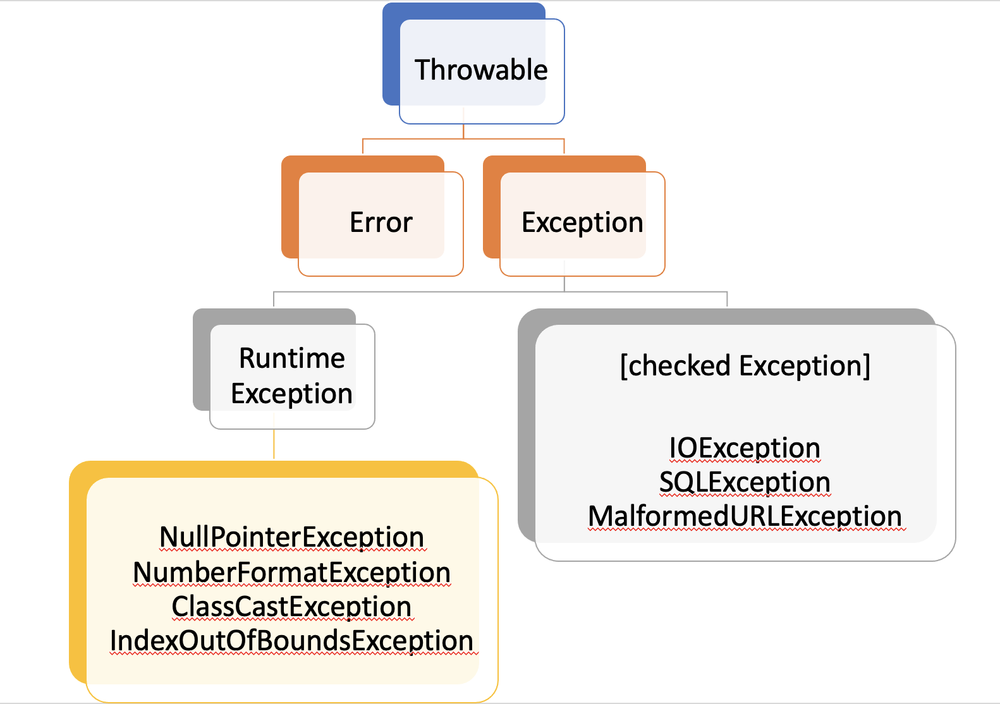

# Throwable class
- java.lang.Throwable 클래스는 모든 예외의 조상이다.
### 예외클래스 상관 관계도


### Error와 Exception클래스의 공동 부모 클래스
> 1. Object클래스 
> 2. java.lang패키지에 선언된 Throwable 클래스 
> 
> Exception나, Error를 처리할 떄, Throwable로 처리해도 무관하다. 성격은 다르나, 동일한 이름의 메소드를 사용하여 처리할수있도록 함.

## 생성자

> 아무 매개변수가 없는 생성자 기본으로 제공
> 예외미시지를 String으로 넘겨줄 수 있음
> 별도의 예외원인을 넘겨줄 수 있음.

- Throwable() 
- Throwable(String message) 
- Throwable(String message, Throwable cause) 
- Throwable(Throwable cause)


## 메소드
> Exception클래스에서 Overriding한 메소드는 10개가 넘는다.
> 그중 가장 많이 사용하는 것은 아래 3가지가 있다.
- getMessage()
  - 예외 메시지를 String 형태로 제공받음.
  - 예외가 출력되었을 때, 어떤 예외가 발생되었는지 확인할때 유용
  - 메시지 활용하여 사용자에게 메시지 보여주고자할때 유용
- toString()
  - 예외 메시지를 String 형태로 제공 받음
  - getMessage() 메소드보다는 약간 더 자세하게, 예외 클래스 이름도 같이 제공
- printStackTrace()
  - 가장 첫줄에는 예외 메시지 출력
  - 두번째 줄부터는 예외가 발생하게 된 메소드들의 호출관계(스택 트레이스)를 출력
  - 많은 양의 로그가 쌓일 수 있으므로, 개발할때만 사용하도록 하며, 꼭 필요한 곳에만 사용할것을 권장

---

### 예제 살펴보기

```java
package c.exception;
public class ThrowableSample { 
    public static void main(String args[]) {
        ThrowableSample sample = new ThrowableSample();
        sample.throwable();
    }
    public void throwable() {
        int[] intArray=new int[5];
        try {
            intArray=null;
            System.out.printIn(intArray [5]);
        } catch (Throwable t) {
            #############빈칸##############
        }
    }
}

```
### 빈칸에 해당 코드 입력시 출력 결과
`System.out.printIn(t.getMessage());`
> null

`System.out.printIn(t.toString());`
> null<br> 
> java.lang.NullPointerException

`System.out.printIn(t.printStackTrace());`
> null <br>
> java.lang.NullPointerException <br>
> java.lang.NullPointerException <br>
>   at c.exception. ThrowableSample. throwable (ThrowableSample. java: 12)<br>
>   at c.exception. ThrowableSample.main(ThrowableSample. java:6)


