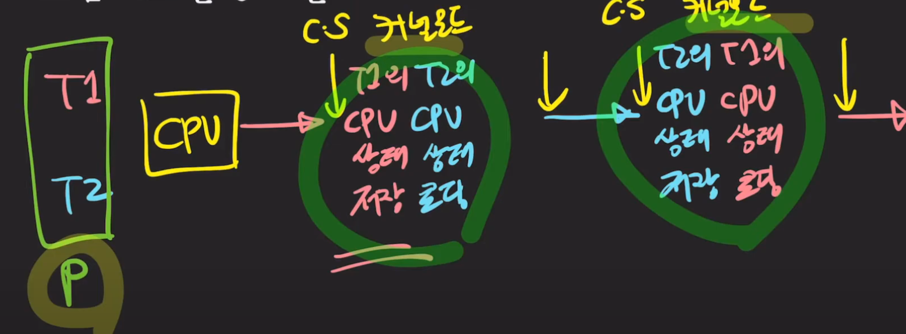
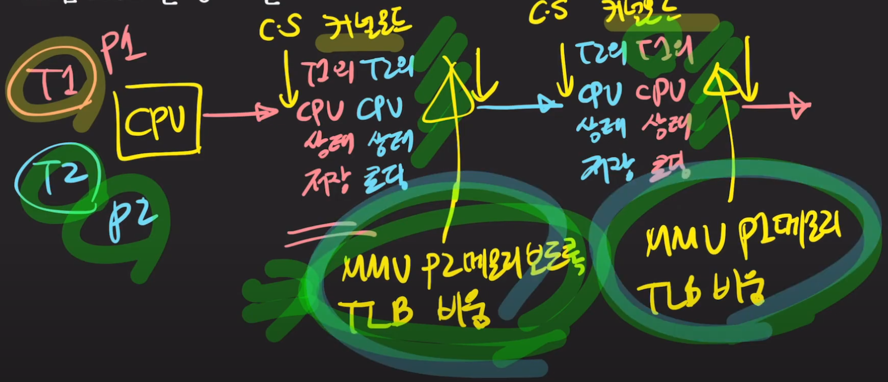

# 컨텍스트 스위칭

- CPU/코어에서 실행중이던 프로세서/스레드가 다른 프로세스/스레드로 교체되는 것
- 하나의 프로세스는 하나의 스레드를 가지고 있다. 
- 프로세스는 운영체제가 관리하는 단위

## 컨텍스트

- 프로세스/스레드의 상태
- CPU(register- programcounter, stackcounter 등), 메모리 등등

## 컨텍스트 스위칭은 언제 발생하는가?

- 주어진 time slice(퀀텀)를 다 사용했거나
- IO작업을 해야하거나
- 다른 리소스를 기다려야 하거나....

## 컨텍스트 스위칭은 누구에 의해 실행되는가?

- 트리거 발생이 의 주체 x -> OS커널(kernel)이 컨텍스트 스위칭을 실행한다.
- 각종 리소스를 관리/감독 하는 역할

## 컨텍스트 스위칭은 구체적으로 어떤 과정으로 일어나는가?

- 다른 프로세스끼리 스위칭인지(Process Context Switching)
- 같은 프로세스의 스레드들끼리 스위칭인지에 따라 다르다.(Thread Context Switching)

### 둘의 공통점은 무엇인가?

1. 프로세스가 직접 접근하는 것이 아니라, 커널 모드의 OS를 통해 접근하게 된다.
    - 통제권이 커널로 넘어가게됨
2. CPU의 레지스터 상태를 교체
    - cpu에는 여러가지 레스트가 존재, 각종 명령어들을 수행하기위해 필요한 여러 데이터들을 저장하는 곳

### 둘의 차이점은 무엇인가?

1. 프로세스 컨텍스트 스위칭(프로세스들은 서로 독립된 메모리를 가지고 있음.)
    - 가상 메모리 주소 관련 체계를 바꾸어주는 처리를 추가로 수행
        - MMU:메모리 매니지 유닛 MMU이 새로운 프로세스의 주소체계를 바라볼수있도록 수정
        - TLB:  가상메모리 메모리 주소와 실제 물리메모리 주소의 매핑정보를 들고있는 캐시역할을 하는 TLB도 완전히 비워줘야한다.
1. 스레드 컨텍스트 스위칭

## 스레드 컨텍스트 스위칭

## 프로세스 컨텍스트 스위칭

- 스레드 컨텍스트 스위칭에서 가상메모리 주소 관련 처리 작업이 부가적으로 발생한다.

## 스레드 컨텍스트 스위칭이 더 빠른 이유는?

- 같은 프로세스 내의 스레드들은 같은 자원을 공유하기 떄문에, 메모리 관련 작업을 수행할 필요가 없으며 CPU의 상테정보만 바꾸어주면된다.

## 컨텍스트 스위칭이 미치는 간접적인 영향은?

- 캐시를 오염시켜서 cpu의 cache에는 내가 찾는 정보가 없어 memory 까지 가야하고, 그러다보면 성능이 저하되게 된다.
- 따라서 어떤 cpu 아키텍처에서는 컨텍스트 스위칭을 할때, cache의 정보도 같이 날려버리기도 한다.

## 유저 관점에서 컨텍스트 스위칭이란?

- 순수한 오버헤드
- 따라서 컨텍스트 스위칭이 많이 일어나면 좋은게 아니다.

## 참고
- https://youtu.be/Xh9Nt7y07FE?si=CggnwnJvqYmylj4X