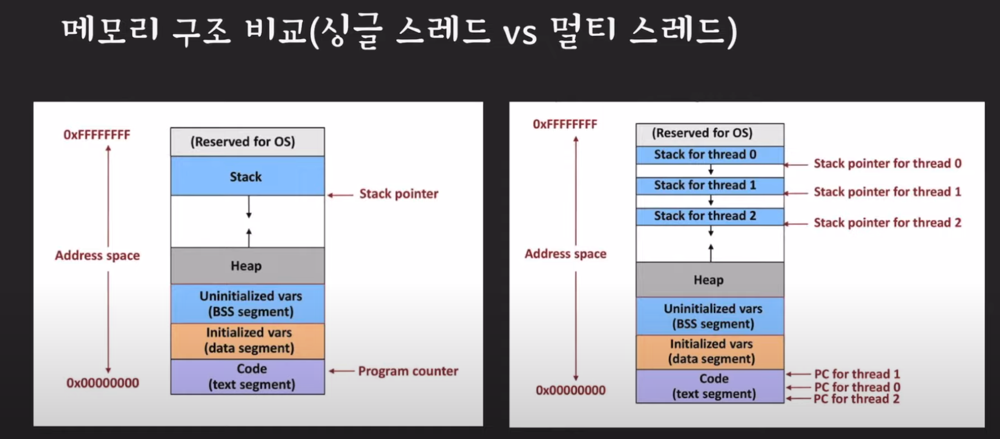
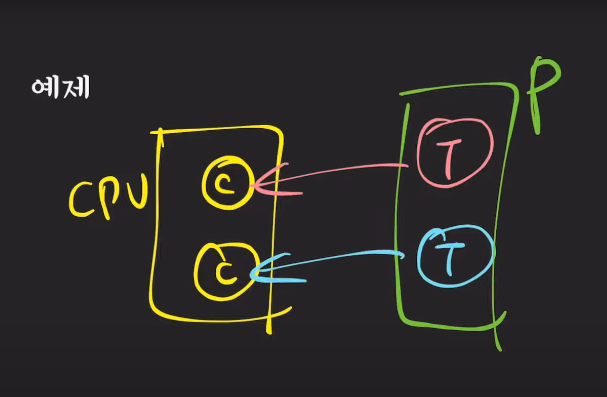
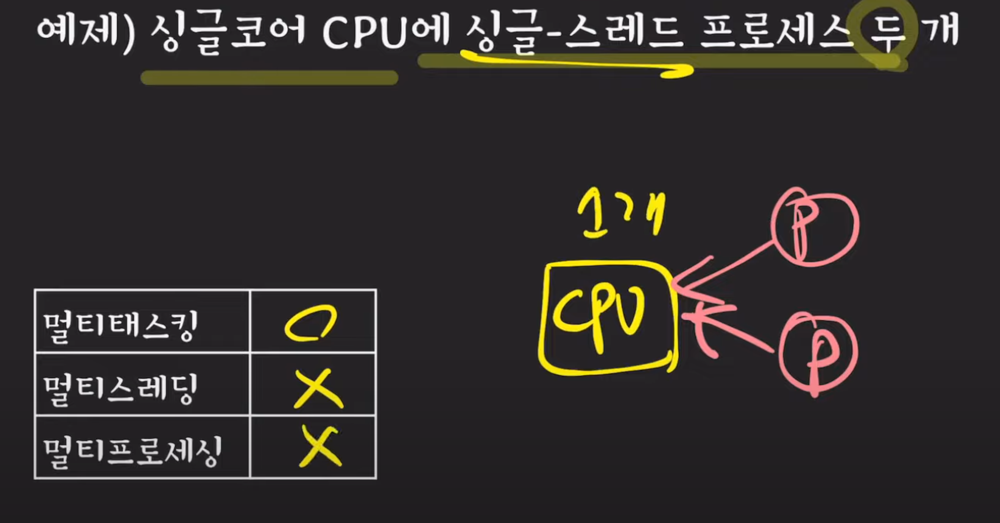
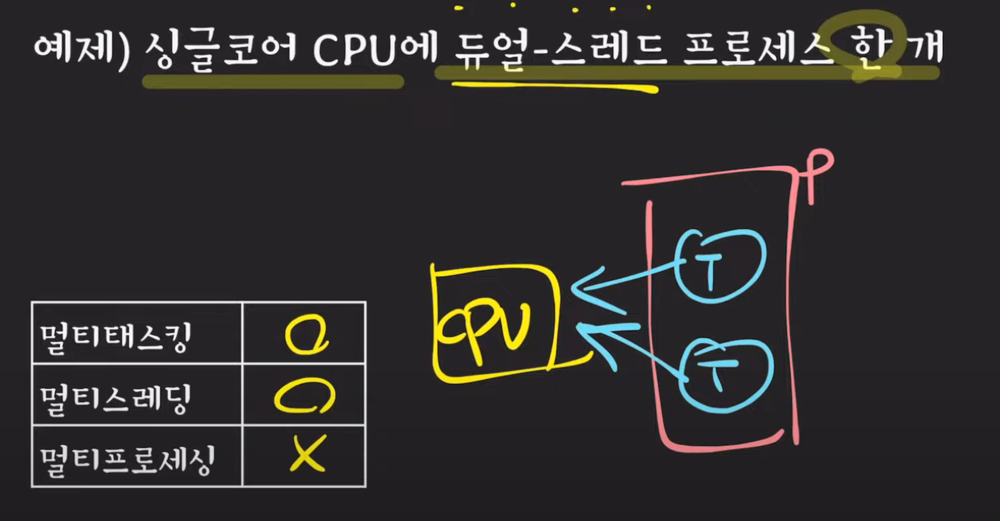
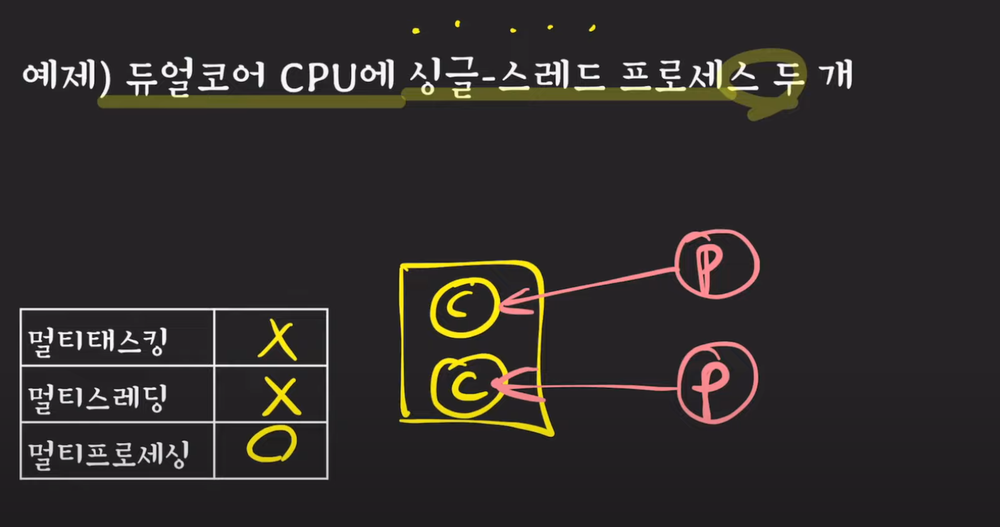
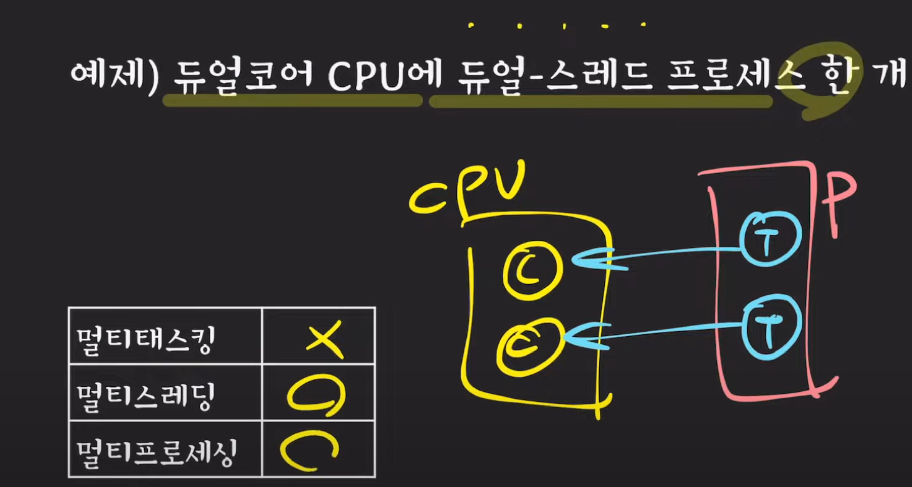
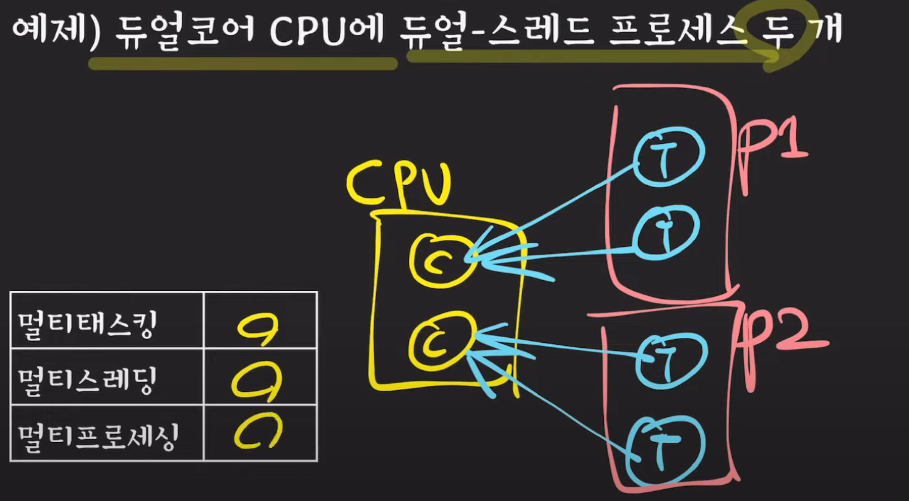
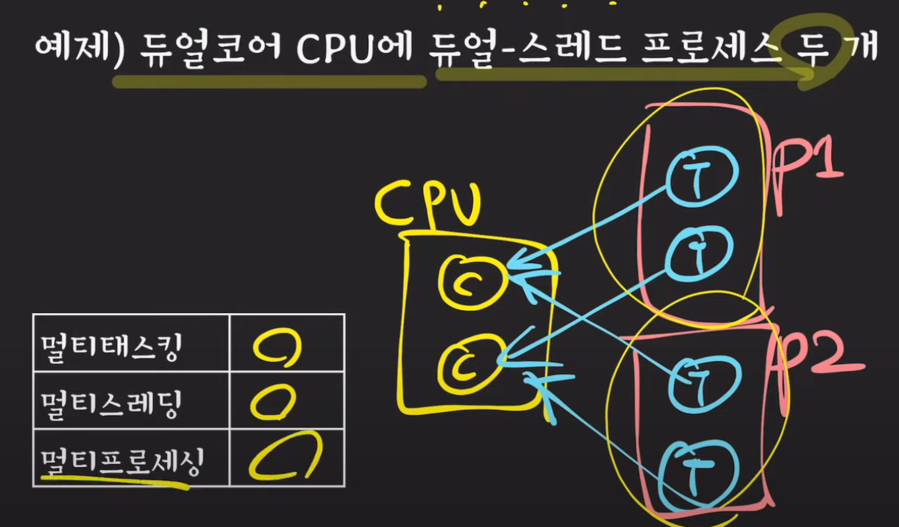

# 멀티태스킹 vs 멀티프로그래밍

- 멀티 태스킹은 멀티 프로그래밍과 비슷하나 하나의 프로세스를 실행하는 시간을 아주 작은 단위인 퀀텀으로 쪼개서 마치 여러개의 프로세스들이 동시에 작업 하는 것 처럼 사용자가 느끼게 한다.
- 따라서 프로세스 응답 시간을 최소화 시키는 것을 목적으로 한다.
- 여러 프로세스를 만들어 수행하게할수는 있지만, 하나의 프로세스가 여러 작업을 수행하고 싶을때, 동시에 여러작업을 수행하지는 못한다.
- 프로세스끼리는 데이터를 공유하지 않다. 때문에 스레드가 나오게 되었다.
- 2000년대 초반부터 단일코어가 아닌 듀얼코어가 등장한다.
- 예전에는 프로세스가 cpu의 작업단위였다면, 이제는 스레드가 cpu에서 수행되는 단위(unit of execution)가 되었다.
- 같은 프로세스의 스레들 끼리 컨텍스트 스위칭은 가볍다.

- 멀티 코어인 경우 가각의 코어에서 병렬적으로 스레드 수행

## 확장된 멀티 태스킹개념

- 여러 프로세스나 여러스레드가 아주 짧게 쪼개진 cpu time을 나눠갖는 것
- 코어를 가지고 프로세스나 스레드가 경합이 있어야함

# 멀티프로세싱

- 두개 이상의 프로세서나 코어를 활용하는 시스템을 말한다.

