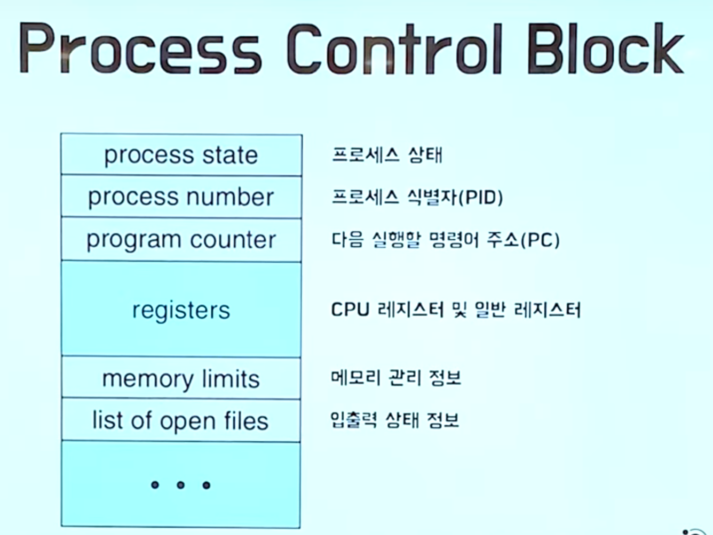
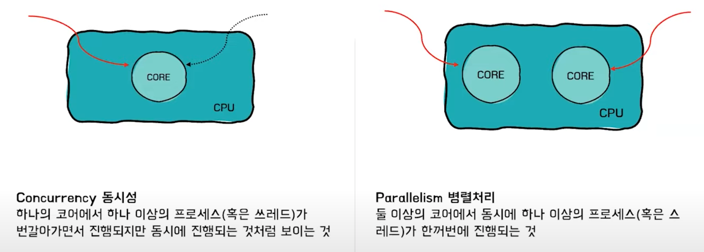
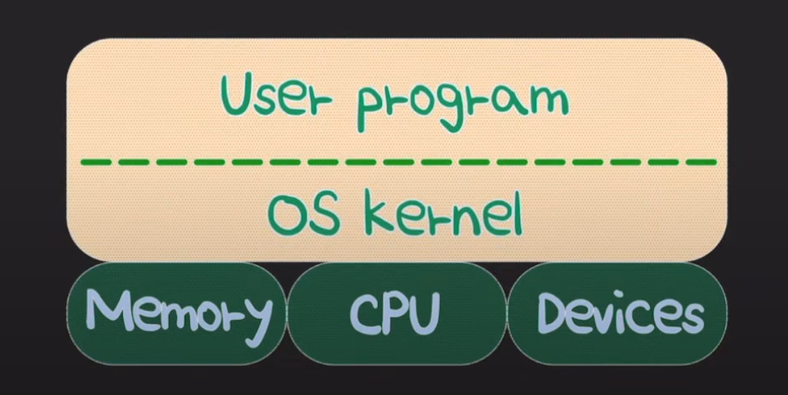

# Process_vs_Thread

## 용어정리

1.실행단위 - cpu코어에서 실행하는 하나의 단위로, 프로세스와 스레드를 포괄하는 개념
2.(부연 설명이 없는)프로세스 - 하나의 스레드만 가지고 있는 단일 스레드 프로세스
3.동시성 - 한순간에 여러가지 일이 아니라, 짧은 전환으로 여러가지 일을 동시에 처리하는 것처럼 보이는 것.

## Process & Thread

- 코드파일=프로그램(실행할수있는 무언가) -> 프로세스(실행)
- 프로그램이 프로세스가 되기위해
    - 프로세스가 필요로하는 재료들이 메모리 영역에 올라가야함
        - code, data, Heap, Stack
    - 프로세스에 대한 정보를 담고있는 PCB(Process Control Block)가 프로세스 생성시 함께 만들어진다.
        - 컨텍스트 스위칭 : 하나의 프로세스가 CPU를 사용중인 상태에서 다른 프로세스가 CPU를 사용하도록 하기 위해, 이전의 프로세스의 상태(문맥)를 보관하고 새로운 프로세스의 상태를 적재하는 작업을
          말한다. 한 프로세스의 문맥은 그 프로세스의 프로세스 제어 블록(PCB)에 기록되어 있다. 컨텍스트 스위칭이 되는 사이의 시간을 오버헤드 시간이라고 한다. CPU가 멈춰있는 상태 프로세스가 많을
          수록 오버해드가 많아지게 된다.
          

- 원래는 한 프로세스에서 cpu를 점유하고 있으면, 다른 프로세스는 실행상태에 있을 수 없다.
- 따라서 다수의 프로세스를 동시에 실행하기 위해 여러개 프로세스를 시분할로 짧은 텀을 반복하면서 전환해서 실행을 시키도록 한다.-> 컨텍스트 스위칭
    - 그래서 등장하는 것이 경량회된 프로세스 버전인 스레드이다.
    - 하나의 프로세스안에 다수의 스레드가 있을떄, 공유되는 자원이 있다.
- 스레드
    - 여러 스레드는 부모 프로세스 내의 코드, 데이터, 힙 영역을 공통된 자원으로 공유하며 사용한다.
    - 각 스레드는 스택부분만 따로 가지고 있따.
    - 따라서 매우 효율적이다.
    - 컨테스트 스위칭이 일어날 떄 캐싱 적중률이 올라간다.
    - 코드, 데이터, 힙 영역을 공유하고 있기 때문에 쓰레드 스위칭을 할때, 모조리 빼고 다시 다 넣을 필요가 없다.

## Multi-process vs Multi-thread

- 한 어플리케이션에 대한 두가지 다른 처리방식에 대해 이야기해보자.
- 멀티 프로세스 - 단순 여러프로그램띄워놓은것이 아니다.
    - 각 프로세스는 독립적
    - 그렇게 때문에 IPC를 통해서 통신을 해야한다.
    - 자원 소모적, 개별 메모리 차지
    - Context Switching 비용이 큼
    - 동기화 작업이 필요하지 않음
- 멀티 스레드
    - 스레드끼리 긴밀하게 연결되어 있음.
- 공유된 자원으로 통신 비용 절감
- 공유된 자원으로 메모리가 효율적임
- Context switching 비용이 적음
- 공유 자원 관리를 해야함.-> 동기화 신경써야함.
- 멀티스레드는 긴밀하게 연결되어 있기 떄문에 한 스레드에 문제가 생기면 전체에 영향을 끼치게 된다.
  

## Multi-core

- 멀티프로세스, 멀티스레드는 어플리케이션 처리방식에 대한 설명이므로, 소프트웨어에 가깝다고 하면, 멀티코어는 하드웨어 측면에 가깝다.
- 키워드 : 동시성, 병렬처리
- 기본적으로 코어 하나는 여러 실행단위를 변갈아 실행하면서, 동시에 일어나는 것처럼 보이게 함
- 사진을 빠르게 바꾸어 애니매이션처럼 보이게 하는것처럼 짧은 순간에 cpu의 시간을 부 ㄴ할해서 동시에 하는것처럼 보이게 한다.
- 멀티코어는 물리적으로 여러 코어를 사용해서 다수의 실행단위를 한순간에 동시에 처리할 수 있게 해준다.
  

### 참고

- https://www.youtube.com/watch?v=1grtWKqTn50

--------------------------------------

## Process : OS가 관리하는 단위 (연산꺼리)

- 연산은 하나의 흐름을 만든다.
- 프로세스 수준에서는 이 연산이 흐름을 만든다.
    - 한 프로세스 내부에는 1번 흐름
    - 한 스레드가 있다. 2번 흐름
- 위 두 흐름은 동시에 각자 작동한다.

## 쓰레드

- 한 프로세스 내부에서 개별화된 실행 흐름
- 한 프로세스에서 스레드가 여러개가 되면 멀티스레딩, 하나의 CPU core가 프로세스나 스레드를 처리할때, 경합이 일어나면 멀티 태스킹이라 한다.

## 컴퓨터의 세계

- 3개의 레이어로 이루어져 있다.

1. 유저
2. 커널
3. 하드웨어
   - CPU + RAM [ ][x][x][x][x][x][ ][ ][ ] + HDD -> 물리 메모리

- 프로세스 1개가 있을때, 연산을 수행한다고 할때, 가장 필요한 자원은 CPU이다.
- 운영 체제 입장에서는 프로세스를 지원하기위해 자원을 주어야한다.
- CPU를 주는데 + 연습장인 RAM(직접 쓰지않고, 추상화시킨 가상의 메모리를 준다.(이를 가상 메모리라고 한다.))도 함께 준다.
- 가상메모리  : 물리메모리를 직접 사요하는 것이 아니라, 프로세스가 가상메모리의 것을 사용한다.
- 메모리에는 RAM(1차 메모리), HDD(2차 메모리)가 있다. 가상 메모리는 이 두가지의 RAM과 HDD를 합쳐서 가상의 메모리를 만든것을 말한다. process입장에서는 운영체제가 준 가상메모리를 RAM인줄
  알고 썼으나, HDD가 나올수있다.
- HDD는 속도가 느리다.
- 프로세스내에 흐름이 또하나 존재하게 된다면???????
- 쓰레드들은 활동할 수 있는 메모리 영역이 OS에서 프로세스에게 할당해준 가상메모리로 제한이 된다.
- 프로세스는 최소 1개의 Thread를 가진다.
- 연산한다고 할떄, Thread 단위로 하게된다.
- OS는 제한된 공간인 VIrtulal Memory를 프로세스에게 할당한다.

> 따라서, 프로세스에게 속한, 모든 Thread는 프로세스의 virtual memory로 공간이 제약된다.

### 쓰레드 : 실직적 연산을 하는 주체

프로세스 안에 쓰레드가 n개가 됬을때, 멀티스레드가 된다.
무조건 따라오는 이슈

- 동시성 이슈
- 동기화 이슈

- process를 한 가구라고 했을때, 집에는 세대원들이 있따.
  - 집 : 프로세스에게 할당된 가상 메모리 공간 
  - 철수, 영희, 길동 : 스레드 집의 공간을 활용하며, 각자의 역할을 한다. 
  - 방이 3개라고 한다면, 부억, 화장실, 거실은 공유하는 공간
    - 방: 사생활보호 메모리공간을 쪼개서 사용, 쓰레드가 각자쓰는 공간.(쓰레드 로컬 스토리지 Thread Local Storage라고 부른다.) 통상의 경우 쓰레드마다 스택구조 관리되는 메모리 공간이 따로 있다.(
        자료구조)
    - 거실, 부억, 화장실 :  Heap 

- 각 쓰레드만의 고유한 공간 TLS(thread local storage)를 가지고 있다.
- 이는 프로세스에게 제공된 공간으로 영역이 한정된다.

### 왜 쓰레드로 나눌까? 프로세스를 여러번 실행하는게 낫지 않을까?
- 프로세스가 수행해야할 일의 양이 많을때, 
- 세사람이 하나의 팀으로 업무 분장하고 virtual memory **리소스를 공유**하는게 좋을까?
- 아니면, 팀이아니라, 각자 따로 재택근무하듯 따로 하는게 좋을까?
- 따로하면 각자의 VM이 주어진다. 각자의 stack 각자의 Heap을 갖게 된다.
- 여기서 운영체제의 설계철학이 나온다.
  - 프로세스 단위 - 리눅스, 도커
  - 스레드 단위 - 윈도우

- https://youtu.be/1grtWKqTn50?si=MLv0kmG3pX0rKLt1
- https://youtu.be/x-Lp-h_pf9Q?si=olKiTVdS_VLqmaBf
