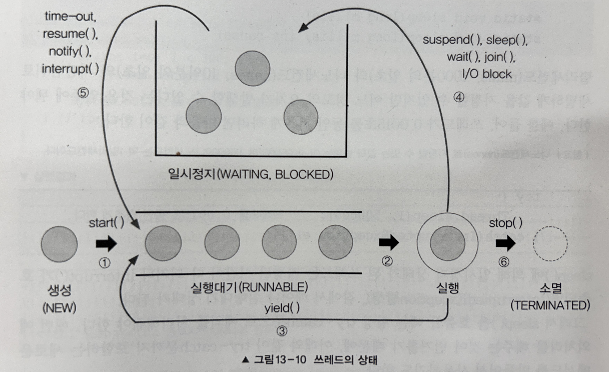

# 쓰레드의 상태와 실행제어



## 쓰레드의 상태

| 상태                    | 설명                                                                                       |
|-----------------------|------------------------------------------------------------------------------------------|
| NEW                   | 쓰레드가 생성되고 아직 start가 호출되지 않은 상태                                                           |
| RUNNABLE              | 실행중 또는 실행 가능한 상태                                                                         |
| BLOCKED               | 동기화 블럭에 의해서 일시정지된 상태(lock이 풀릴때 까지 기다리는 상태)                                               |
| WAITING, TIME_WAITING | 쓰레드의 작업이 종료되지는 않았지만, 실행가능하지 않은(unrunnable) 일시정지 상태. TIME_WAITING은 일시정지 시간이 지정된 경우를 의미한다. |
| TERMINATED            | 쓰레드의 작업이 종료된 상태                                                                          |


## 쓰레드의 실행제어

### 1. Sleep(long millis)
- 일정시간동안 쓰레드를 멈추게 한다.
- sleep에 의해 `일시정지(WAITING, BLOCKED)` 상태가 된 쓰레드는
    - 지정된 시간이 다되거나
    - interrupt()가 호출되면
    - (`InterruptedException`발생), 잠에서 깨어나 실행상태가 아닌, `실행대기(RUNNABLE)` 상태가 된다.

- `sleep()`을 호출할 때는 항상 try-catch 문으로 예외를 처리해줘야 한다.
    - try-catch문을 포함하는 새로운 메서드를 만들어 사용하기도 한다.
```java
void delay(long millis) {
  try {
	  Thread.sleep(millis);
  } catch(InterruptedException e) {}
}
```

- `sleep()` 메소드는 항상 현재 실행중인 쓰레드에 대해 작동하기때문에, `th1.sleep(2000)`과 같이 호출하였어도 th1에 영향을 주는 것이 아니라 해당 메소드가 실행된 main스레드가 영향을 받게 된다 .
  따라서, 참조 변수를 호출하기 보다는 `Thread.sleep(2000)`과 같이 선언해주어야 한다.

### 2. interrupt(), interrupted()
>`void interrupt()` : 쓰레드의 interrupted상태를 false에서 true로 변경
>`static boolean interrupted()` : 현재 쓰레드의 interrupted 상태를 반환 후, false로 초기화
>`boolean isInterrupted()` : 쓰레드의 interrupted 상태를 반환. 초기화는 하지 않음.

1. 진행중인 쓰레드의 작업이 끝나기 전에 취소시켜야 할때 사용.
    단지 쓰레드의 인스턴수 변수인 `interrupted` 상태를 바꾸는 것
- ex) 큰 파일을 다운로드 받을 때 시간이 너무 오래걸리면 중간에 다운로드를 포기하고 취소할 수 있어야 한다.
- interrupt()는 쓰레드에게 작업을 멈추라고 요청한다. 하지만, 단지 멈추라고 요청만 하는 것일 뿐, 쓰레드를 강제로 종료시키지는 못한다.
- 2. sleep(), join(), wait() 에 의해 `일시정지 상태(WAITING)`에 있을 때, 해당 쓰레드에 대해 interrupt()를 호출하면, Interrupted Exception이 발생하고 쓰레드는 `실행가능(RUNNABLE)상태`로 바뀐다.
- 즉, 멈춰있는 쓰레드를 깨워서 실행가능한 상태로 만드는 것이다.
```java
Thread th = new Thread();
th.sart();
	...
th.interrupt(); // 쓰레드 th에 interrup()를 호출되면, interrupted()의 결과가 true로 바뀌어 방복문을 탈출하게 된다.

class MyThread extends Thread {
	public void run() {
		while(!interrupted()) { // interrupted()의 결과가 false인 동안 반복
			... 
		}
	}
}

```

```java
import javax.swing.*;  
  
public class ThreadEx {  
    public static void main(String[] args) {  
        ThreadEx_1 th = new ThreadEx_1();  
        th.start();  
        String input = JOptionPane.showInputDialog("아무 값이나 입력하세요");  
        System.out.println("입력하신 값은" + input + "입니다.");  
        th.interrupt(); // interrupt()를 호출하면, interrupted 상태가 true가 된다.  
        System.out.println("isInterrupted():" + th.isInterrupted()); // true  
    }  
}  
  
class ThreadEx_1 extends Thread {  
    @Override  
    public void run() {
        int i = 10;
        while (i != 0 && !isInterrupted()) {
            System.out.println(i--);
            for (long y = 0; y < 2500000000L; y++);
        }  
        System.out.println("카운트가 종료되었습니다.");
    }  
}

```

### 3. suspend(), resume(), stop()
    - sleep()처럼 쓰레드를 멈추게 한다.
    - `suspend()`에 의해 정지된 쓰레드는 resume()을 호출해야 다시 실행대기 상태가 된다.
    - `stop()`은 호출되는 즉시 쓰레드가 종료된다.
    - 쓰레드를 제어하는 가장 손쉬운 방법이지만, suspend(), stop()은 교착상태(데드락)을 일으키기 쉽게 작성되어있어, 권장하지 않는다. 따라서 deprecated되었음.
### 4. yield()
- 자신에게 주어진 실행시간을 다음 차례의 쓰레드에게 양보한다.
- 예를 들어, 스케쥴러에 의해 1초의 실행시간을 할당받은 쓰레드가 0.5초의 시간동안 작업한 상태에서 yield()가 호출되면, 나머지 0.5초는 포기하고 다시 실행대기상태가 된다.
- yield()와 interrupt()를 적절히 사용하면, 프로그램의 응답성을 높이고, 보다 효율적인 실행이 가능하게 할 수 있다.
```java
class ThreadEx18 {

    public static void main(String args[]) {
        ThreadEx18_1 th1 = new ThreadEx18_1("*");
        ThreadEx18_1 th2 = new ThreadEx18_1("**");
        ThreadEx18_1 th3 = new ThreadEx18_1("***");
        th1.start();
        th2.start();
        th3.start();

        try {
            Thread.sleep(2000);
            th1.suspend();
            Thread.sleep(2000);
            th2.suspend();
            Thread.sleep(3000);
            th1.resume();
            Thread.sleep(3000);
            th1.stop();
            th2.stop();
            Thread.sleep(2000);
            th3.stop();
        } catch (InterruptedException e) {
        }
    }
}


class ThreadEx18_1 implements Runnable {

    boolean suspended = false;
    boolean stopped = false;

    ThreadEx18_1(String name) {
        th = new Thread(this, name); // Thread(Runnable r, String name)
    }

    public void run() {
        String name = th.getName();

        while (!stopped) {
            if (!suspended) {
                System.out.println(name);
                try {
                    Thread.sleep(1000);
                } catch (InterruptedException e) {
                    System.out.println(name + " - interrupted");
                }
            } else {
                Thread.yield(); // suspended()를 호출하였을 때, 아무의미없이 스레드가 돌지 않게 실행시간을 다른 스레드에게 양보한다.
            }
        }
        System.out.println(name + " - stopped");
    }

    public void suspend() {
        suspended = true;
        th.interrupt();
        System.out.println(th.getName() + " - interrupt() by suspend()");
    }

    public void resume() {
        suspended = false;
    }

    public void stop() {
        stopped = true;
        th.interrupt(); // sleep상태에서 스레드를 빠르게 종료시키고 싶다면, 1초를 기다릴 필요 없이, interrtup() 메서드를 호출하여, IntteruptedExceptiopn을 발생시켜, 실행가능 상태가 되도록 한다. 즉, 응답성이 좋아진다.
        System.out.println(th.getName() + " - interrupt() by stop()");
    }

    public void start() {
        th.start();
    }
}
```

### 5. join() - 다른 쓰레드의 작업을 기다린다.
- 쓰레드 자신이 하던 작업을 잠시 멈추고 다른 쓰레드가 지정된 시간동안 작업을 수행하도록 할 때 join()을 사용
- 시간을 정하지 않으면, 다른 쓰레드가 작업을 모두 마칠때까지 기다리게 된다.
- 작업 중에 다른 쓰레드의 작업이 먼저 수행되어야할 필요가 있을 때 join을 사용
- sleep()과 유사하게 interrupt()를 호출하여 대기상태에서 실행가능상태로 벗어날 수 있다.
- 다른 점은 join()은 현재 쓰레드가 아닌 특정 쓰레드에 대해 동작하므로 static 메소드가 아니라는 것이다.
    - `Thread.sleep()`
```java
try{
	th2.join(); // 현재 실행 중인 스레드가 th1일때, th2의 작업이 끝날때 까지 기다린다.
} catch(InterruptedException e){}
```