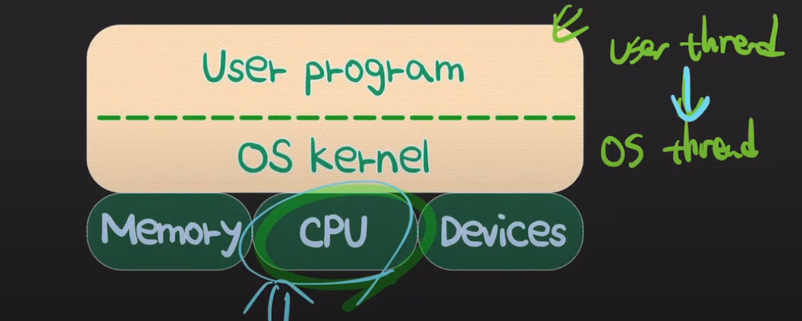

# 스레드의 종류

## 1.하드웨어 스레드


- 인텔의 hyper-threading
    - 물리적인 코어마다 하드웨어 스레드가 두개
- OS 관점에서는 가상의(logical) 코어
    - 만약, 싱글 코어 CPU에서 하드웨어 스레드가 두개라면, OS는 이 CPU를 듀어코어로 인식하고, 듀얼 코어에 맞춰서 OS 레벨의 스레드들을 스케쥴링한다.
- 인텔 듀얼 코어 CPU에 hyper-threading이 적용됐다면, 하드웨어 스레드는 총 몇개가 될까?
    - 정답 : 4개(하나의 코어당 하드웨어 스레드가 2개가 되므로 듀얼코어라고 한다면, 총 4개의 하드웨어 스레드를 코어로 인식하게 된다.)

## 2. 운영체제 스레드

- 커널
    - 운영체제의 핵심, 시스템의 전반을 관리/감독하는 역할
    - 하드웨어와 관련된 작업을 직접 수행
- OS 스레드(=네이티브스레드,커널레벨스레드,OS레벨스레드)
    - OS 커널 레벨에서 생성되고 관리되는 스레드
    - CPU에서 실제로 실행되는 단위, CPU 스케줄링의 단위
    - OS스레드의 컨텍스트 스위칭은 커널이 개입-> 비용 발생
    - 사용자 코드와 커널 코드 모두 OS 스레드에서 실행된다.
        - 시스템콜을 통해 사용자모드에서 커널모드로 전환되며 커널 코드가 시행
        - 커널코드 시행후 시스템콜이 종료되면 유저모드로 돌아오고 유저코드가 실행됨

- 커널스레드라고도 하나 커널스레드는 다른 맥락의 의미를 가지고 있다.
    - OS커널의 역할을 수행하는 스레드

## 3. 유저스레드



- 스레드개념을 프로그래밍 레벨에서 추상화 한것
- 자바에서는 스레드 생성시, start 메소드를 호출하는데, 이메소드는 내부적으로 start0메소드를 호출하며,
- 이 start0메소드는 JNI라는 기술을 통해 OS kernel레벨의 OS system call을 호출하게 된다.
- 만약 리눅스 OS라면 clone이라는 시스템콜을 호출하게되고, 이 시스템콜을 호출하게되는 순간 리눅스에서는 OS레벨의 스레드를 하나 생성하게 된다.
- 이렇게 생성된 OS레벨의 스레드는 자바의 유저 스레드와 연결이 되게 된다.
- 따라서, 유저 스레드가 CPU에서 실행되려면, OS 스레드와 반드시 연결되어야 한다.

```java
Thread thread=new Thread();

        thread.start(); 
```

### 유저스레드와 OS 스레드를 연결시키는 방식

1. One to One model


- java
- 스레드 관리를 OS에 위임
- 스케줄링 커널이 수행
- 멀티코어 활용가능
- 같은 프로세스내의 여러개의 스레드라고 할때, 하나의 스레드가 블락이 되어도 다른 스레드는 잘 동작함
- 하지만 OS스레드와 매핑이 되어있으므로, 어떻게 실행되는지에 따라, race 컨디션이 발생할 수 있다.

2. One to Many model


- 여러개의 유저 스레드가 하난의 os스레드에 연결됨
- 커널이 개입하지 않게 되므로 원투원모델에 비해 컨텍스트 스위칭이 빠르다.
- os 스레드가 하나밖에 없으므로, os레밸에서 싱글스레드이기 때문에 os레벨에서 race 컨디션이 일어날 가능 성은 거의 없다. race 컨디션이 일어난다고 하면 유저레벨의 스레드에서 발생할수있으나, 가능성이
  적다.
- os 스레드가 하나이기 때문에 멀티코어 활용을 못한다.
- 하나의 user 스레드에서 block I/O가 발생하였을때, os 스레드에서 block I/O가 일어나고 하나밖에 없기 때문에 전체 스레드에 영향을 미치게 된다. 한스레드 블락시 모든 스레드가 블락된다. 이문제를
  해결하기 위해 non block I/O를 사용하게 된다.

3. Many to many


- go 언어
- 유저스레드와 os스레드가 각각2개 이상 존재한다.
- 유저스레드간의 스위칭이 빠르면서도, 멀티코어를 활용하게 된다.
- 하나의 os 레밸이 블락이 되어도 전체 스레드에 영향을 미치지 않게 된다.
- 대신 구현이 복잡하다.
- 유저스레드가 어떤 맥락에서의 스레드를 의미하는지 기술문서 읽을때 주의
  

### Green Thread


- Java 초창기 버전은 many-to-One 스레딩 모델에 한정해서 **유저 스레드**들을 **그린 스레드**라고 호칭
- 현재는 그 의미가 확장되어 OS와는 독립적으로 유저 레벨에서 스케줄링 되는 스레드를 지칭함

## 참고
- https://youtu.be/vorIqiLM7jc?si=tgc3XEQk8k8iFboF
- https://youtu.be/QmtYKZC0lMU?si=86VkHXw1uDMcDcYm