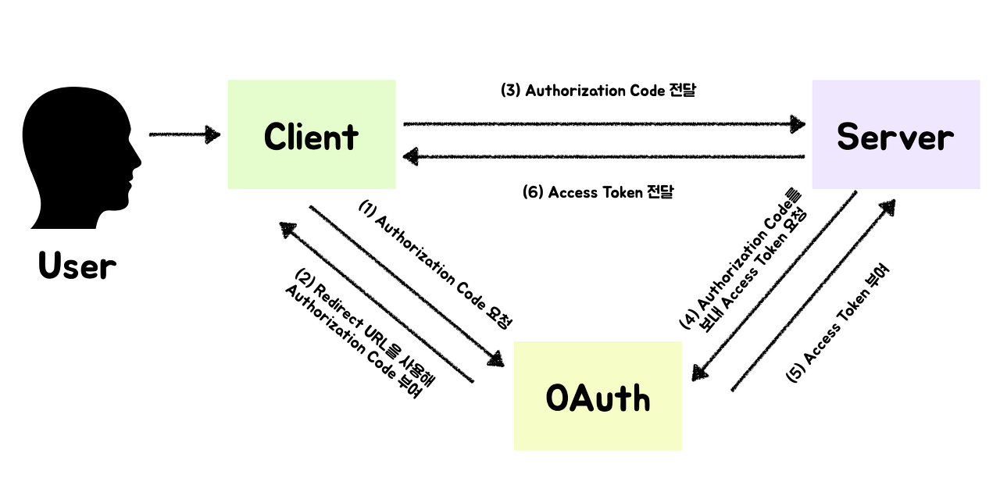

# OAuth2.0

- OAuth2.0(Open Authorization 2.0, OAuth2)는 인증을 위한 개방형 표준 프로토콜입니다.
- 이 프로토콜에서는 Third-Party 프로그램에게 리소스 소유자를 대신해 리소스 서버에서 제공하는 자원에 대한 접근 권한을 위임하는 방식으로 작동됩니다.
- 구글, 페이스북 등 외부 소셜 계정을 기반으로 간편하게 인증하는 기능입니다.
- 기존의 인증방식과 달리 인증을 중개해주는 방식이라고 생각하시면 됩니다.
- 소셜 서비스에서 인증(Authentication)을 대신 해주지만 클라이언트 정보가 서버에 저장되는 것은 기존 인증 방식과 동일합니다.

> 즉, 서버에서 접근 권한 관리(Authorization)은 여전히 서버가 담당해야 할 부분이 됩니다. 그럼에도 불구하고 OAuth 프로토콜을 사용해서 접근 권한 관리, 인증 절차를 간단하게 구현할 수 있습니다.

## OAuth2의 제공자

- 구글
- 페이스북
- 카카오
- 네이버

## 역할

| 이름                   | 	설명                                                                                                                                                                                   |
|----------------------|---------------------------------------------------------------------------------------------------------------------------------------------------------------------------------------|
| Resource Owner       | 	리소스 소유자입니다. 본인의 정보에 접근할 수 있는 자격을 승인하는 주체입니다. 예시로 구글 로그인을 할 사용자를 말합니다. Resource Owner는 클라이언트를 인증(Authorize)하는 역할을 수행하고, 인증이 완료되면 동의를 통해 권한 획득 자격(Authorization Grant)을 클라이언트에게 부여합니다. | 
| Client               | 	Resource Owner의 리소스를 사용하고자 접근 요청을 하는 어플리케이션 입니다.                                                                                                                                     | 
| Resource Server      | 	Resource Owner의 정보가 저장되어 있는 서버입니다.                                                                                                                                                   | 
| Authorization Server | 	권한 서버입니다. 인증/인가를 수행하는 서버로 클라이언트의 접근 자격을 확인하고 Access Token을 발급하여 권한을 부여하는 역할을 수행합니다.                                                                                                  |

## OAuth2.0의 인증 과정

1️⃣ 사용자는 특정 웹 어플리케이션에서 OAuth 서비스를 요청합니다. 웹 어플리케이션(Client)에서는 OAuth 서비스에 Authorization Code를 요청합니다.

2️⃣ OAuth 서비스는 Redirect를 통해 Client에게 Authorization Code를 부여합니다.

3️⃣ Client는 Server에게 OAuth 서비스에서 전달받은 Authorization Code를 보냅니다.

4️⃣ Server는 Authorization Code를 다시 OAuth 서비스에 전달해 Access Token을 전달받습니다.

5️⃣ Server는 Access Token으로 Client를 인증하고 요청에 대한 응답을 반환합니다.

## OAuth2.0의 권한 부여 방식
#### 1) Authorization Code Grant (권한 코드 승인 방식)
#### 2) Implicit Grant (암시적 승인 방식)
#### 3) Resource Owner Password Credentials Grant (리소스 소유자 비밀번호 자격 증명)
#### 4) Client Credentials Grant (클라이언트 자격증명 승인 방식)

[참고](https://king-ja.tistory.com/87)