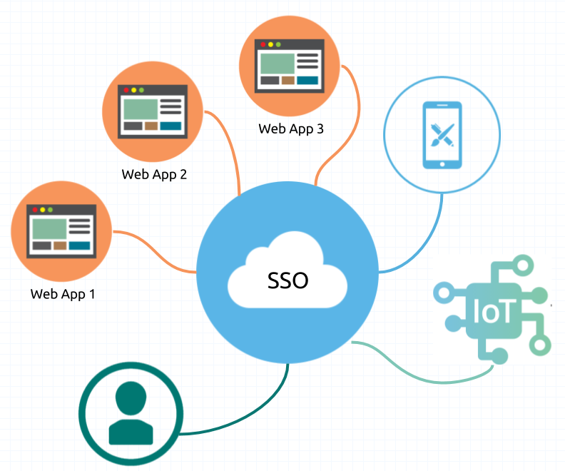

# sso

- Single Sign-On의 약자로 여러 개의 사이트에서 한번의 로그인으로 여러가지 다른 사이트들을 자동적으로 접속하여 이용하는 방법을 말합니다.
- 일반적으로 서로 다른 시스템 및 사이트에서 각각의 사용자 정보를 관리하게 되는데, 필요에 따라서 사용자 정보를 연동하여 사용해야 하는 경우도 생기게 됩니다.
- 이 때, 하나의 사용자 정보를 기반으로 여러 시스템을 하나의 통합 인증을 사용하게 하는 것을 말합니다.
- 즉 하나의 시스템에서 인증을 할 경우 타 시스템에서는 인증 정보가 있는지 확인하고 있으면, 로그인 처리를 하도록 하고, 없는 경우, 다시 통합 인증을 할 수 있도록 만드는 것을 의미합니다.
- 아래의 도식화된 이미지를 참조하시면 됩니다.
  

> 즉, 하나의 아이디 및 패스워드를 통해 여러 시스템에 접근할 수 있는 통합 로그인(인증) 솔루션이라고 생각하시면 됩니다.

### 등장 배경

- 최근 회사들이 그룹화 되거나 대형화가 되어서 여러 사이트들을 통합 관리하는 경우 SSO를 사용합니다. 이 때, 통합 인증 SSO를 사용하게 되면, 관리자는 보다 수월하게 관리 대상(사용자 및 고객)을 관리할 수
  있게 됩니다.
    - 기술적 측면 : 기업 내 다양한 정보 시스템의 구축에 따른 복잡성 증가, PKI, 생체 인식 등 다양한 인증 기술의 활성화
    - 관리적 측면 : 중앙 관리를 통한 업무 단순화 및 표준화 실현, 중앙 집중적인 사용자 관리를 통한 보안 기능 강화

[참고](https://toma0912.tistory.com/75)